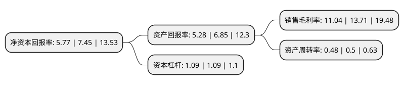

> 本页面由自动化程序生成于 2022年5月20日 01:20
> 内容可能存在错误，如有bug请提交issue至：https://github.com/Eroleice/doc-pi/issues
{.is-warning}

# 上市公司基本情况

## 基本资料

金现代信息产业股份有限公司（以下简称“金现代”）成立于2001年12月05日，济南市。于2020年05月06日在深交所创业板上市。

金现代注册资本43,012.5万元，主营业务:公司是一家专注于电力行业信息化解决方案的高新技术企业，主要向发电企业和供电企业提供软件开发，实施及运行维护等服务。以下是详细信息：

- 公司名称: 金现代信息产业股份有限公司
- 股票代码: 300830.SZ
- 所在地: 山东 - 济南市
- 成立日期: 2001年12月05日
- 注册资本: 43,012.5万元
- 法定代表人: 黎峰
- 主营业务: 主营业务:公司是一家专注于电力行业信息化解决方案的高新技术企业，主要向发电企业和供电企业提供软件开发，实施及运行维护等服务
- 公司官网: www.jxdinfo.com
- 公司介绍: 公司是一家专注于电力行业信息化解决方案的高新技术企业，主要向发电企业和供电企业提供软件开发、实施及运行维护等服务。公司的产品及服务主要集中于生产管理、安全管理、基建管理、营销管理和调度管理等多个业务领域，其中生产管理领域的产品及服务是公司的优势业务及核心业务。凭借电力行业信息化十余年积累的技术和经验，公司正逐步将产品及服务拓展至铁路、石化和工业制造等行业，并已取得显著业绩。公司及子公司拥有软件著作权111项、软件产品11项，拥有专利权7项，其中发明专利1项，实用新型专利6项。公司是高新技术企业和软件企业，通过了CMMI5认证、ITSS认证，并取得了ISO9001:2015质量管理体系、ISO20000-1:2011信息技术服务管理体系、ISO27001：2013信息安全管理体系的认证，持有三级信息系统集成及服务资质。公司全资子公司山东金码是高新技术企业和软件企业，通过了CMMI5认证，并取得了ISO9001:2015质量管理体系、ISO27001:2013信息安全管理体系的认证，持有三级信息系统集成及服务资质、三级保密资格单位证书；公司全资子公司济南金码、青岛金现代均是软件企业，且均取得了ISO9001：2015质量管理体系认证。

## 股东及高管情况

上市公司第一大股东为黎峰，持股157,987,500股，占比36.73%，为上市公司实际控制人。

截至2022年04月20日，上市公司的前十大股东中，共有7名自然人股东，3名机构股东，其中5%以上大股东共有6名。上市公司前十大股东明细如下：

> 截至2022年04月20日，上市公司前十大股东信息如下：

| 股东名称 | 持股数量（股） | 持股比例 |
| --- | --- | --- |
| 黎峰 | 157,987,500 | 36.73% |
| 黎峰 | 157,987,500 | 36.73% |
| 韩锋 | 28,417,300 | 6.61% |
| 济南金思齐投资管理合伙企业(有限合伙) | 27,000,000 | 6.28% |
| 济南金思齐投资管理合伙企业(有限合伙) | 27,000,000 | 6.28% |
| 韩锋 | 25,602,300 | 5.9523% |
| 张春茹 | 19,147,300 | 4.45% |
| 孙莹 | 7,216,002 | 1.68% |
| 吴龙超 | 6,500,000 | 1.51% |
| 燕东华泰电气(北京)有限公司 | 3,348,600 | 0.78% |

## 利润表分析

上市公司2021年总收入为5.99亿元，净利润为0.66亿元，实现盈利。

## 杜邦分析

> 数据列示周期：2021年 | 2020年 | 2019年
{.is-info}

上市公司的净资产收益率在近一年有所下降，下降幅度为-22.55%，其变化情况分解如下：
- 上市公司的销售毛利率在近一年下降了-19.47%，可能是生产效率的下降、商品原材料价格上涨或商品价格的下跌所致。
- 上市公司的资产周转率在近一年下降了-4%，可能是源自于更慢的销售回款或库存管理效果下降。
- 上市公司的财务杠杆比率在近一年下降了0%，可能是减少负债降低财务费用。

