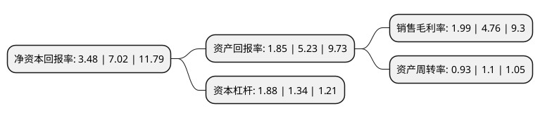

> 本页面由自动化程序生成于 2022年5月20日 01:21
> 内容可能存在错误，如有bug请提交issue至：https://github.com/Eroleice/doc-pi/issues
{.is-warning}

# 上市公司基本情况

## 基本资料

北京首都在线科技股份有限公司（以下简称“首都在线”）成立于2005年07月13日，北京市。于2020年07月01日在深交所创业板上市。

首都在线注册资本46,631.628万元，高性能的IDC服务及云服务等高效，优质的信息技术服务以下是详细信息：

- 公司名称: 北京首都在线科技股份有限公司
- 股票代码: 300846.SZ
- 所在地: 北京 - 北京市
- 成立日期: 2005年07月13日
- 注册资本: 46,631.628万元
- 法定代表人: 曲宁
- 主营业务: 高性能的IDC服务及云服务等高效，优质的信息技术服务
- 公司官网: www.capitalonline.net
- 公司介绍: 公司是一家覆盖全球的互联网数据中心服务提供商，致力于为中国企业出海提供全球云网一体化解决方案。公司主要服务于游戏、电商、视频、教育、大数据等互联网细分领域及传统行业客户，为其在全球提供快速、安全、稳定的云计算及IDC服务。公司的IDC服务覆盖全国三十多个主要城市。一方面公司的服务使客户业务接近其终端用户，保证了用户体验，另一方面数据中心的广泛覆盖及公司将IDC服务与云计算服务集成为一体的混合架构也有利于客户将其互联网业务布局全球。目前，公司在全国60余个数据中心部署超过3,000个机柜。此外，公司还在全球10余个国家或地区建立了云网一体化服务节点，包括美国、日本、新加坡、德国、中国香港等。

## 股东及高管情况

上市公司第一大股东为曲宁，持股121,003,417股，占比25.95%，**疑似为**上市公司实际控制人。

截至2022年04月27日，上市公司的前十大股东中，共有4名自然人股东，4名机构股东，2个产品账户，其中5%以上大股东共有5名。上市公司前十大股东明细如下：

> 未能通过持股比例判定出上市公司实际控制人（持股30%以上）
> 可能存在通过间接持股、联合持股、协议控制等方式拥有实际控制权的主体，具体请参考上市公司定期公告！
{.is-warning}

> 截至2022年04月27日，上市公司前十大股东信息如下：

| 股东名称 | 持股数量（股） | 持股比例 |
| --- | --- | --- |
| 曲宁 | 121,003,417 | 25.95% |
| 曲宁 | 121,003,417 | 25.95% |
| 赵永志 | 30,732,776 | 6.59% |
| 赵永志 | 30,732,776 | 6.59% |
| 闽清县合众企业管理中心(有限合伙) | 24,163,276 | 5.18% |
| 天阳宏业科技股份有限公司 | 10,703,852 | 2.3% |
| 南阳云拓企业管理服务合伙企业(有限合伙) | 8,348,830 | 1.79% |
| 北京航天科工信息产业投资基金(有限合伙) | 7,292,449 | 1.56% |
| 南京瑞森投资管理合伙企业(有限合伙) | 6,153,846 | 1.32% |
| 北京基石创业投资管理中心(有限合伙)-北京基石创业投资基金(有限合伙) | 4,324,000 | 0.93% |

## 利润表分析

上市公司2021年总收入为12.2亿元，净利润为0.24亿元，实现盈利。

## 杜邦分析

> 数据列示周期：2021年 | 2020年 | 2019年
{.is-info}

上市公司的净资产收益率在近一年有所下降，下降幅度为-50.43%，其变化情况分解如下：
- 上市公司的销售毛利率在近一年下降了-58.19%，可能是生产效率的下降、商品原材料价格上涨或商品价格的下跌所致。
- 上市公司的资产周转率在近一年下降了-15.45%，可能是源自于更慢的销售回款或库存管理效果下降。
- 上市公司的财务杠杆比率在近一年上升了40.3%，可能是增加负债扩大生产规模。

