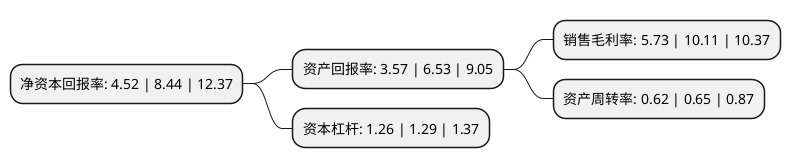

> 本页面由自动化程序生成于 2022年5月20日 01:21
> 内容可能存在错误，如有bug请提交issue至：https://github.com/Eroleice/doc-pi/issues
{.is-warning}

# 上市公司基本情况

## 基本资料

天阳宏业科技股份有限公司（以下简称“天阳科技”）成立于2003年07月09日，拉萨市。于2020年08月24日在深交所创业板上市。

天阳科技注册资本22,468.203万元，公司是一家金融业IT解决方案及服务提供商，主要向以银行为主的金融机构提供IT解决方案，咨询服务，专业测试服务，运维服务和系统集成服务。以下是详细信息：

- 公司名称: 天阳宏业科技股份有限公司
- 股票代码: 300872.SZ
- 所在地: 西藏 - 拉萨市
- 成立日期: 2003年07月09日
- 注册资本: 22,468.203万元
- 法定代表人: 欧阳建平
- 主营业务: 公司是一家金融业IT解决方案及服务提供商，主要向以银行为主的金融机构提供IT解决方案，咨询服务，专业测试服务，运维服务和系统集成服务
- 公司官网: www.tansun.com.cn
- 公司介绍: 公司专注为金融行业客户提供IT解决方案和服务，是金融IT业内颇具规模、成长最快、最具活力和创新精神的企业之一。基于金融IT和业务创新能力，公司正致力于成为国内领先的金融综合服务提供商，提供金融IT服务、金融信息服务和金融运营服务。公司从2003年创立以来，为央行和政策性银行、国有商业银行、股份制商业银行和地方性商业银行等近百家金融客户提供咨询、开发、测试、运维和系统集成等应用于全生命周期的服务。源于客户的业务创新和管理创新需求，公司在专业测试、对公金融(包括信贷、供应链金融、互联网金融、贸易金融和资金监管等)、商业智能与大数据应用、风险管理(信用风险、操作风险和市场风险)、信用卡、协同应用等专业领域研发了多种解决方案，在开发、测试和运行管理领域研发了业内领先的基础技术架构产品，积累了丰富的行业业务、IT技术知识、IT应用解决方案和专业服务人才。公司已拥有了一批优质、稳定的核心战略客户，同时公司也在积极拓展新客户，进一步完善客户和区域布局，创造新的业绩增长点。目前公司已经为两百多家银行客户提供了相关产品和服务，在行业内拥有较高的品牌声誉。

## 股东及高管情况

上市公司第一大股东为欧阳建平，持股48,947,697股，占比21.79%，**疑似为**上市公司实际控制人。

截至2022年05月12日，上市公司的前十大股东中，共有3名自然人股东，7名机构股东，其中5%以上大股东共有6名。上市公司前十大股东明细如下：

> 未能通过持股比例判定出上市公司实际控制人（持股30%以上）
> 可能存在通过间接持股、联合持股、协议控制等方式拥有实际控制权的主体，具体请参考上市公司定期公告！
{.is-warning}

> 截至2022年05月12日，上市公司前十大股东信息如下：

| 股东名称 | 持股数量（股） | 持股比例 |
| --- | --- | --- |
| 欧阳建平 | 48,947,697 | 21.79% |
| 北京天阳宏业投资管理合伙企业(有限合伙) | 33,361,176 | 14.85% |
| 北京天阳宏业投资管理合伙企业(有限合伙) | 33,361,176 | 14.85% |
| 李青 | 20,574,859 | 9.16% |
| 李青 | 20,574,859 | 9.16% |
| 北京时间投资合伙企业(有限合伙) | 11,388,405 | 5.0687% |
| 珠海时间创业投资合伙企业(有限合伙) | 4,193,549 | 1.87% |
| 光大资本投资有限公司 | 3,810,482 | 1.7% |
| 北京华睿互联创业投资中心(有限合伙) | 3,510,626 | 1.56% |
| 华元金控资本管理(上海)有限公司 | 1,555,283 | 0.69% |

## 利润表分析

上市公司2021年总收入为17.76亿元，净利润为1.01亿元，实现盈利。

## 杜邦分析

> 数据列示周期：2021年 | 2020年 | 2019年
{.is-info}

上市公司的净资产收益率在近一年有所下降，下降幅度为-46.45%，其变化情况分解如下：
- 上市公司的销售毛利率在近一年下降了-43.32%，可能是生产效率的下降、商品原材料价格上涨或商品价格的下跌所致。
- 上市公司的资产周转率在近一年下降了-4.62%，可能是源自于更慢的销售回款或库存管理效果下降。
- 上市公司的财务杠杆比率在近一年下降了-2.33%，可能是减少负债降低财务费用。

