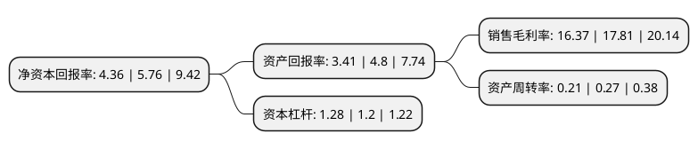

> 本页面由自动化程序生成于 2022年5月20日 01:21
> 内容可能存在错误，如有bug请提交issue至：https://github.com/Eroleice/doc-pi/issues
{.is-warning}

# 上市公司基本情况

## 基本资料

北京铜牛信息科技股份有限公司（以下简称“铜牛信息”）成立于2005年09月21日，北京市。于2020年09月24日在深交所创业板上市。

铜牛信息注册资本11,636.418万元，主营业务包括IDC业务及增值服务，IDC及云平台信息系统集成服务和其他互联网综合服务。以下是详细信息：

- 公司名称: 北京铜牛信息科技股份有限公司
- 股票代码: 300895.SZ
- 所在地: 北京 - 北京市
- 成立日期: 2005年09月21日
- 注册资本: 11,636.418万元
- 法定代表人: 吴立
- 主营业务: 主营业务包括IDC业务及增值服务，IDC及云平台信息系统集成服务和其他互联网综合服务
- 公司官网: www.topnewinfo.cn
- 公司介绍: 公司是一家集互联网数据中心服务、云服务、互联网接入服务、互联网数据中心及云平台信息系统集成服务、应用软件开发服务为一体的互联网综合服务提供商，在互联网数据中心及相关增值服务、互联网数据中心及云平台信息系统集成等方面具有竞争优势。公司致力于成为国内领先的云服务和互联网综合服务提供商，满足客户多样化的信息系统服务需求。公司通过了ISO9001质量管理体系认证、ISO27001信息安全管理体系认证、ISO20000信息技术服务管理体系认证、ISO22301业务连续性管理体系认证；获得了工信部颁发的跨地区增值电信业务经营许可证和国家通信工业协会颁发的信息系统业务安全服务资质证书；为中国电子工业标准化技术协会信息技术服务分会会员单位、国家信息技术服务标准工作组全权成员单位；2017年公司获得了北京市国资委“京津冀国有企业创新发展云平台”项目支持。

## 股东及高管情况

上市公司第一大股东为北京时尚控股有限责任公司，持股29,310,480股，占比25.19%，**疑似为**上市公司实际控制人。

截至2022年03月31日，上市公司的前十大股东中，共有7名自然人股东，2名机构股东，1个产品账户，其中5%以上大股东共有2名。上市公司前十大股东明细如下：

> 未能通过持股比例判定出上市公司实际控制人（持股30%以上）
> 可能存在通过间接持股、联合持股、协议控制等方式拥有实际控制权的主体，具体请参考上市公司定期公告！
{.is-warning}

> 截至2022年03月31日，上市公司前十大股东信息如下：

| 股东名称 | 持股数量（股） | 持股比例 |
| --- | --- | --- |
| 北京时尚控股有限责任公司 | 29,310,480 | 25.19% |
| 北京铜牛集团有限公司 | 28,857,540 | 24.8% |
| 银河粤科(广东)产业投资基金(有限合伙) | 2,741,335 | 2.36% |
| 高鸿波 | 2,598,358 | 2.23% |
| 胡占义 | 1,990,800 | 1.71% |
| 毕凤芝 | 840,000 | 0.72% |
| 皮纪梅 | 821,960 | 0.71% |
| 李超成 | 795,600 | 0.68% |
| 樊红涛 | 614,940 | 0.53% |
| 刘毅 | 589,440 | 0.51% |

## 利润表分析

上市公司2021年总收入为3.03亿元，净利润为0.49亿元，实现盈利。

## 杜邦分析

> 数据列示周期：2021年 | 2020年 | 2019年
{.is-info}

上市公司的净资产收益率在近一年有所下降，下降幅度为-24.31%，其变化情况分解如下：
- 上市公司的销售毛利率在近一年下降了-8.09%，可能是生产效率的下降、商品原材料价格上涨或商品价格的下跌所致。
- 上市公司的资产周转率在近一年下降了-22.22%，可能是源自于更慢的销售回款或库存管理效果下降。
- 上市公司的财务杠杆比率在近一年上升了6.67%，可能是增加负债扩大生产规模。

