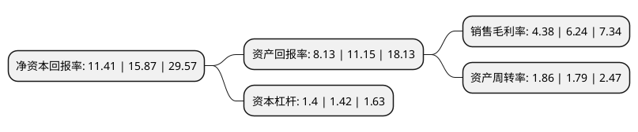

> 本页面由自动化程序生成于 2022年5月20日 01:21
> 内容可能存在错误，如有bug请提交issue至：https://github.com/Eroleice/doc-pi/issues
{.is-warning}

# 上市公司基本情况

## 基本资料

深圳市法本信息技术股份有限公司（以下简称“法本信息”）成立于2006年11月08日，深圳市。于2020年12月30日在深交所创业板上市。

法本信息注册资本22,009.917万元，公司基于对信息技术的研究与开发，结合客户的业务场景，为客户在信息化和数字化进程中的不同需求提供软件技术外包服务。以下是详细信息：

- 公司名称: 深圳市法本信息技术股份有限公司
- 股票代码: 300925.SZ
- 所在地: 广东 - 深圳市
- 成立日期: 2006年11月08日
- 注册资本: 22,009.917万元
- 法定代表人: 严华
- 主营业务: 公司基于对信息技术的研究与开发，结合客户的业务场景，为客户在信息化和数字化进程中的不同需求提供软件技术外包服务
- 公司官网: www.farben.com.cn
- 公司介绍: 公司是一家致力于为客户提供专业的信息技术外包(ITO)服务的提供商。公司基于对信息技术的研究与开发，结合客户的业务场景，为客户在信息化和数字化进程中的不同需求提供软件技术外包服务。公司自设立以来，主营业务未发生重大变化。经过多年的研发技术积累、行业经验沉淀、组织管理优化和业务市场开拓，结合强有力的客户管理能力，公司已经与金融、互联网、软件、通信、房地产、航空物流、制造业、批发零售等多个行业的客户形成长期而稳定的合作关系。

## 股东及高管情况

上市公司第一大股东为严华，持股76,947,669股，占比34.96%，为上市公司实际控制人。

截至2022年03月31日，上市公司的前十大股东中，共有3名自然人股东，5名机构股东，2个产品账户，其中5%以上大股东共有1名。上市公司前十大股东明细如下：

> 截至2022年03月31日，上市公司前十大股东信息如下：

| 股东名称 | 持股数量（股） | 持股比例 |
| --- | --- | --- |
| 严华 | 76,947,669 | 34.96% |
| 夏海燕 | 8,855,352 | 4.02% |
| 深圳市投控东海一期基金(有限合伙) | 6,757,336 | 3.07% |
| 深圳市耕读邦投资合伙企业(有限合伙) | 6,120,000 | 2.78% |
| 深圳市木加林投资合伙企业(有限合伙) | 6,120,000 | 2.78% |
| 深圳市嘉嘉通投资合伙企业(有限合伙) | 6,120,000 | 2.78% |
| 余华均 | 5,461,500 | 2.48% |
| 深圳市汇博成长创业投资有限公司-深圳市汇博红瑞三号创业投资合伙企业(有限合伙) | 5,408,269 | 2.46% |
| 海通创新证券投资有限公司 | 5,158,443 | 2.34% |
| 嘉兴海通旭初股权投资基金合伙企业(有限合伙) | 5,158,443 | 2.34% |

## 利润表分析

上市公司2021年总收入为30.88亿元，净利润为1.35亿元，实现盈利。

## 杜邦分析

> 数据列示周期：2021年 | 2020年 | 2019年
{.is-info}

上市公司的净资产收益率在近一年有所下降，下降幅度为-28.1%，其变化情况分解如下：
- 上市公司的销售毛利率在近一年下降了-29.81%，可能是生产效率的下降、商品原材料价格上涨或商品价格的下跌所致。
- 上市公司的资产周转率在近一年上升了3.91%，可能是源自于更快的销售回款或库存管理效果提升。
- 上市公司的财务杠杆比率在近一年下降了-1.41%，可能是减少负债降低财务费用。

