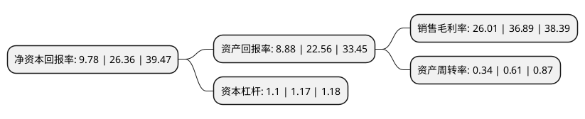

> 本页面由自动化程序生成于 2022年5月20日 01:21
> 内容可能存在错误，如有bug请提交issue至：https://github.com/Eroleice/doc-pi/issues
{.is-warning}

# 上市公司基本情况

## 基本资料

北京盈建科软件股份有限公司（以下简称“盈建科”）成立于2010年12月03日，北京市。于2021年01月20日在深交所创业板上市。

盈建科注册资本5,650.5万元，建筑结构设计软件的开发，销售及相关技术服务，为建筑设计行业提供从建模，计算，设计到出图覆盖全设计流程的综合解决方案。主要产品为YJK建筑结构设计软件系统。以下是详细信息：

- 公司名称: 北京盈建科软件股份有限公司
- 股票代码: 300935.SZ
- 所在地: 北京 - 北京市
- 成立日期: 2010年12月03日
- 注册资本: 5,650.5万元
- 法定代表人: 陈岱林
- 主营业务: 建筑结构设计软件的开发，销售及相关技术服务，为建筑设计行业提供从建模，计算，设计到出图覆盖全设计流程的综合解决方案主要产品为YJK建筑结构设计软件系统
- 公司官网: www.yjk.cn
- 公司介绍: 公司是以中国建筑结构设计软件行业首席专家、全国劳动模范陈岱林研究员为核心的建筑结构资深专家团队于2010年在北京创建成立，中国是世界上最大的建筑市场，中国必须要有一个真正的具有世界领先水平的建筑结构设计软件。这是历史的必然，也是盈建科的历史使命。公司的宗旨是开发全新一代的结构设计软件，致力于为全球建设行业提供最优秀的建筑结构设计软件综合解决方案，让设计师实现创意梦想。盈建科软件是面向国内及国际市场的建筑结构设计软件，既有中国规范版，也有国际规范版。盈建科建筑结构设计软件系统，包括盈建科建筑结构计算软件(YJK-A)；盈建科基础设计软件(YJK-F)；盈建科砌体结构设计软件(YJK-M)；盈建科结构施工图设计软件(YJK-D)；盈建科钢结构施工图设计软件(YJK-STS)；盈建科弹塑性动力时程分析软件(YJK-EP)和接口软件等。

## 股东及高管情况

上市公司第一大股东为陈岱林，持股9,481,940股，占比16.78%，**疑似为**上市公司实际控制人。

截至2022年03月31日，上市公司的前十大股东中，共有10名自然人股东，其中5%以上大股东共有4名。上市公司前十大股东明细如下：

> 未能通过持股比例判定出上市公司实际控制人（持股30%以上）
> 可能存在通过间接持股、联合持股、协议控制等方式拥有实际控制权的主体，具体请参考上市公司定期公告！
{.is-warning}

> 截至2022年03月31日，上市公司前十大股东信息如下：

| 股东名称 | 持股数量（股） | 持股比例 |
| --- | --- | --- |
| 陈岱林 | 9,481,940 | 16.78% |
| 张建云 | 8,701,940 | 15.4% |
| 任卫教 | 3,695,080 | 6.54% |
| 张凯利 | 3,694,820 | 6.54% |
| 李明高 | 2,175,680 | 3.85% |
| 贾晓冬 | 1,611,120 | 2.85% |
| 黄鑫 | 1,303,200 | 2.31% |
| 陈璞 | 870,220 | 1.54% |
| 李伟光 | 542,080 | 0.96% |
| 王贤磊 | 533,080 | 0.94% |

## 利润表分析

上市公司2021年总收入为2.3亿元，净利润为0.6亿元，实现盈利。

## 杜邦分析

> 数据列示周期：2021年 | 2020年 | 2019年
{.is-info}

上市公司的净资产收益率在近一年有所下降，下降幅度为-62.9%，其变化情况分解如下：
- 上市公司的销售毛利率在近一年下降了-29.49%，可能是生产效率的下降、商品原材料价格上涨或商品价格的下跌所致。
- 上市公司的资产周转率在近一年下降了-44.26%，可能是源自于更慢的销售回款或库存管理效果下降。
- 上市公司的财务杠杆比率在近一年下降了-5.98%，可能是减少负债降低财务费用。

