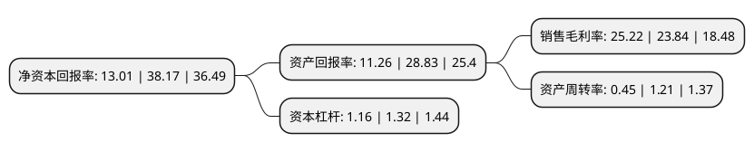

> 本页面由自动化程序生成于 2022年5月20日 01:21
> 内容可能存在错误，如有bug请提交issue至：https://github.com/Eroleice/doc-pi/issues
{.is-warning}

# 上市公司基本情况

## 基本资料

福建创识科技股份有限公司（以下简称“创识科技”）成立于1995年08月18日，福州市。于2021年02月09日在深交所创业板上市。

创识科技注册资本13,650万元，公司是一家电子支付IT方案商，主营业务为提供电子支付IT解决方案，主要产品是为商户及银行提供电子支付涉及的软硬件产品及服务。以下是详细信息：

- 公司名称: 福建创识科技股份有限公司
- 股票代码: 300941.SZ
- 所在地: 福建 - 福州市
- 成立日期: 1995年08月18日
- 注册资本: 13,650万元
- 法定代表人: 张更生
- 主营业务: 公司是一家电子支付IT方案商，主营业务为提供电子支付IT解决方案，主要产品是为商户及银行提供电子支付涉及的软硬件产品及服务
- 公司官网: www.echase.cn
- 公司介绍: 公司是一家电子支付IT方案商，主营业务为提供电子支付IT解决方案，主要产品是为商户及银行提供电子支付涉及的软硬件产品及服务。公司自成立以来一直专注于电子支付IT系统的开发、销售和服务，承担了电子支付领域两项国家重点火炬计划项目和一项国家火炬计划项目，获得一项省部级科学技术二等奖和两项省部级科学技术进步三等奖。公司在多年的发展过程中不断坚持技术创新，推出了涵盖商超、医院、景区、酒店、交通、烟草、石油石化、财政非税等近30个行业支付解决方案及中小商户支付解决方案，包括支付应用软件、行业特色应用软件、自助终端、POS终端、扫码终端等产品。目前产品及服务已覆盖线下主要支付场景，支持传统银行卡及新兴移动支付方式。公司客户主要为农业银行，其他客户还有中石化、建设银行、工商银行、交通银行、浦发银行、骏途网、嵊泗县交通局等。产品及服务的用户除了银行外，还包括中石化、中国铁路总公司、北京移动、万达广场、永辉超市、甘肃烟草、北京中日友好医院、秦始皇帝陵博物院、青海省高院、江苏地市车管所、骏途网、嵊泗县交通局等三千多家大型商户。

## 股东及高管情况

上市公司第一大股东为张更生，持股46,641,500股，占比34.17%，为上市公司实际控制人。

截至2022年03月31日，上市公司的前十大股东中，共有9名自然人股东，1名机构股东，其中5%以上大股东共有4名。上市公司前十大股东明细如下：

> 截至2022年03月31日，上市公司前十大股东信息如下：

| 股东名称 | 持股数量（股） | 持股比例 |
| --- | --- | --- |
| 张更生 | 46,641,500 | 34.17% |
| 黄忠恒 | 9,807,500 | 7.18% |
| 上海墨加投资管理中心(有限合伙) | 8,739,250 | 6.4% |
| 彭宏毅 | 7,540,000 | 5.52% |
| 郭尚斌 | 2,925,000 | 2.14% |
| 林岚 | 2,925,000 | 2.14% |
| 王其 | 2,629,751 | 1.93% |
| 丛登高 | 2,529,749 | 1.85% |
| 田暐 | 2,263,749 | 1.66% |
| 吴桢林 | 1,301,250 | 0.95% |

## 利润表分析

上市公司2021年总收入为4.2亿元，净利润为1.06亿元，实现盈利。

## 杜邦分析

> 数据列示周期：2021年 | 2020年 | 2019年
{.is-info}

上市公司的净资产收益率在近一年有所下降，下降幅度为-65.92%，其变化情况分解如下：
- 上市公司的销售毛利率在近一年上升了5.79%，可能是生产效率的提升、商品原材料价格下跌或商品价格的上涨所致。
- 上市公司的资产周转率在近一年下降了-62.81%，可能是源自于更慢的销售回款或库存管理效果下降。
- 上市公司的财务杠杆比率在近一年下降了-12.12%，可能是减少负债降低财务费用。

