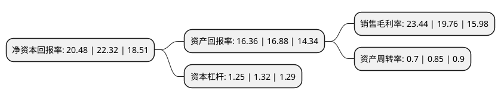

> 本页面由自动化程序生成于 2022年5月20日 01:22
> 内容可能存在错误，如有bug请提交issue至：https://github.com/Eroleice/doc-pi/issues
{.is-warning}

# 上市公司基本情况

## 基本资料

普联软件股份有限公司（以下简称“普联软件”）成立于2001年09月28日，济南市。于2021年06月03日在深交所创业板上市。

普联软件注册资本14,101.066万元，主营业务:公司是一家专注于能源行业管理软件开发的综合服务提供商。公司目前主要服务于石油石化企业信息化高端市场，为其提供适应其企业管理改进的信息化方案，软件的定制开发，国内外高端软件的集成和扩展开发，以及软件应用培训和实施服务。主要产品为集团企业财务集中管理系统，集团企业资金集中管理及结算系统，集团企业全面预算管理系统，财务共享服务系统，商业银行直联系统，集团企业WebHR人力资源管理系列产品，关联交易网上结算系统，集团企业资产条码管理系统。以下是详细信息：

- 公司名称: 普联软件股份有限公司
- 股票代码: 300996.SZ
- 所在地: 山东 - 济南市
- 成立日期: 2001年09月28日
- 注册资本: 14,101.066万元
- 法定代表人: 蔺国强
- 主营业务: 主营业务:公司是一家专注于能源行业管理软件开发的综合服务提供商公司目前主要服务于石油石化企业信息化高端市场，为其提供适应其企业管理改进的信息化方案，软件的定制开发，国内外高端软件的集成和扩展开发，以及软件应用培训和实施服务主要产品为集团企业财务集中管理系统，集团企业资金集中管理及结算系统，集团企业全面预算管理系统，财务共享服务系统，商业银行直联系统，集团企业WebHR人力资源管理系列产品，关联交易网上结算系统，集团企业资产条码管理系统
- 公司官网: www.pansoft.com
- 公司介绍: 公司是一家专注于能源行业管理软件开发的综合服务提供商。公司目前主要服务于石油石化企业信息化高端市场，为其提供适应其企业管理改进的信息化方案、软件的定制开发、国内外高端软件的集成和扩展开发以及软件应用培训和实施服务。

## 股东及高管情况

上市公司第一大股东为王虎，持股15,105,525股，占比10.71%，**疑似为**上市公司实际控制人。

截至2022年03月31日，上市公司的前十大股东中，共有4名自然人股东，5名机构股东，1个产品账户，其中5%以上大股东共有2名。上市公司前十大股东明细如下：

> 未能通过持股比例判定出上市公司实际控制人（持股30%以上）
> 可能存在通过间接持股、联合持股、协议控制等方式拥有实际控制权的主体，具体请参考上市公司定期公告！
{.is-warning}

> 截至2022年03月31日，上市公司前十大股东信息如下：

| 股东名称 | 持股数量（股） | 持股比例 |
| --- | --- | --- |
| 王虎 | 15,105,525 | 10.71% |
| 杭州金灿金道股权投资合伙企业(有限合伙) | 7,642,443 | 5.42% |
| 潍坊鲁信康大创业投资中心(有限合伙) | 4,589,753 | 3.25% |
| 重庆中冶泊达股权投资基金管理有限公司-重庆鼎恺投资中心(有限合伙) | 4,585,465 | 3.25% |
| 山西同仁股权投资合伙企业(有限合伙) | 4,390,545 | 3.11% |
| 济南实信投资合伙企业(有限合伙) | 3,928,785 | 2.79% |
| 上海联卡企业管理服务有限公司-重庆潜龙一号投资中心(有限合伙) | 2,987,176 | 2.12% |
| 张廷兵 | 2,687,858 | 1.91% |
| 相洪伟 | 2,687,858 | 1.91% |
| 任炳章 | 2,687,858 | 1.91% |

## 利润表分析

上市公司2021年总收入为5.81亿元，净利润为1.36亿元，实现盈利。

## 杜邦分析

> 数据列示周期：2021年 | 2020年 | 2019年
{.is-info}

上市公司的净资产收益率在近一年有所下降，下降幅度为-8.24%，其变化情况分解如下：
- 上市公司的销售毛利率在近一年上升了18.62%，可能是生产效率的提升、商品原材料价格下跌或商品价格的上涨所致。
- 上市公司的资产周转率在近一年下降了-17.65%，可能是源自于更慢的销售回款或库存管理效果下降。
- 上市公司的财务杠杆比率在近一年下降了-5.3%，可能是减少负债降低财务费用。

