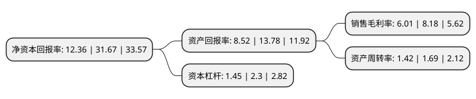

> 本页面由自动化程序生成于 2022年5月20日 01:22
> 内容可能存在错误，如有bug请提交issue至：https://github.com/Eroleice/doc-pi/issues
{.is-warning}

# 上市公司基本情况

## 基本资料

北京亚康万玮信息技术股份有限公司（以下简称“亚康股份”）成立于2007年06月01日，北京市。于2021年10月18日在深交所创业板上市。

亚康股份注册资本8,000万元，公司主营业务是为大中型互联网公司和云厂商提供IT设备销售及运维服务以下是详细信息：

- 公司名称: 北京亚康万玮信息技术股份有限公司
- 股票代码: 301085.SZ
- 所在地: 北京 - 北京市
- 成立日期: 2007年06月01日
- 注册资本: 8,000万元
- 法定代表人: 徐江
- 主营业务: 公司主营业务是为大中型互联网公司和云厂商提供IT设备销售及运维服务
- 公司官网: www.asiacom.net.cn
- 公司介绍: 公司是一家面向互联网数据中心，以IT设备销售、运维为核心的IT服务商，公司主营业务是为大中型互联网公司和云厂商提供IT设备销售及运维服务。公司致力于通过“C+4S(顾问Consultant、销售Sale、运维Service、备件Sparepart、反馈Survey)”的模式，为客户IT设备提供涵盖测试选型、运营维护、售后维保的全生命周期专业服务。凭借长期的技术、实践积累，公司形成了为数据中心产业链上下游客户同时服务的能力，形成了完善的服务体系。在产业链上游，公司与华为、戴尔、浪潮、中科曙光、新华三等主流品牌厂商及富士康、英业达等ODM厂商保持着长期稳定的合作；在产业链下游，公司为阿里巴巴、腾讯、百度、金山云、滴滴、网易、新浪、搜狐、五八同城、携程在内的大中型互联网公司和云厂商提供专业IT产品、服务。公司是高新技术企业，形成了数据中心运维可视化管理系统、IT资产管理系统、售后服务管理系统、知识共享系统等53项软件著作权。公司自设立以来，始终专注于互联网行业，通过模式创新、专业化服务，形成了具备自身特点的业务模式。

## 股东及高管情况

上市公司第一大股东为徐江，持股32,596,478股，占比40.75%，为上市公司实际控制人。

截至2022年03月31日，上市公司的前十大股东中，共有5名自然人股东，5名机构股东，其中5%以上大股东共有3名。上市公司前十大股东明细如下：

> 截至2022年03月31日，上市公司前十大股东信息如下：

| 股东名称 | 持股数量（股） | 持股比例 |
| --- | --- | --- |
| 徐江 | 32,596,478 | 40.75% |
| 天津祥远顺昌企业管理咨询中心(有限合伙) | 9,518,698 | 11.9% |
| 天津恒茂益盛企业管理咨询中心(有限合伙) | 8,252,914 | 10.32% |
| 古桂林 | 2,663,210 | 3.33% |
| 天津天佑永蓄企业管理咨询中心(有限合伙) | 1,658,671 | 2.07% |
| 王丰 | 1,518,941 | 1.9% |
| 曹伟 | 1,336,668 | 1.67% |
| 华纳众金投资管理有限公司-宁波梅山保税港区沣沅股权投资合伙企业(有限合伙) | 1,176,471 | 1.47% |
| 天津翼杨天益企业管理咨询中心(有限合伙) | 923,529 | 1.15% |
| 吴晓帆 | 354,420 | 0.44% |

## 利润表分析

上市公司2021年总收入为11.75亿元，净利润为0.7亿元，实现盈利。

## 杜邦分析

> 数据列示周期：2021年 | 2020年 | 2019年
{.is-info}

上市公司的净资产收益率在近一年有所下降，下降幅度为-60.97%，其变化情况分解如下：
- 上市公司的销售毛利率在近一年下降了-26.53%，可能是生产效率的下降、商品原材料价格上涨或商品价格的下跌所致。
- 上市公司的资产周转率在近一年下降了-15.98%，可能是源自于更慢的销售回款或库存管理效果下降。
- 上市公司的财务杠杆比率在近一年下降了-36.96%，可能是减少负债降低财务费用。

