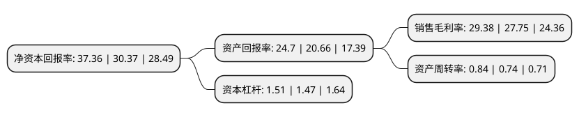

> 本页面由自动化程序生成于 2022年5月20日 01:23
> 内容可能存在错误，如有bug请提交issue至：https://github.com/Eroleice/doc-pi/issues
{.is-warning}

# 上市公司基本情况

## 基本资料

佳缘科技股份有限公司（以下简称“佳缘科技”）成立于1994年08月30日，成都市。于2022年01月17日在深交所创业板上市。

佳缘科技注册资本9,226.33万元，公司是一家信息化服务及网络信息安全综合解决方案的提供商，业务专注于国防军工，医疗健康和政务服务领域。报告期内，公司主要为医疗健康，国防军工，政务服务等领域的客户提供以自研数据平台系统为核心，集智能化系统建设和行业信息化定制应用的“软硬件一体”信息化综合解决方案。同时，依托于在信息化领域的深刻积累，公司大力开展网络信息安全产品的研发，面向国防军工等重点行业客户提供以公司自研编码学应用技术为核心的网络信息安全相关产品，包括软件系统，硬件平台，板卡和专用芯片等，为国防军工提供了关键的安全支撑与技术保障。以下是详细信息：

- 公司名称: 佳缘科技股份有限公司
- 股票代码: 301117.SZ
- 所在地: 四川 - 成都市
- 成立日期: 1994年08月30日
- 注册资本: 9,226.33万元
- 法定代表人: 王进
- 主营业务: 公司是一家信息化服务及网络信息安全综合解决方案的提供商，业务专注于国防军工，医疗健康和政务服务领域报告期内，公司主要为医疗健康，国防军工，政务服务等领域的客户提供以自研数据平台系统为核心，集智能化系统建设和行业信息化定制应用的“软硬件一体”信息化综合解决方案同时，依托于在信息化领域的深刻积累，公司大力开展网络信息安全产品的研发，面向国防军工等重点行业客户提供以公司自研编码学应用技术为核心的网络信息安全相关产品，包括软件系统，硬件平台，板卡和专用芯片等，为国防军工提供了关键的安全支撑与技术保障
- 公司官网: www.scjydz.com
- 公司介绍: 佳缘科技股份有限公司成立于1994年，是一家专业提供网络信息安全产品和信息化综合解决方案的国家高新技术企业，以“精细化”把握国防军工、医疗健康和政务服务领域客户需求为方向，坚持“技术创新驱动”，持续探索创新型网络信息安全产品和信息化综合解决方案服务模式，推动新一代信息技术在网络信息安全及信息化领域的融合应用。

## 股东及高管情况

上市公司第一大股东为王进，持股34,765,500股，占比37.68%，为上市公司实际控制人。

截至2022年03月31日，上市公司的前十大股东中，共有5名自然人股东，4名机构股东，1个产品账户，其中5%以上大股东共有4名。上市公司前十大股东明细如下：

> 截至2022年03月31日，上市公司前十大股东信息如下：

| 股东名称 | 持股数量（股） | 持股比例 |
| --- | --- | --- |
| 王进 | 34,765,500 | 37.68% |
| 朱伟华 | 9,140,000 | 9.91% |
| 朱伟民 | 6,602,500 | 7.16% |
| 厦门嘉德创信创业投资合伙企业(有限合伙) | 5,590,000 | 6.06% |
| 厦门鑫瑞集英股权投资合伙企业(有限合伙) | 3,600,000 | 3.9% |
| 北京家安明康企业管理顾问有限公司 | 2,670,000 | 2.89% |
| 成都佳多吉商务信息咨询中心(有限合伙) | 2,240,000 | 2.43% |
| 陈自郁 | 1,462,000 | 1.58% |
| 中信证券-招商银行-中信证券佳缘科技员工参与创业板战略配售集合资产管理计划 | 1,260,683 | 1.37% |
| 袁尚翠 | 1,000,000 | 1.08% |

## 利润表分析

上市公司2021年总收入为3.16亿元，净利润为0.93亿元，实现盈利。

## 杜邦分析

> 数据列示周期：2021年 | 2020年 | 2019年
{.is-info}

上市公司的净资产收益率在近一年有所上升，上升幅度为23.02%，其变化情况分解如下：
- 上市公司的销售毛利率在近一年上升了5.87%，可能是生产效率的提升、商品原材料价格下跌或商品价格的上涨所致。
- 上市公司的资产周转率在近一年上升了13.51%，可能是源自于更快的销售回款或库存管理效果提升。
- 上市公司的财务杠杆比率在近一年上升了2.72%，可能是增加负债扩大生产规模。

