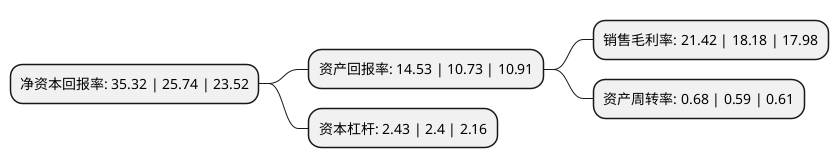

> 本页面由自动化程序生成于 2022年5月20日 01:23
> 内容可能存在错误，如有bug请提交issue至：https://github.com/Eroleice/doc-pi/issues
{.is-warning}

## 股东及高管情况

上市公司第一大股东为广州广电运通金融电子股份有限公司，持股37,260,000股，占比34.5%，为上市公司实际控制人。

截至2022年05月18日，上市公司的前十大股东中，共有1名自然人股东，5名机构股东，4个产品账户，其中5%以上大股东共有5名。上市公司前十大股东明细如下：

> 截至2022年05月18日，上市公司前十大股东信息如下：

| 股东名称 | 持股数量（股） | 持股比例 |
| --- | --- | --- |
| 广州广电运通金融电子股份有限公司 | 37,260,000 | 34.5% |
| 天津众志软科信息技术中心(有限合伙) | 15,764,300 | 14.6% |
| 天津融商力源企业管理咨询中心(有限合伙) | 11,563,800 | 10.71% |
| 衡凤英 | 9,600,400 | 8.89% |
| 天津科鼎好友信息技术中心(有限合伙) | 6,811,500 | 6.31% |
| 华泰中科江南家园1号创业板员工持股集合资产管理计划 | 2,700,000 | 2.5% |
| 华泰联合证券有限责任公司 | 98,417 | 0.09% |
| 中国建设银行股份有限公司企业年金计划-中国工商银行股份有限公司 | 27,811 | 0.03% |
| 中国工商银行股份有限公司企业年金计划-中国建设银行股份有限公司 | 27,811 | 0.03% |
| 浙江省贰号职业年金计划-中国银行 | 23,838 | 0.02% |

## 杜邦分析

> 数据列示周期：2020年 | 2019年 | 2018年
{.is-info}

上市公司的净资产收益率在近一年有所上升，上升幅度为37.22%，其变化情况分解如下：
- 上市公司的销售毛利率在近一年上升了17.82%，可能是生产效率的提升、商品原材料价格下跌或商品价格的上涨所致。
- 上市公司的资产周转率在近一年上升了15.25%，可能是源自于更快的销售回款或库存管理效果提升。
- 上市公司的财务杠杆比率在近一年上升了1.25%，可能是增加负债扩大生产规模。

