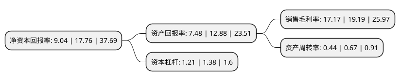

> 本页面由自动化程序生成于 2022年5月20日 01:23
> 内容可能存在错误，如有bug请提交issue至：https://github.com/Eroleice/doc-pi/issues
{.is-warning}

# 上市公司基本情况

## 基本资料

北京三维天地科技股份有限公司（以下简称“三维天地”）成立于1995年07月03日，北京市。于2022年01月07日在深交所创业板上市。

三维天地注册资本7,735万元，主营业务系检验检测信息化，数据资产管理等应用软件产品的研发，销售及实施，并提供相关的技术服务;主要产品包括检验检测信息管理软件，数据资产管理软件，供应链管理软件，技术服务四大类。以下是详细信息：

- 公司名称: 北京三维天地科技股份有限公司
- 股票代码: 301159.SZ
- 所在地: 北京 - 北京市
- 成立日期: 1995年07月03日
- 注册资本: 7,735万元
- 法定代表人: 金震
- 主营业务: 主营业务系检验检测信息化，数据资产管理等应用软件产品的研发，销售及实施，并提供相关的技术服务;主要产品包括检验检测信息管理软件，数据资产管理软件，供应链管理软件，技术服务四大类
- 公司官网: www.sunwayworld.com
- 公司介绍: 公司的主营业务系检验检测信息化、数据资产管理等应用软件产品的研发、销售及实施，并提供相关的技术服务。公司主要产品包括检验检测信息管理软件、数据资产管理软件、供应链管理软件、技术服务四大类。公司拥有多项自主知识产权及自主研发核心技术，是国内技术实力较强、团队规模较大、项目业绩较多的检验检测信息管理和数据资产管理软件开发及服务供应商。在数据资产管理软件产品方面，公司是国内较早拥有自主知识产权的主数据管理平台提供商，拥有多项相关知识产权和核心技术，具备综合的数据资产管理能力，所服务客户包括中国石化、五矿集团、国家能源集团、中兴通讯、比亚迪、宜家家居等大型企业集团。

## 股东及高管情况

上市公司第一大股东为金震，持股30,447,450股，占比39.36%，为上市公司实际控制人。

截至2022年03月31日，上市公司的前十大股东中，共有3名自然人股东，6名机构股东，1个产品账户，其中5%以上大股东共有3名。上市公司前十大股东明细如下：

> 截至2022年03月31日，上市公司前十大股东信息如下：

| 股东名称 | 持股数量（股） | 持股比例 |
| --- | --- | --- |
| 金震 | 30,447,450 | 39.36% |
| 北京维恒管理咨询中心(有限合伙) | 7,739,050 | 10.01% |
| 北京三维智鉴管理咨询中心(有限合伙) | 6,449,300 | 8.34% |
| 君信(上海)股权投资基金管理有限公司-苏民投君信(上海)产业升级与科技创新股权投资合伙企业(有限合伙) | 3,000,000 | 3.88% |
| 宁波保税区智望天浩股权投资合伙企业(有限合伙) | 2,063,600 | 2.67% |
| 苏州英豪资产管理有限公司-苏州成贤一期股权投资合伙企业(有限合伙) | 1,741,300 | 2.25% |
| 罗世文 | 1,547,700 | 2% |
| 杨进德 | 1,547,700 | 2% |
| 苏州雅枫投资管理有限公司-苏州雅枫一期股权投资合伙企业(有限合伙) | 967,450 | 1.25% |
| 苏州成贤三期股权投资合伙企业(有限合伙) | 773,850 | 1% |

## 杜邦分析

> 数据列示周期：2021年 | 2020年 | 2019年
{.is-info}

上市公司的净资产收益率在近一年有所下降，下降幅度为-49.1%，其变化情况分解如下：
- 上市公司的销售毛利率在近一年下降了-10.53%，可能是生产效率的下降、商品原材料价格上涨或商品价格的下跌所致。
- 上市公司的资产周转率在近一年下降了-34.33%，可能是源自于更慢的销售回款或库存管理效果下降。
- 上市公司的财务杠杆比率在近一年下降了-12.32%，可能是减少负债降低财务费用。

