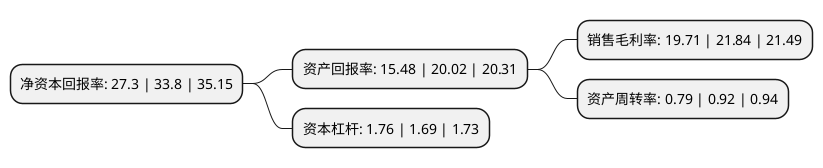

> 本页面由自动化程序生成于 2022年5月20日 01:23
> 内容可能存在错误，如有bug请提交issue至：https://github.com/Eroleice/doc-pi/issues
{.is-warning}

## 股东及高管情况

上市公司第一大股东为雍正，持股19,022,205股，占比26.83%，**疑似为**上市公司实际控制人。

截至2022年04月29日，上市公司的前十大股东中，共有7名自然人股东，3名机构股东，其中5%以上大股东共有5名。上市公司前十大股东明细如下：

> 未能通过持股比例判定出上市公司实际控制人（持股30%以上）
> 可能存在通过间接持股、联合持股、协议控制等方式拥有实际控制权的主体，具体请参考上市公司定期公告！
{.is-warning}

> 截至2022年04月29日，上市公司前十大股东信息如下：

| 股东名称 | 持股数量（股） | 持股比例 |
| --- | --- | --- |
| 雍正 | 19,022,205 | 26.83% |
| 丁江伟 | 6,288,113 | 8.87% |
| 北京厚源广汇投资管理中心(有限合伙) | 4,615,500 | 6.51% |
| 财通创新投资有限公司 | 3,979,239 | 5.61% |
| 徐源宏 | 3,649,626 | 5.15% |
| 融和日新(嘉兴)投资合伙企业(有限合伙) | 2,544,900 | 3.59% |
| 王滔 | 2,284,826 | 3.22% |
| 周永 | 1,574,162 | 2.22% |
| 顾锋 | 1,537,650 | 2.17% |
| 翟献慈 | 1,225,845 | 1.73% |

## 利润表分析

上市公司2021年总收入为3亿元，净利润为0.59亿元，实现盈利。

## 杜邦分析

> 数据列示周期：2021年 | 2020年 | 2019年
{.is-info}

上市公司的净资产收益率在近一年有所下降，下降幅度为-19.23%，其变化情况分解如下：
- 上市公司的销售毛利率在近一年下降了-9.75%，可能是生产效率的下降、商品原材料价格上涨或商品价格的下跌所致。
- 上市公司的资产周转率在近一年下降了-14.13%，可能是源自于更慢的销售回款或库存管理效果下降。
- 上市公司的财务杠杆比率在近一年上升了4.14%，可能是增加负债扩大生产规模。

