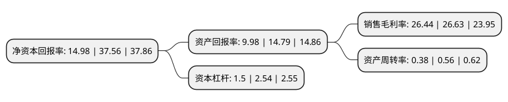

> 本页面由自动化程序生成于 2022年5月20日 01:23
> 内容可能存在错误，如有bug请提交issue至：https://github.com/Eroleice/doc-pi/issues
{.is-warning}

# 上市公司基本情况

## 基本资料

江苏泽宇智能电力股份有限公司（以下简称“泽宇智能”）成立于2011年11月18日，南通市。于2021年12月08日在深交所创业板上市。

泽宇智能注册资本13,200万元，公司以提供电力信息系统整体解决方案为导向，包含电力咨询设计，系统集成业务，工程施工及运维的一站式智能电网综合服务商。主营电网咨询设计业务和配电网咨询设计业务。以下是详细信息：

- 公司名称: 江苏泽宇智能电力股份有限公司
- 股票代码: 301179.SZ
- 所在地: 江苏 - 南通市
- 成立日期: 2011年11月18日
- 注册资本: 13,200万元
- 法定代表人: 张剑
- 主营业务: 公司以提供电力信息系统整体解决方案为导向，包含电力咨询设计，系统集成业务，工程施工及运维的一站式智能电网综合服务商主营电网咨询设计业务和配电网咨询设计业务
- 公司官网: www.zeyu99.com
- 公司介绍: 公司是一家专注于电力信息化业务的高新技术企业。公司以提供电力信息系统整体解决方案为导向，包含电力咨询设计、系统集成、工程施工及运维的一站式智能电网综合服务商。公司拥有电力行业(送电、变电)工程设计乙级资质、电力行业工程咨询乙级资质、通信工程施工总承包三级、电力工程施工总承包三级、电子与智能化工程专业承包贰级、承装(修、试)四级资质。公司是业内为数不多具有电力咨询设计、系统集成、工程施工及运维等资质齐全的企业之一，近年来公司参与承建了“北京至上海光传输设备改造项目”、“国家电网公司大容量骨干光传输网新疆延伸覆盖工程甘肃地区施工”、“青海-河南±800千伏特高压直流输电光纤通信工程包8甘肃地区通信设备安装施工”、“国网江苏省电力有限公司调度管理信息大区数据网二平面系统建设”等多个国家电网重点大型项目，在业内建立了良好的口碑，公司与电力系统优质客户的合作推动了公司创新能力的不断提升和服务能力的不断提高，同时为公司未来持续的发展奠定了坚实的基础。

## 股东及高管情况

上市公司第一大股东为张剑，持股73,590,000股，占比55.75%，为上市公司实际控制人。

截至2022年03月31日，上市公司的前十大股东中，共有5名自然人股东，2名机构股东，3个产品账户，其中5%以上大股东共有2名。上市公司前十大股东明细如下：

> 截至2022年03月31日，上市公司前十大股东信息如下：

| 股东名称 | 持股数量（股） | 持股比例 |
| --- | --- | --- |
| 张剑 | 73,590,000 | 55.75% |
| 南通沁德投资管理中心(有限合伙) | 10,000,000 | 7.58% |
| 常州沃泽慧宇实业投资中心(有限合伙) | 5,410,000 | 4.1% |
| 夏根兴 | 5,000,000 | 3.79% |
| 褚玉华 | 5,000,000 | 3.79% |
| 华泰证券资管-兴业银行-华泰泽宇智能家园1号创业板员工持股集合资产管理计划 | 2,067,696 | 1.57% |
| 招商银行股份有限公司-兴全轻资产投资混合型证券投资基金(LOF) | 1,018,382 | 0.77% |
| 徐宏亮 | 476,991 | 0.36% |
| 徐亚运 | 452,260 | 0.34% |
| 华富基金-上海银行-华富锦利集合资产管理计划 | 364,930 | 0.28% |

## 利润表分析

上市公司2021年总收入为7.03亿元，净利润为1.85亿元，实现盈利。

## 杜邦分析

> 数据列示周期：2021年 | 2020年 | 2019年
{.is-info}

上市公司的净资产收益率在近一年有所下降，下降幅度为-60.12%，其变化情况分解如下：
- 上市公司的销售毛利率在近一年下降了-0.71%，可能是生产效率的下降、商品原材料价格上涨或商品价格的下跌所致。
- 上市公司的资产周转率在近一年下降了-32.14%，可能是源自于更慢的销售回款或库存管理效果下降。
- 上市公司的财务杠杆比率在近一年下降了-40.94%，可能是减少负债降低财务费用。

