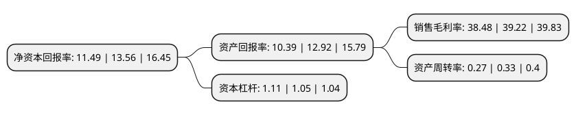

> 本页面由自动化程序生成于 2022年5月20日 01:23
> 内容可能存在错误，如有bug请提交issue至：https://github.com/Eroleice/doc-pi/issues
{.is-warning}

# 上市公司基本情况

## 基本资料

山东山大鸥玛软件股份有限公司（以下简称“鸥玛软件”）成立于2005年02月25日，济南市。于2021年11月19日在深交所创业板上市。

鸥玛软件注册资本15,341.76万元，考试与测评领域信息化产品的研究，开发，销售及服务以下是详细信息：

- 公司名称: 山东山大鸥玛软件股份有限公司
- 股票代码: 301185.SZ
- 所在地: 山东 - 济南市
- 成立日期: 2005年02月25日
- 注册资本: 15,341.76万元
- 法定代表人: 马磊
- 主营业务: 考试与测评领域信息化产品的研究，开发，销售及服务
- 公司官网: www.oumasoft.com
- 公司介绍: 公司自成立以来一直致力于考试领域软、硬件的研发与应用，在大型应用软件产品研发、大规模数据处理、国家级信息平台建设、全方位技术支持等信息化建设和服务方面积累了丰富的经验。长期为我国教育考试与评价、人事执业资格考试与测评、行业协会准入类资格考试、企事业单位人员招聘与考核、社会调查、知识性学习培训与测评等提供相应的信息化服务，目前已发展成为我国考试与测评领域知名的信息化建设整体方案提供商和应用服务商。

## 股东及高管情况

上市公司第一大股东为山东山大资本运营有限公司，持股47,263,944股，占比30.81%，为上市公司实际控制人。

截至2022年03月31日，上市公司的前十大股东中，共有8名自然人股东，2名机构股东，其中5%以上大股东共有1名。上市公司前十大股东明细如下：

> 截至2022年03月31日，上市公司前十大股东信息如下：

| 股东名称 | 持股数量（股） | 持股比例 |
| --- | --- | --- |
| 山东山大资本运营有限公司 | 47,263,944 | 30.81% |
| 马磊 | 5,347,566 | 3.49% |
| 张立毅 | 3,814,232 | 2.49% |
| 烟台信贞添盈股权投资中心(有限合伙) | 3,781,400 | 2.46% |
| 宋华 | 3,193,968 | 2.08% |
| 唐伟 | 3,111,561 | 2.03% |
| 王景刚 | 3,018,836 | 1.97% |
| 袁峰 | 2,948,357 | 1.92% |
| 张华英 | 2,729,697 | 1.78% |
| 陈义学 | 2,700,448 | 1.76% |

## 利润表分析

上市公司2021年总收入为2.09亿元，净利润为0.8亿元，实现盈利。

## 杜邦分析

> 数据列示周期：2021年 | 2020年 | 2019年
{.is-info}

上市公司的净资产收益率在近一年有所下降，下降幅度为-15.27%，其变化情况分解如下：
- 上市公司的销售毛利率在近一年下降了-1.89%，可能是生产效率的下降、商品原材料价格上涨或商品价格的下跌所致。
- 上市公司的资产周转率在近一年下降了-18.18%，可能是源自于更慢的销售回款或库存管理效果下降。
- 上市公司的财务杠杆比率在近一年上升了5.71%，可能是增加负债扩大生产规模。

