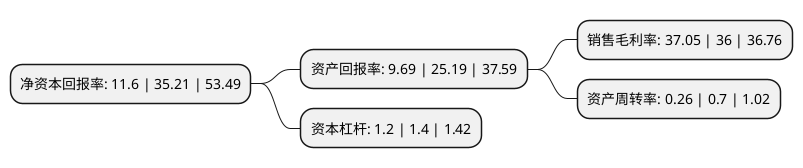

> 本页面由自动化程序生成于 2022年5月20日 01:23
> 内容可能存在错误，如有bug请提交issue至：https://github.com/Eroleice/doc-pi/issues
{.is-warning}

# 上市公司基本情况

## 基本资料

四川观想科技股份有限公司（以下简称“观想科技”）成立于2009年02月11日，成都市。于2021年12月06日在深交所创业板上市。

观想科技注册资本8,000万元，通用装备维修数字化平台(EMMS)的设计，开发，生产和服务;部队资源规划系统(ARP)的设计，开发和服务;装备信息化，装备全寿命周期管理信息化，军民融合式综合保障服务。以下是详细信息：

- 公司名称: 四川观想科技股份有限公司
- 股票代码: 301213.SZ
- 所在地: 四川 - 成都市
- 成立日期: 2009年02月11日
- 注册资本: 8,000万元
- 法定代表人: 魏强
- 主营业务: 通用装备维修数字化平台(EMMS)的设计，开发，生产和服务;部队资源规划系统(ARP)的设计，开发和服务;装备信息化，装备全寿命周期管理信息化，军民融合式综合保障服务
- 公司官网: www.gxwin.cn
- 公司介绍: 公司是一家以计算机软硬件及通信技术研发为核心，以部队管理和武器装备信息化研究和服务为特色的高科技企业。专业从事通用装备维修数字化平台(EMMS)的设计、开发、生产和服务；部队资源规划系统(ARP)的设计、开发和服务。主要产品包括：装备故障检测仪(便携式、车载式)、数据采集终端、终端监测系统、应急抢修系统、维修资源系统、工位信息化综合处理装置等。公司先后开发了十余项软硬件产品并在二十多家部队单位实施。其中1个产品获得军队科技进步一等奖，5个产品获得军队科技进步二等奖；公司产品还多次参加部队信息化成果展演示和全军性的评比等活动，均受到各级首长的好评。

## 股东及高管情况

上市公司第一大股东为魏强，持股33,945,600股，占比42.43%，为上市公司实际控制人。

截至2022年03月31日，上市公司的前十大股东中，共有6名自然人股东，3名机构股东，1个产品账户，其中5%以上大股东共有2名。上市公司前十大股东明细如下：

> 截至2022年03月31日，上市公司前十大股东信息如下：

| 股东名称 | 持股数量（股） | 持股比例 |
| --- | --- | --- |
| 魏强 | 33,945,600 | 42.43% |
| 四川观想发展科技合伙企业(有限合伙) | 12,300,000 | 15.38% |
| 易明权 | 2,132,000 | 2.67% |
| 韩恂 | 2,132,000 | 2.67% |
| 王礼节 | 2,132,000 | 2.67% |
| 成都创新风险投资有限公司 | 1,881,599 | 2.35% |
| 重庆上创新微股权投资基金管理有限公司-重庆上创科微股权投资基金合伙企业(有限合伙) | 1,800,000 | 2.25% |
| 成都同德创客投资管理合伙企业(有限合伙)-四川新同德大数据产业创业投资合伙企业(有限合伙) | 1,478,400 | 1.85% |
| 李飞 | 1,348,800 | 1.69% |
| 叶茂辉 | 566,400 | 0.71% |

## 利润表分析

上市公司2021年总收入为1.57亿元，净利润为0.58亿元，实现盈利。

## 杜邦分析

> 数据列示周期：2021年 | 2020年 | 2019年
{.is-info}

上市公司的净资产收益率在近一年有所下降，下降幅度为-67.05%，其变化情况分解如下：
- 上市公司的销售毛利率在近一年上升了2.92%，可能是生产效率的提升、商品原材料价格下跌或商品价格的上涨所致。
- 上市公司的资产周转率在近一年下降了-62.86%，可能是源自于更慢的销售回款或库存管理效果下降。
- 上市公司的财务杠杆比率在近一年下降了-14.29%，可能是减少负债降低财务费用。

