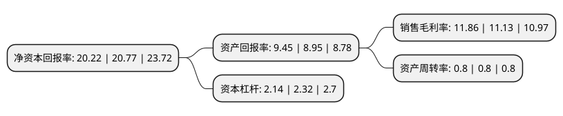

> 本页面由自动化程序生成于 2022年5月20日 01:23
> 内容可能存在错误，如有bug请提交issue至：https://github.com/Eroleice/doc-pi/issues
{.is-warning}

# 上市公司基本情况

## 基本资料

浙江华是科技股份有限公司（以下简称“华是科技”）成立于1998年06月02日，杭州市。于2022年03月07日在深交所创业板上市。

华是科技注册资本7,602.667万元，为智慧城市行业客户提供信息化系统集成及技术服务。公司以客户需求为导向，为智慧政务，智慧民生，智慧建筑等智慧城市细分领域客户提供项目设计，信息系统开发，软硬件采购，系统集成及运维服务的一站式综合解决方案。以下是详细信息：

- 公司名称: 浙江华是科技股份有限公司
- 股票代码: 301218.SZ
- 所在地: 浙江 - 杭州市
- 成立日期: 1998年06月02日
- 注册资本: 7,602.667万元
- 法定代表人: 俞永方
- 主营业务: 为智慧城市行业客户提供信息化系统集成及技术服务公司以客户需求为导向，为智慧政务，智慧民生，智慧建筑等智慧城市细分领域客户提供项目设计，信息系统开发，软硬件采购，系统集成及运维服务的一站式综合解决方案
- 公司官网: www.zjwhyis.com
- 公司介绍: 华是科技是一家致力于为智慧城市行业客户提供信息化系统集成及技术服务的高新技术企业。公司以客户需求为导向，为智慧政务、智慧民生、智慧建筑等智慧城市细分领域客户提供项目设计、信息系统开发、软硬件采购、系统集成及运维服务的一站式综合解决方案。公司拥有浙江省物联网应用省级企业研究院，始终重视技术创新体系建设，通过多年持续不断的研发投入与大型项目经验积累，在人工智能图像识别、应用软件设计等领域形成了具有自主知识产权的核心技术，拥有25项专利，174项软件著作权。经过多年的发展，公司已取得电子与智能化工程专业承包壹级、建筑智能化系统设计专项甲级、建筑机电安装工程专业承包贰级等资质证书，通过了各类质量管理体系、信息技术服务运行维护标准符合性认证、CMMI能力成熟度五级认证。公司始终重视项目实施过程的质量控制和管理，获得了政府部门等行业内优质客户的认可的同时，公司荣获浙江省首批“隐形冠军”企业、全国电子信息行业优秀企业、G20峰会先进施工企业、浙江数字新锐企业、浙江省创新企业百强等荣誉称号。

## 股东及高管情况

上市公司第一大股东为俞永方，持股13,188,000股，占比17.35%，**疑似为**上市公司实际控制人。

截至2022年03月31日，上市公司的前十大股东中，共有7名自然人股东，3名机构股东，其中5%以上大股东共有4名。上市公司前十大股东明细如下：

> 未能通过持股比例判定出上市公司实际控制人（持股30%以上）
> 可能存在通过间接持股、联合持股、协议控制等方式拥有实际控制权的主体，具体请参考上市公司定期公告！
{.is-warning}

> 截至2022年03月31日，上市公司前十大股东信息如下：

| 股东名称 | 持股数量（股） | 持股比例 |
| --- | --- | --- |
| 俞永方 | 13,188,000 | 17.35% |
| 叶建标 | 12,740,000 | 16.76% |
| 章忠灿 | 8,890,000 | 11.69% |
| 杭州中是股权投资管理合伙企业(有限合伙) | 5,348,000 | 7.03% |
| 杭州汇是贸易合伙企业(有限合伙) | 3,664,200 | 4.82% |
| 温志伟 | 3,454,640 | 4.54% |
| 杭州天是股权投资管理合伙企业(有限合伙) | 2,910,600 | 3.83% |
| 丁宏伟 | 2,262,260 | 2.98% |
| 成华 | 1,534,000 | 2.02% |
| 陈江海 | 917,280 | 1.21% |

## 利润表分析

上市公司2021年总收入为5.24亿元，净利润为0.62亿元，实现盈利。

## 杜邦分析

> 数据列示周期：2021年 | 2020年 | 2019年
{.is-info}

上市公司的净资产收益率在近一年有所下降，下降幅度为-2.65%，其变化情况分解如下：
- 上市公司的销售毛利率在近一年上升了6.56%，可能是生产效率的提升、商品原材料价格下跌或商品价格的上涨所致。
- 上市公司的资产周转率在近一年下降了0%，可能是源自于更慢的销售回款或库存管理效果下降。
- 上市公司的财务杠杆比率在近一年下降了-7.76%，可能是减少负债降低财务费用。

