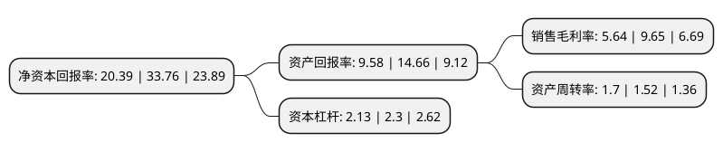

> 本页面由自动化程序生成于 2022年5月20日 01:23
> 内容可能存在错误，如有bug请提交issue至：https://github.com/Eroleice/doc-pi/issues
{.is-warning}

# 上市公司基本情况

## 基本资料

软通动力信息技术(集团)股份有限公司（以下简称“软通动力”）成立于2005年11月04日，北京市。于2022年03月15日在深交所创业板上市。

软通动力注册资本42,352.941万元，软通动力主要为通讯设备，互联网服务，金融，高科技与制造等多个行业客户提供端到端的软件与数字技术服务和数字化运营服务。以下是详细信息：

- 公司名称: 软通动力信息技术(集团)股份有限公司
- 股票代码: 301236.SZ
- 所在地: 北京 - 北京市
- 成立日期: 2005年11月04日
- 注册资本: 42,352.941万元
- 法定代表人: 刘天文
- 主营业务: 软通动力主要为通讯设备，互联网服务，金融，高科技与制造等多个行业客户提供端到端的软件与数字技术服务和数字化运营服务
- 公司官网: www.isoftstone.com
- 公司介绍: 公司是一家拥有深厚行业积累和全面技术实力的软件与信息技术服务商，主营业务是为通讯设备、互联网服务、金融、高科技与制造等多个行业客户提供端到端的软件与数字技术服务和数字化运营服务。公司先后获得工信部“中国软件业务收入前百家企业”、中国电子信息行业联合会“软件和信息技术服务综合竞争力百强企业”、中国软件行业协会“中国最具影响力软件和信息服务企业”、国际外包专业协会(IAOP)“GlobalOutsourcing100list Leader Size Group”等奖项荣誉。至2020年12月31日，公司已经拥有549项主要计算机软件著作权、34项专利，通过了CMMI五级、软件服务商交付能力一级、信息系统服务交付能力一级、ITSS信息技术服务运行维护能力成熟度二级、数据管理能力成熟度三级(稳健级)、信息系统建设和服务能力四级(优秀级)评估，并取得ISO20000、ISO9001、ISO27001、ISO14001、ISO45001、ISO22301认证。

## 股东及高管情况

上市公司第一大股东为刘天文，持股100,602,111股，占比23.75%，**疑似为**上市公司实际控制人。

截至2022年03月31日，上市公司的前十大股东中，共有1名自然人股东，6名机构股东，1个产品账户，2个海外主体，其中5%以上大股东共有3名。上市公司前十大股东明细如下：

> 未能通过持股比例判定出上市公司实际控制人（持股30%以上）
> 可能存在通过间接持股、联合持股、协议控制等方式拥有实际控制权的主体，具体请参考上市公司定期公告！
{.is-warning}

> 截至2022年03月31日，上市公司前十大股东信息如下：

| 股东名称 | 持股数量（股） | 持股比例 |
| --- | --- | --- |
| 刘天文 | 100,602,111 | 23.75% |
| CEL Bravo Limited | 41,070,232 | 9.7% |
| 长城(天津)股权投资基金管理有限责任公司-舟山长通投资合伙企业(有限合伙) | 21,199,387 | 5.01% |
| 无锡软石智动投资企业(有限合伙) | 20,564,905 | 4.86% |
| FNOF Easynet (HK) Limited | 20,209,465 | 4.77% |
| 晋汇国际(香港)有限公司 | 17,502,681 | 4.13% |
| 上海云锋麒泰投资中心(有限合伙) | 13,999,033 | 3.31% |
| 兴资睿盈(平潭)资产管理有限公司-福州经济技术开发区兴睿永瀛股权投资合伙企业(有限合伙) | 10,296,852 | 2.43% |
| 春华秋实(天津)股权投资管理有限公司-春华秋实(天津)股权投资合伙企业(有限合伙) | 9,352,389 | 2.21% |
| 青岛学而民和投资中心(有限合伙) | 8,833,082 | 2.09% |

## 利润表分析

上市公司2021年总收入为166.23亿元，净利润为9.37亿元，实现盈利。

## 杜邦分析

> 数据列示周期：2021年 | 2020年 | 2019年
{.is-info}

上市公司的净资产收益率在近一年有所下降，下降幅度为-39.6%，其变化情况分解如下：
- 上市公司的销售毛利率在近一年下降了-41.55%，可能是生产效率的下降、商品原材料价格上涨或商品价格的下跌所致。
- 上市公司的资产周转率在近一年上升了11.84%，可能是源自于更快的销售回款或库存管理效果提升。
- 上市公司的财务杠杆比率在近一年下降了-7.39%，可能是减少负债降低财务费用。

