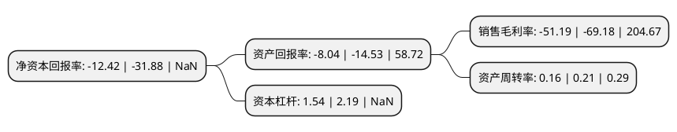

> 本页面由自动化程序生成于 2022年5月20日 01:25
> 内容可能存在错误，如有bug请提交issue至：https://github.com/Eroleice/doc-pi/issues
{.is-warning}

# 上市公司基本情况

## 基本资料

亿阳信通股份有限公司（以下简称“ST信通”）成立于1995年01月18日，哈尔滨市。于2000年07月20日在上交所主板上市。

ST信通注册资本63,105.207万元，主要业务:各类通信网络业务支撑系统，网络信息安全应用软件研发，生产，销售以及信息安全整体解决方案的实施，通信增值业务平台应用及服务。以下是详细信息：

- 公司名称: 亿阳信通股份有限公司
- 股票代码: 600289.SH
- 所在地: 黑龙江 - 哈尔滨市
- 成立日期: 1995年01月18日
- 注册资本: 63,105.207万元
- 法定代表人: 袁义祥
- 主营业务: 各类通信网络业务支撑系统，网络信息安全应用软件研发，生产，销售以及信息安全整体解决方案的实施，通信增值业务平台应用及服务
- 公司官网: www.boco.com.cn:8080/bocoit/index.asp
- 公司介绍: 公司是首批被国家科技部、国务院国资委、中华全国总工会认定的全国91家创新型高科技企业之一，是电信网络管理系统、企业IT运营支撑系统、信息安全、智能交通、高速公路机电工程、智慧城市、医疗信息化、物联网等方面的行业应用软件开发和解决方案提供商。公司主营业务是为电信运营商以及交通、广电、能源、金融、铁路等行业客户提供信息化支撑系统建设与服务。公司立足于通信及信息化领域，实行多元化发展战略，利用自身在电信行业长期积累的技术经验和客户资源，创造新的利润增长点，强化在DevOps，微服务技术能力等领域的核心竞争力。

## 股东及高管情况

上市公司第一大股东为亿阳集团股份有限公司，持股207,573,483股，占比32.89%，为上市公司实际控制人。

截至2022年03月31日，上市公司的前十大股东中，共有7名自然人股东，2名机构股东，1个产品账户，其中5%以上大股东共有2名。上市公司前十大股东明细如下：

> 截至2022年03月31日，上市公司前十大股东信息如下：

| 股东名称 | 持股数量（股） | 持股比例 |
| --- | --- | --- |
| 亿阳集团股份有限公司 | 207,573,483 | 32.89% |
| 大连万怡投资有限公司 | 33,245,833 | 5.27% |
| 吕秀芬 | 5,947,606 | 0.94% |
| 亿阳信通股份有限公司回购专用证券账户 | 5,937,300 | 0.94% |
| 王日昇 | 5,515,299 | 0.87% |
| 王树先 | 4,261,421 | 0.68% |
| 吴小林 | 4,251,514 | 0.67% |
| 程洪斌 | 4,090,000 | 0.65% |
| 赵睿 | 4,085,665 | 0.65% |
| 徐莉蓉 | 4,003,100 | 0.63% |

## 杜邦分析

> 数据列示周期：2021年 | 2020年 | 2019年
{.is-info}

上市公司的净资产收益率在近一年有所下降，下降幅度为-61.04%，其变化情况分解如下：
- 上市公司的销售毛利率在近一年下降了-26%，可能是生产效率的下降、商品原材料价格上涨或商品价格的下跌所致。
- 上市公司的资产周转率在近一年下降了-23.81%，可能是源自于更慢的销售回款或库存管理效果下降。
- 上市公司的财务杠杆比率在近一年下降了-29.68%，可能是减少负债降低财务费用。

