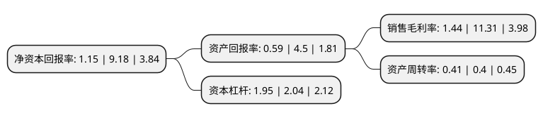

> 本页面由自动化程序生成于 2022年5月20日 01:26
> 内容可能存在错误，如有bug请提交issue至：https://github.com/Eroleice/doc-pi/issues
{.is-warning}

# 上市公司基本情况

## 基本资料

北京华胜天成科技股份有限公司（以下简称“华胜天成”）成立于1998年11月30日，北京市。于2004年04月27日在上交所主板上市。

华胜天成注册资本109,874.338万元，公司的主营业务主要由系统产品及系统集成服务，软件及软件开发业务及专业服务业务组成。以下是详细信息：

- 公司名称: 北京华胜天成科技股份有限公司
- 股票代码: 600410.SH
- 所在地: 北京 - 北京市
- 成立日期: 1998年11月30日
- 注册资本: 109,874.338万元
- 法定代表人: 王维航
- 主营业务: 公司的主营业务主要由系统产品及系统集成服务，软件及软件开发业务及专业服务业务组成
- 公司官网: www.teamsun.com.cn
- 公司介绍: 公司是中国领袖级的IT综合服务提供商，是国内第一家服务网络覆盖整个大中华区域及部分东南亚的本土IT服务商，业务方向涉及云计算、移动互联网、物联网、信息安全等领域，业务领域涵盖IT产品化服务、应用软件开发、系统集成及增值分销等多种IT服务业务，是中国最早提出IT服务产品化的公司。公司立足于大中华市场，以为企业及政府客户提升IT核心能力为使命，以卓越的解决方案、对客户业务的深刻理解以及遍布大中华及部分东南亚区域的高效密集的服务交付网络，为客户提供贯穿其IT建设整个生命周期的“一站式”服务。公司在电信、邮政、金融、政府、教育、制造、能源、交通、军队等领域拥有大量成功案例。公司是中国首家全面通过ISO9001、ISO20000、ISO27001三大国际质量管理体系认证的IT服务提供商，中国第一家真正意义上网络覆盖整个大中华和部分东南亚区域的IT服务提供商。

## 股东及高管情况

上市公司第一大股东为王维航，持股77,069,358股，占比7.01%，**疑似为**上市公司实际控制人。

截至2022年03月31日，上市公司的前十大股东中，共有5名自然人股东，5个产品账户，其中5%以上大股东共有1名。上市公司前十大股东明细如下：

> 未能通过持股比例判定出上市公司实际控制人（持股30%以上）
> 可能存在通过间接持股、联合持股、协议控制等方式拥有实际控制权的主体，具体请参考上市公司定期公告！
{.is-warning}

> 上市公司第一大股东持股不超过10%，请检查是否存在公司控制权风险！
{.is-danger}

> 截至2022年03月31日，上市公司前十大股东信息如下：

| 股东名称 | 持股数量（股） | 持股比例 |
| --- | --- | --- |
| 王维航 | 77,069,358 | 7.01% |
| 刘燕京 | 20,023,754 | 1.82% |
| 张仲华 | 18,470,107 | 1.68% |
| 易方达基金-中央汇金资产管理有限责任公司-易方达基金-汇金资管单一资产管理计划 | 18,158,980 | 1.65% |
| 荆涛 | 7,000,000 | 0.64% |
| 富淑梅 | 6,420,589 | 0.58% |
| 博时基金-农业银行-博时中证金融资产管理计划 | 4,548,320 | 0.41% |
| 广发基金-农业银行-广发中证金融资产管理计划 | 4,548,320 | 0.41% |
| 大成基金-农业银行-大成中证金融资产管理计划 | 4,548,320 | 0.41% |
| 易方达基金-农业银行-易方达中证金融资产管理计划 | 4,548,320 | 0.41% |

## 利润表分析

上市公司2021年总收入为37.99亿元，净利润为0.54亿元，实现盈利。

## 杜邦分析

> 数据列示周期：2021年 | 2020年 | 2019年
{.is-info}

上市公司的净资产收益率在近一年有所下降，下降幅度为-87.47%，其变化情况分解如下：
- 上市公司的销售毛利率在近一年下降了-87.27%，可能是生产效率的下降、商品原材料价格上涨或商品价格的下跌所致。
- 上市公司的资产周转率在近一年上升了2.5%，可能是源自于更快的销售回款或库存管理效果提升。
- 上市公司的财务杠杆比率在近一年下降了-4.41%，可能是减少负债降低财务费用。

