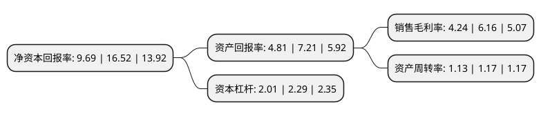

> 本页面由自动化程序生成于 2022年5月20日 01:26
> 内容可能存在错误，如有bug请提交issue至：https://github.com/Eroleice/doc-pi/issues
{.is-warning}

# 上市公司基本情况

## 基本资料

深圳市金证科技股份有限公司（以下简称“金证股份”）成立于1998年08月21日，深圳市。于2003年12月24日在上交所主板上市。

金证股份注册资本94,108.181万元，主要产品:系统集成，软件，硬件，系统维护。主营业务一直为金融IT领域以下是详细信息：

- 公司名称: 深圳市金证科技股份有限公司
- 股票代码: 600446.SH
- 所在地: 广东 - 深圳市
- 成立日期: 1998年08月21日
- 注册资本: 94,108.181万元
- 法定代表人: 李结义
- 主营业务: 主要产品:系统集成，软件，硬件，系统维护主营业务一直为金融IT领域
- 公司官网: www.szkingdom.com
- 公司介绍: 公司是国内金融科技领军企业。经过多年的发展，公司从一家金融软件公司发展成为集团化的金融科技企业。公司在稳固传统业务的同时，横向“拓展行业、拓展产品”，不断在新行业领域进行业务探索与产品创新。公司业务现已广泛覆盖证券、基金、银行、期货、保险、信托、综合金融、监管机构等领域，同时以软件技术为优势，带动智慧城市、IT运维等业务迅速发展。公司先后承担了国家“863计划项目”、“十五”国家科技攻关计划项目，作为全国金融证券IT著名品牌，“金证”得到市场广泛认同。公司是国家计算机信息系统集成一级资质单位，在金融、政府、教育等领域的信息化建设中卓有建树。公司是国家规划布局内重点软件企业、国家火炬计划软件产业基地骨干企业，深圳市高新技术企业。

## 股东及高管情况

上市公司第一大股东为李结义，持股84,566,270股，占比8.99%，**疑似为**上市公司实际控制人。

截至2022年05月11日，上市公司的前十大股东中，共有6名自然人股东，2名机构股东，1个产品账户，1个海外主体，其中5%以上大股东共有4名。上市公司前十大股东明细如下：

> 未能通过持股比例判定出上市公司实际控制人（持股30%以上）
> 可能存在通过间接持股、联合持股、协议控制等方式拥有实际控制权的主体，具体请参考上市公司定期公告！
{.is-warning}

> 上市公司第一大股东持股不超过10%，请检查是否存在公司控制权风险！
{.is-danger}

> 截至2022年05月11日，上市公司前十大股东信息如下：

| 股东名称 | 持股数量（股） | 持股比例 |
| --- | --- | --- |
| 李结义 | 84,566,270 | 8.99% |
| 杜宣 | 78,366,433 | 8.33% |
| 徐岷波 | 76,776,471 | 8.16% |
| 赵剑 | 75,678,438 | 8.04% |
| 广东恒阔投资管理有限公司 | 16,207,455 | 1.72% |
| 深圳前海联礼阳投资有限责任公司 | 14,595,478 | 1.55% |
| 香港中央结算有限公司(陆股通) | 11,860,320 | 1.26% |
| 倪国强 | 11,799,343 | 1.25% |
| 广州市玄元投资管理有限公司-玄元科新119号私募证券投资基金 | 9,245,800 | 0.98% |
| 沈志坤 | 4,491,891 | 0.48% |

## 利润表分析

上市公司2021年总收入为66.45亿元，净利润为2.81亿元，实现盈利。

## 杜邦分析

> 数据列示周期：2021年 | 2020年 | 2019年
{.is-info}

上市公司的净资产收益率在近一年有所下降，下降幅度为-41.34%，其变化情况分解如下：
- 上市公司的销售毛利率在近一年下降了-31.17%，可能是生产效率的下降、商品原材料价格上涨或商品价格的下跌所致。
- 上市公司的资产周转率在近一年下降了-3.42%，可能是源自于更慢的销售回款或库存管理效果下降。
- 上市公司的财务杠杆比率在近一年下降了-12.23%，可能是减少负债降低财务费用。

