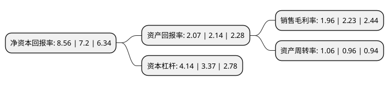

> 本页面由自动化程序生成于 2022年5月20日 01:27
> 内容可能存在错误，如有bug请提交issue至：https://github.com/Eroleice/doc-pi/issues
{.is-warning}

# 上市公司基本情况

## 基本资料

中国软件与技术服务股份有限公司（以下简称“中国软件”）成立于1994年03月01日，北京市。于2002年05月17日在上交所主板上市。

中国软件注册资本49,456.278万元，主要产品:系统软件及支撑软件，应用软件及服务，软件出口加工及服务。以下是详细信息：

- 公司名称: 中国软件与技术服务股份有限公司
- 股票代码: 600536.SH
- 所在地: 北京 - 北京市
- 成立日期: 1994年03月01日
- 注册资本: 49,456.278万元
- 法定代表人: 陈锡明
- 主营业务: 主要产品:系统软件及支撑软件，应用软件及服务，软件出口加工及服务
- 公司官网: www.css.com.cn
- 公司介绍: 公司是中国电子信息产业集团有限公司(CEC)控股的大型高科技上市企业，是CEC网络安全与信息化板块的核心企业。多年来，公司打造了完整的从操作系统、数据库、中间件、安全产品到应用系统的产品链条；在全国税务、党政、交通、知识产权、金融、能源、医卫、安监、信访、应急、工商、公用事业等国民经济重要领域积累了上万家客户群体；同时，紧随IT行业发展趋势，着力推动云计算、物联网、移动互联网、大数据等新技术的应用。公司现拥有系统集成、软件开发等众多国内一级行业资质，通过了国际质量管理、服务管理、信息安全管理等体系认证，是首批通过全国“软件企业”认证的企业，连续多年被评定为“国家规划布局内重点软件企业”，并入选国家软件百强企业。

## 股东及高管情况

上市公司第一大股东为中国电子有限公司，持股149,584,446股，占比30.25%，为上市公司实际控制人。

截至2022年03月31日，上市公司的前十大股东中，共有3名自然人股东，2名机构股东，3个产品账户，2个海外主体，其中5%以上大股东共有2名。上市公司前十大股东明细如下：

> 截至2022年03月31日，上市公司前十大股东信息如下：

| 股东名称 | 持股数量（股） | 持股比例 |
| --- | --- | --- |
| 中国电子有限公司 | 149,584,446 | 30.25% |
| 中国电子-中信证券-19中电EB担保及信托财产专户 | 60,000,000 | 12.13% |
| 白敏莉 | 9,171,823 | 1.85% |
| 全国社保基金五零三组合 | 3,499,951 | 0.71% |
| 刘康 | 2,928,500 | 0.59% |
| 香港中央结算有限公司(陆股通) | 2,547,040 | 0.52% |
| 吴霞 | 2,408,800 | 0.49% |
| 中国农业银行股份有限公司-中证500交易型开放式指数证券投资基金 | 1,341,622 | 0.27% |
| 招商银行股份有限公司-兴业收益增强债券型证券投资基金 | 1,261,089 | 0.25% |
| 贵州汇新科技发展有限公司 | 967,392 | 0.2% |

## 利润表分析

上市公司2021年总收入为103.51亿元，净利润为2.02亿元，实现盈利。

## 杜邦分析

> 数据列示周期：2021年 | 2020年 | 2019年
{.is-info}

上市公司的净资产收益率在近一年有所上升，上升幅度为18.89%，其变化情况分解如下：
- 上市公司的销售毛利率在近一年下降了-12.11%，可能是生产效率的下降、商品原材料价格上涨或商品价格的下跌所致。
- 上市公司的资产周转率在近一年上升了10.42%，可能是源自于更快的销售回款或库存管理效果提升。
- 上市公司的财务杠杆比率在近一年上升了22.85%，可能是增加负债扩大生产规模。

