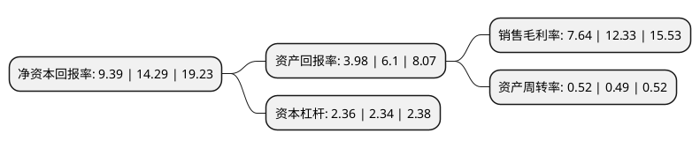

> 本页面由自动化程序生成于 2022年5月20日 01:27
> 内容可能存在错误，如有bug请提交issue至：https://github.com/Eroleice/doc-pi/issues
{.is-warning}

# 上市公司基本情况

## 基本资料

用友网络科技股份有限公司（以下简称“用友网络”）成立于1995年01月18日，北京市。于2001年05月18日在上交所主板上市。

用友网络注册资本343,632.384万元，主要产品:软件销售，技术服务及培训，软件配套用品销售。以下是详细信息：

- 公司名称: 用友网络科技股份有限公司
- 股票代码: 600588.SH
- 所在地: 北京 - 北京市
- 成立日期: 1995年01月18日
- 注册资本: 343,632.384万元
- 法定代表人: 王文京
- 主营业务: 主要产品:软件销售，技术服务及培训，软件配套用品销售
- 公司官网: www.yonyou.com
- 公司介绍: 公司是领先的综合型、融合化、生态式的企业服务提供商，致力于服务中国及全球企业与公共组织的数字化转型与智能化发展，推动企业服务产业变革，用创想与技术推动商业和社会进步。基于移动互联网、云计算、大数据、社交等先进技术，用友UAP私有云平台是中国大型企业和公共组织应用最广泛的企业计算平台，畅捷通公有云平台在小微企业和各类企业公共应用服务中得到运用。中国及亚太地区超过400万家企业与公共组织通过使用用友软件和云服务，实现精细管理、敏捷经营、业务创新。公司连续多年被评定为国家“规划布局内重点软件企业”，“用友ERP管理软件”系“中国名牌产品”，“用友”系中国驰名商标，公司拥有系统集成一级资质，获中国绿色公司百强。

## 股东及高管情况

上市公司第一大股东为北京用友科技有限公司，持股921,161,630股，占比26.81%，**疑似为**上市公司实际控制人。

截至2022年03月31日，上市公司的前十大股东中，共有2名自然人股东，6名机构股东，1个产品账户，1个海外主体，其中5%以上大股东共有3名。上市公司前十大股东明细如下：

> 未能通过持股比例判定出上市公司实际控制人（持股30%以上）
> 可能存在通过间接持股、联合持股、协议控制等方式拥有实际控制权的主体，具体请参考上市公司定期公告！
{.is-warning}

> 截至2022年03月31日，上市公司前十大股东信息如下：

| 股东名称 | 持股数量（股） | 持股比例 |
| --- | --- | --- |
| 北京用友科技有限公司 | 921,161,630 | 26.81% |
| 上海用友科技咨询有限公司 | 392,069,275 | 11.41% |
| 香港中央结算有限公司(陆股通) | 235,637,324 | 6.86% |
| 上海益倍管理咨询有限公司 | 128,080,000 | 3.73% |
| 北京用友企业管理研究所有限公司 | 102,322,506 | 2.98% |
| 葛卫东 | 76,259,780 | 2.22% |
| 刘世强 | 68,000,000 | 1.98% |
| 共青城优富投资管理合伙企业(有限合伙) | 50,361,271 | 1.47% |
| 中国证券金融股份有限公司 | 49,767,911 | 1.45% |
| 上海合道资产管理有限公司-合道科创1期私募证券投资基金 | 40,000,000 | 1.16% |

## 利润表分析

上市公司2021年总收入为89.31亿元，净利润为6.82亿元，实现盈利。

## 杜邦分析

> 数据列示周期：2021年 | 2020年 | 2019年
{.is-info}

上市公司的净资产收益率在近一年有所下降，下降幅度为-34.29%，其变化情况分解如下：
- 上市公司的销售毛利率在近一年下降了-38.04%，可能是生产效率的下降、商品原材料价格上涨或商品价格的下跌所致。
- 上市公司的资产周转率在近一年上升了6.12%，可能是源自于更快的销售回款或库存管理效果提升。
- 上市公司的财务杠杆比率在近一年上升了0.85%，可能是增加负债扩大生产规模。

