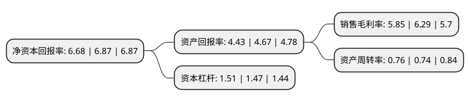

> 本页面由自动化程序生成于 2022年5月20日 01:27
> 内容可能存在错误，如有bug请提交issue至：https://github.com/Eroleice/doc-pi/issues
{.is-warning}

# 上市公司基本情况

## 基本资料

云赛智联股份有限公司（以下简称“云赛智联”）成立于1993年05月28日，上海市。于1990年12月19日在上交所主板上市。

云赛智联注册资本136,767.346万元，主营业务:消费电子，特殊电子，智能安防三大产业为主营业务。以下是详细信息：

- 公司名称: 云赛智联股份有限公司
- 股票代码: 600602.SH
- 所在地: 上海 - 上海市
- 成立日期: 1993年05月28日
- 注册资本: 136,767.346万元
- 法定代表人: 黄金刚
- 主营业务: 主营业务:消费电子，特殊电子，智能安防三大产业为主营业务
- 公司官网: www.inesa-it.com
- 公司介绍: 公司是一家以云计算与大数据、行业解决方案及智能化产品为核心业务的专业化信息技术服务企业。公司成立于1986年12月。1987年1月，公司作为首家试行股份制的国有企业向社会发行股票，是国内最早上市的“老八股”之一。公司于2015年实施了重大资产重组，将云赛信息(集团)有限公司和上海仪电科学仪器股份有限公司的信息服务核心业务及相关资产置入公司，由公司运营以新一代信息技术为特征的智慧城市核心产业。公司加快电子制造与信息技术相融合，不仅拥有坚实的物联网硬件产品研发制造基础，而且形成了以自主建设的高等级大规模数据中心为平台，集云计算业务架构和云计算服务能力为一体，全面向智能化、网络化、信息化转型升级，在物联网感知层、传输层到数据层、应用层，实施了从“云”到“端”的业务布局，为实现“智慧城市综合解决方案提供商”的战略定位和“中国一流的信息服务提供商”的战略目标而努力。

## 股东及高管情况

上市公司第一大股东为上海仪电电子(集团)有限公司，持股383,337,947股，占比28.03%，**疑似为**上市公司实际控制人。

截至2022年03月31日，上市公司的前十大股东中，共有5名自然人股东，3名机构股东，2个海外主体，其中5%以上大股东共有2名。上市公司前十大股东明细如下：

> 未能通过持股比例判定出上市公司实际控制人（持股30%以上）
> 可能存在通过间接持股、联合持股、协议控制等方式拥有实际控制权的主体，具体请参考上市公司定期公告！
{.is-warning}

> 截至2022年03月31日，上市公司前十大股东信息如下：

| 股东名称 | 持股数量（股） | 持股比例 |
| --- | --- | --- |
| 上海仪电电子(集团)有限公司 | 383,337,947 | 28.03% |
| 云赛信息(集团)有限公司 | 88,948,065 | 6.5% |
| 姚玮俊 | 7,337,871 | 0.54% |
| 谢敏 | 5,800,000 | 0.42% |
| VANGUARD TOTAL INTERNATIONAL   STOCK INDEX FUND | 5,100,446 | 0.37% |
| 程欣武 | 4,774,349 | 0.35% |
| 杭州乾钧投资管理有限公司 | 4,520,000 | 0.33% |
| WATTSBURG CO.LTD. | 4,400,558 | 0.32% |
| 张国兴 | 4,181,000 | 0.31% |
| 王广汇 | 4,143,400 | 0.3% |

## 利润表分析

上市公司2021年总收入为49.92亿元，净利润为2.92亿元，实现盈利。

## 杜邦分析

> 数据列示周期：2021年 | 2020年 | 2019年
{.is-info}

上市公司的净资产收益率在近一年有所下降，下降幅度为-2.77%，其变化情况分解如下：
- 上市公司的销售毛利率在近一年下降了-7%，可能是生产效率的下降、商品原材料价格上涨或商品价格的下跌所致。
- 上市公司的资产周转率在近一年上升了2.7%，可能是源自于更快的销售回款或库存管理效果提升。
- 上市公司的财务杠杆比率在近一年上升了2.72%，可能是增加负债扩大生产规模。

