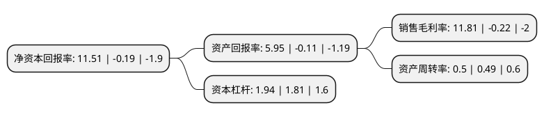

> 本页面由自动化程序生成于 2022年5月20日 01:28
> 内容可能存在错误，如有bug请提交issue至：https://github.com/Eroleice/doc-pi/issues
{.is-warning}

# 上市公司基本情况

## 基本资料

东软集团股份有限公司（以下简称“东软集团”）成立于1991年06月17日，沈阳市。于1996年06月18日在上交所主板上市。

东软集团注册资本124,237.03万元，主营业务:软件及系统集成，数字医疗。以下是详细信息：

- 公司名称: 东软集团股份有限公司
- 股票代码: 600718.SH
- 所在地: 辽宁 - 沈阳市
- 成立日期: 1991年06月17日
- 注册资本: 124,237.03万元
- 法定代表人: 刘积仁
- 主营业务: 主营业务:软件及系统集成，数字医疗
- 公司官网: www.neusoft.com
- 公司介绍: 东软创立于1991年，是中国第一家上市的软件公司，致力于以软件的创新，赋能新生活，推动社会发展。东软曾多次入选普华永道“全球软件百强企业”名单，荣获罗兰贝格国际咨询公司和《环球企业家》杂志评选的“全球竞争力中国公司20强“，波士顿咨询公司(BCG)评选的”中国50强全球挑战者“，Teleos和The KNOW Network评选的”亚洲最受赏识的知识型企业“等奖项，以及怡安翰威特授予的“中国最佳雇主”及“亚太地区最佳雇主”等荣誉。东软以软件技术为核心，业务聚焦智慧城市、医疗健康、智能汽车互联以及软件产品与服务领域。在智慧城市领域，东软以软件赋能城市发展，让社会更智慧。在医疗健康领域，东软以信息技术推动医疗健康生态的和谐，为医疗健康生态中的利益相关方创造价值、分享价值，推动信息技术与医疗的融合。在智能汽车互联领域，以软件为驱动，赋能智能汽车生活。在软件产品与服务领域，东软基于移动互联网、人工智能、云计算、大数据等新兴技术，提供拥有自主知识产权的软件产品、云与数据服务、产品工程与软件工程服务等，帮助企业实现业务的创新与转型。未来，东软将以更敏捷、创新的方式，以客户为中心，用软件帮助个人、企业及众多行业应对万物互联时代的升级，用超越技术的创意改变生活、改变世界。

## 股东及高管情况

上市公司第一大股东为大连东软控股有限公司，持股174,202,414股，占比14.0218%，**疑似为**上市公司实际控制人。

截至2022年05月12日，上市公司的前十大股东中，共有3名自然人股东，3名机构股东，2个产品账户，1个海外主体，1名其他股东，其中5%以上大股东共有3名。上市公司前十大股东明细如下：

> 未能通过持股比例判定出上市公司实际控制人（持股30%以上）
> 可能存在通过间接持股、联合持股、协议控制等方式拥有实际控制权的主体，具体请参考上市公司定期公告！
{.is-warning}

> 截至2022年05月12日，上市公司前十大股东信息如下：

| 股东名称 | 持股数量（股） | 持股比例 |
| --- | --- | --- |
| 大连东软控股有限公司 | 174,202,414 | 14.0218% |
| 东北大学科技产业集团有限公司 | 86,908,172 | 6.9954% |
| 阿尔派电子(中国)有限公司 | 78,683,547 | 6.3333% |
| 杨光 | 35,380,605 | 2.8478% |
| 阿尔派株式会社 | 20,057,144 | 1.6144% |
| SAP SE | 16,283,768 | 1.3107% |
| 徐燕超 | 13,600,673 | 1.0947% |
| 中国银行股份有限公司-招商安华债券型证券投资基金 | 9,907,200 | 0.7974% |
| 陈少先 | 8,300,000 | 0.6681% |
| 杭州亘曦资产管理有限公司-亘曦1号私募证券投资基金 | 8,200,000 | 0.66% |

## 利润表分析

上市公司2021年总收入为87.34亿元，净利润为10.31亿元，实现盈利。

## 杜邦分析

> 数据列示周期：2021年 | 2020年 | 2019年
{.is-info}

上市公司的净资产收益率在近一年有所下降，下降幅度为-6157.89%，其变化情况分解如下：
- 上市公司的销售毛利率在近一年下降了-5468.18%，可能是生产效率的下降、商品原材料价格上涨或商品价格的下跌所致。
- 上市公司的资产周转率在近一年上升了2.04%，可能是源自于更快的销售回款或库存管理效果提升。
- 上市公司的财务杠杆比率在近一年上升了7.18%，可能是增加负债扩大生产规模。

