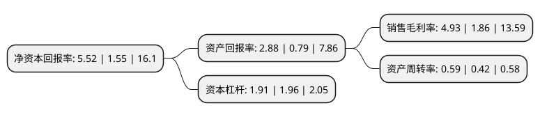

> 本页面由自动化程序生成于 2022年5月20日 01:28
> 内容可能存在错误，如有bug请提交issue至：https://github.com/Eroleice/doc-pi/issues
{.is-warning}

# 上市公司基本情况

## 基本资料

佳都科技集团股份有限公司（以下简称“佳都科技”）成立于2001年09月30日，广州市。于1996年07月16日在上交所主板上市。

佳都科技注册资本175,822.91万元，主营业务:智能安防，智能交通，通信增值，IT综合服务等。以下是详细信息：

- 公司名称: 佳都科技集团股份有限公司
- 股票代码: 600728.SH
- 所在地: 广东 - 广州市
- 成立日期: 2001年09月30日
- 注册资本: 175,822.91万元
- 法定代表人: 刘伟
- 主营业务: 主营业务:智能安防，智能交通，通信增值，IT综合服务等
- 公司官网: www.pcitech.com
- 公司介绍: 公司是中国人工智能技术与产品提供商，为全球提供人脸识别、视频结构化、知识图谱、大数据技术与服务。公司在人脸识别、视频结构化等、知识图谱、智能大数据等人工智能技术处于自主核心技术。公司立足于智慧城市、智能轨道交通、服务与产品集成领域，专注智能化技术与产品的研发及应用，经过多年的创新发展和资源积累，形成了在技术、市场、运营、服务等方面的竞争优势。公司先后参与中国40余个以公共安全、智慧交通为核心的智慧城市建设，其中，视频云+大数据应用平台是以服务实战为目的的视频云解决方案。

## 股东及高管情况

上市公司第一大股东为佳都集团有限公司，持股168,046,096股，占比9.56%，**疑似为**上市公司实际控制人。

截至2022年03月31日，上市公司的前十大股东中，共有1名自然人股东，4名机构股东，5个产品账户，其中5%以上大股东共有2名。上市公司前十大股东明细如下：

> 未能通过持股比例判定出上市公司实际控制人（持股30%以上）
> 可能存在通过间接持股、联合持股、协议控制等方式拥有实际控制权的主体，具体请参考上市公司定期公告！
{.is-warning}

> 上市公司第一大股东持股不超过10%，请检查是否存在公司控制权风险！
{.is-danger}

> 截至2022年03月31日，上市公司前十大股东信息如下：

| 股东名称 | 持股数量（股） | 持股比例 |
| --- | --- | --- |
| 佳都集团有限公司 | 168,046,096 | 9.56% |
| 堆龙佳都科技有限公司 | 103,103,099 | 5.86% |
| 广州市番禺通信管道建设投资有限公司 | 75,810,785 | 4.31% |
| 刘伟 | 66,604,509 | 3.79% |
| 广州腾昱投资合伙企业(有限合伙) | 43,001,492 | 2.45% |
| 横琴广金美好基金管理有限公司-美好贝叶斯一号私募证券投资基金 | 23,137,887 | 1.32% |
| 广发证券资管-何娟-广发资管申鑫利10号单一资产管理计划 | 18,776,788 | 1.07% |
| 珠海阿巴马资产管理有限公司-阿巴马元享红利9号私募证券投资基金 | 14,897,233 | 0.85% |
| 横琴广金美好基金管理有限公司-广金美好科新二十号私募证券投资基金 | 13,528,822 | 0.77% |
| 佳都科技集团股份有限公司-2021年员工持股计划 | 12,000,000 | 0.68% |

## 利润表分析

上市公司2021年总收入为62.23亿元，净利润为3.06亿元，实现盈利。

## 杜邦分析

> 数据列示周期：2021年 | 2020年 | 2019年
{.is-info}

上市公司的净资产收益率在近一年有所上升，上升幅度为256.13%，其变化情况分解如下：
- 上市公司的销售毛利率在近一年上升了165.05%，可能是生产效率的提升、商品原材料价格下跌或商品价格的上涨所致。
- 上市公司的资产周转率在近一年上升了40.48%，可能是源自于更快的销售回款或库存管理效果提升。
- 上市公司的财务杠杆比率在近一年下降了-2.55%，可能是减少负债降低财务费用。

