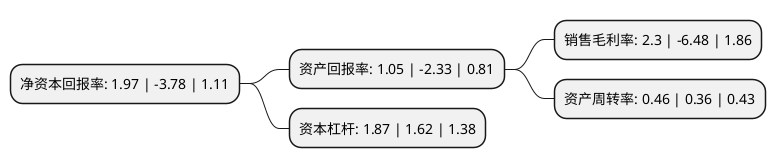

> 本页面由自动化程序生成于 2022年5月20日 01:28
> 内容可能存在错误，如有bug请提交issue至：https://github.com/Eroleice/doc-pi/issues
{.is-warning}

# 上市公司基本情况

## 基本资料

浪潮软件股份有限公司（以下简称“浪潮软件”）成立于1994年11月07日，泰安市。于1996年09月23日在上交所主板上市。

浪潮软件注册资本32,409.875万元，主营业务为通信及计算机软硬件技术开发，生产，销售;通信及计算机网络工程技术技术咨询，技术培训;资格证书许可范围内的进出口业务。主要产品:软件与系统集成，计算机及应用产品。以下是详细信息：

- 公司名称: 浪潮软件股份有限公司
- 股票代码: 600756.SH
- 所在地: 山东 - 泰安市
- 成立日期: 1994年11月07日
- 注册资本: 32,409.875万元
- 法定代表人: 王柏华
- 主营业务: 主营业务为通信及计算机软硬件技术开发，生产，销售;通信及计算机网络工程技术技术咨询，技术培训;资格证书许可范围内的进出口业务主要产品:软件与系统集成，计算机及应用产品
- 公司官网: www.Inspur.com
- 公司介绍: 公司是浪潮集团有限公司旗下的上市公司，主营软件与系统集成、计算机及应用产品。近年来，公司进一步明确了智慧政府方案和服务供应商的战略定位。面对良好的行业发展机遇，公司继续加大产品研发投入，加强自主创新和新产品研发力度，积极开发面向行业的云应用系统和解决方案，不断提高整体产品竞争力。同时积极适应市场需要，通过调整业务部门架构、优化运营模式、加强内部控制，坚定不移的走应用软件“产品化、专业化”道路，进一步探索跨行业的复制和应用，在行业巩固与创新、资源复用领域均获得长足发展，在行业解决方案、技术研发、项目实施和管理、市场管理、内部控制以及产品竞争力等方面取得长足进步。

## 股东及高管情况

上市公司第一大股东为浪潮软件科技有限公司，持股61,881,000股，占比19.09%，**疑似为**上市公司实际控制人。

截至2022年03月31日，上市公司的前十大股东中，共有6名自然人股东，2名机构股东，2个产品账户，其中5%以上大股东共有1名。上市公司前十大股东明细如下：

> 未能通过持股比例判定出上市公司实际控制人（持股30%以上）
> 可能存在通过间接持股、联合持股、协议控制等方式拥有实际控制权的主体，具体请参考上市公司定期公告！
{.is-warning}

> 截至2022年03月31日，上市公司前十大股东信息如下：

| 股东名称 | 持股数量（股） | 持股比例 |
| --- | --- | --- |
| 浪潮软件科技有限公司 | 61,881,000 | 19.09% |
| 武汉睿福德投资管理中心(有限合伙) | 3,229,394 | 1% |
| 李淑英 | 1,953,609 | 0.6% |
| 汤臻浩 | 1,660,000 | 0.51% |
| 闫维平 | 1,630,052 | 0.5% |
| 国通信托有限责任公司-国通信托·方信1号集合资金信托计划 | 1,600,000 | 0.49% |
| 袁广凤 | 1,562,932 | 0.48% |
| 马瑜 | 1,503,000 | 0.46% |
| 赵功锋 | 1,499,376 | 0.46% |
| 中国工商银行股份有限公司-诺安创新驱动灵活配置混合型证券投资基金 | 1,273,500 | 0.39% |

## 利润表分析

上市公司2021年总收入为18.3亿元，净利润为0.42亿元，实现盈利。

## 杜邦分析

> 数据列示周期：2021年 | 2020年 | 2019年
{.is-info}

上市公司的净资产收益率在近一年有所下降，下降幅度为-152.12%，其变化情况分解如下：
- 上市公司的销售毛利率在近一年下降了-135.49%，可能是生产效率的下降、商品原材料价格上涨或商品价格的下跌所致。
- 上市公司的资产周转率在近一年上升了27.78%，可能是源自于更快的销售回款或库存管理效果提升。
- 上市公司的财务杠杆比率在近一年上升了15.43%，可能是增加负债扩大生产规模。

