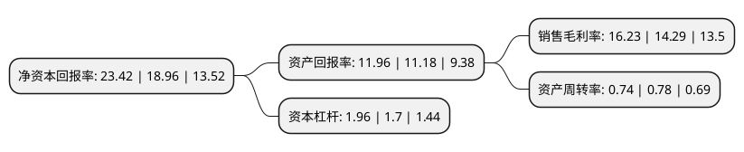

> 本页面由自动化程序生成于 2022年5月20日 01:29
> 内容可能存在错误，如有bug请提交issue至：https://github.com/Eroleice/doc-pi/issues
{.is-warning}

# 上市公司基本情况

## 基本资料

上海宝信软件股份有限公司（以下简称“宝信软件”）成立于1994年08月15日，上海市。于1994年03月11日在上交所主板上市。

宝信软件注册资本152,013.854万元，主要从事计算机，自动化，网络通讯系统及软硬件产品的研究，设计，开发，制造，集成，及相应的外包，维修，咨询等服务;主要产品和提供的劳务为软件开发，服务外包，系统集成，工程设计及智能交通，属软件和信息技术服务业。以下是详细信息：

- 公司名称: 上海宝信软件股份有限公司
- 股票代码: 600845.SH
- 所在地: 上海 - 上海市
- 成立日期: 1994年08月15日
- 注册资本: 152,013.854万元
- 法定代表人: 夏雪松
- 主营业务: 主要从事计算机，自动化，网络通讯系统及软硬件产品的研究，设计，开发，制造，集成，及相应的外包，维修，咨询等服务;主要产品和提供的劳务为软件开发，服务外包，系统集成，工程设计及智能交通，属软件和信息技术服务业
- 公司官网: www.baosight.com
- 公司介绍: 公司系宝钢股份控股的上市软件企业。历经多年发展,公司在推动信息化与工业化深度融合、支撑中国制造企业发展方式转变、提升城市智能化水平等方面作出了突出的贡献，成为中国领先的工业软件行业应用解决方案和服务提供商。公司产品与服务业绩遍及钢铁、交通、医药、有色、化工、装备制造、金融、公共服务、水利水务等多个行业。公司紧紧围绕“互联网+”、“中国制造2025”等国家战略，致力于推动新一代信息技术与制造技术融合发展，引领中国工业化与信息化的深度融合，促进制造企业从信息化、自动化向智慧制造迈进；同时，公司还持续强化智慧城市相关领域的开拓，在智能交通、智慧楼宇、公共服务等领域也拥有强大实力，努力推动智慧城市创新。

## 股东及高管情况

上市公司第一大股东为宝山钢铁股份有限公司，持股753,276,826股，占比49.55%，为上市公司实际控制人。

截至2022年03月31日，上市公司的前十大股东中，共有1名自然人股东，2名机构股东，1个产品账户，6个海外主体，其中5%以上大股东共有2名。上市公司前十大股东明细如下：

> 截至2022年03月31日，上市公司前十大股东信息如下：

| 股东名称 | 持股数量（股） | 持股比例 |
| --- | --- | --- |
| 宝山钢铁股份有限公司 | 753,276,826 | 49.55% |
| 香港中央结算有限公司(陆股通) | 92,457,439 | 6.08% |
| 金樟贤 | 12,228,149 | 0.8% |
| 马钢(集团)控股有限公司 | 11,692,179 | 0.77% |
| MORGAN   STANLEY & CO. INTERNATIONAL PLC | 10,976,181 | 0.72% |
| 中国工商银行股份有限公司-富国天惠精选成长混合型证券投资基金(LOF) | 10,000,000 | 0.66% |
| VANGUARD EMERGING MARKETS STOCK INDEX FUND | 6,494,089 | 0.43% |
| SHENWAN   HONGYUAN NOMINEES (H.K.) LIMITED | 6,346,915 | 0.42% |
| SHENWAN HONGYUAN NOMINEES (H.K.) LIMITED | 6,346,915 | 0.42% |
| VANGUARD   TOTAL INTERNATIONAL STOCK INDEX FUND | 5,989,540 | 0.39% |

## 利润表分析

上市公司2021年总收入为117.59亿元，净利润为19.08亿元，实现盈利。

## 杜邦分析

> 数据列示周期：2021年 | 2020年 | 2019年
{.is-info}

上市公司的净资产收益率在近一年有所上升，上升幅度为23.52%，其变化情况分解如下：
- 上市公司的销售毛利率在近一年上升了13.58%，可能是生产效率的提升、商品原材料价格下跌或商品价格的上涨所致。
- 上市公司的资产周转率在近一年下降了-5.13%，可能是源自于更慢的销售回款或库存管理效果下降。
- 上市公司的财务杠杆比率在近一年上升了15.29%，可能是增加负债扩大生产规模。

