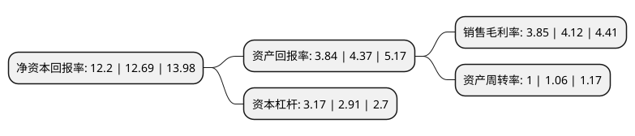

> 本页面由自动化程序生成于 2022年5月20日 01:29
> 内容可能存在错误，如有bug请提交issue至：https://github.com/Eroleice/doc-pi/issues
{.is-warning}

# 上市公司基本情况

## 基本资料

中电科数字技术股份有限公司（以下简称“电科数字”）成立于1993年09月13日，上海市。于1994年03月24日在上交所主板上市。

电科数字注册资本42,685.223万元，主营业务包括面向IT基础设施的系统集成和专业服务，软件和行业解决方案，IT产品增值销售，智能建筑与机房等。以下是详细信息：

- 公司名称: 中电科数字技术股份有限公司
- 股票代码: 600850.SH
- 所在地: 上海 - 上海市
- 成立日期: 1993年09月13日
- 注册资本: 42,685.223万元
- 法定代表人: 江波
- 主营业务: 主营业务包括面向IT基础设施的系统集成和专业服务，软件和行业解决方案，IT产品增值销售，智能建筑与机房等
- 公司官网: www.shecc.com
- 公司介绍: 公司是中国大陆IT行业首家上市公司。公司主营业务集中在增值销售、专业服务、解决方案及创新业务领域，在政府、教育、金融、电信、制造、能源及交通等行业拥有广泛的客户基础。公司依托上市公司平台，卓越服务、创新发展，致力打造中国软件与信息服务龙头企业。公司注重能力建设，在“新华东”战略的指导下，通过战略有效资本运作、布局产业价值链，积极发展信息技术和传统行业业务相融合的创新模式，实现业务转型升级。公司拥有广泛的客户基础和丰富的行业经验，在金融、运营商与互联网、政府与公共服务、企业等领域均衡发展，多年来赢得了客户的信赖和业界良好的口碑。

## 股东及高管情况

上市公司第一大股东为中国电子科技集团公司第三十二研究所，持股103,285,166股，占比24.2%，**疑似为**上市公司实际控制人。

截至2022年03月31日，上市公司的前十大股东中，共有5名自然人股东，4名机构股东，1个海外主体，其中5%以上大股东共有2名。上市公司前十大股东明细如下：

> 未能通过持股比例判定出上市公司实际控制人（持股30%以上）
> 可能存在通过间接持股、联合持股、协议控制等方式拥有实际控制权的主体，具体请参考上市公司定期公告！
{.is-warning}

> 截至2022年03月31日，上市公司前十大股东信息如下：

| 股东名称 | 持股数量（股） | 持股比例 |
| --- | --- | --- |
| 中国电子科技集团公司第三十二研究所 | 103,285,166 | 24.2% |
| 中电科投资控股有限公司 | 55,306,024 | 12.96% |
| 宋世民 | 12,623,588 | 2.96% |
| 郭文奇 | 12,337,726 | 2.89% |
| 张为民 | 11,939,770 | 2.8% |
| 中国兵器装备集团有限公司 | 11,388,468 | 2.67% |
| 苏宗伟 | 7,930,050 | 1.86% |
| 郭晓民 | 6,921,000 | 1.62% |
| 中国人民财产保险股份有限公司-传统-收益组合 | 6,098,365 | 1.43% |
| 香港中央结算有限公司(陆股通) | 4,492,358 | 1.05% |

## 利润表分析

上市公司2021年总收入为89.61亿元，净利润为3.45亿元，实现盈利。

## 杜邦分析

> 数据列示周期：2021年 | 2020年 | 2019年
{.is-info}

上市公司的净资产收益率在近一年有所下降，下降幅度为-3.86%，其变化情况分解如下：
- 上市公司的销售毛利率在近一年下降了-6.55%，可能是生产效率的下降、商品原材料价格上涨或商品价格的下跌所致。
- 上市公司的资产周转率在近一年下降了-5.66%，可能是源自于更慢的销售回款或库存管理效果下降。
- 上市公司的财务杠杆比率在近一年上升了8.93%，可能是增加负债扩大生产规模。

