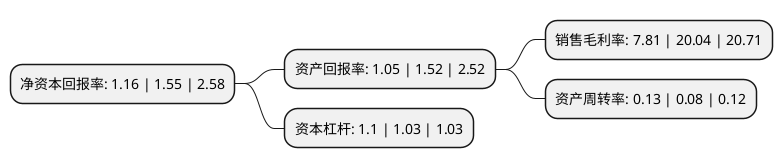

> 本页面由自动化程序生成于 2022年5月20日 01:29
> 内容可能存在错误，如有bug请提交issue至：https://github.com/Eroleice/doc-pi/issues
{.is-warning}

# 上市公司基本情况

## 基本资料

广东梅雁吉祥水电股份有限公司（以下简称“梅雁吉祥”）成立于1993年01月01日，梅州市。于1994年09月12日在上交所主板上市。

梅雁吉祥注册资本189,814.868万元，主营业务是电力生产，生产制造加工业。以下是详细信息：

- 公司名称: 广东梅雁吉祥水电股份有限公司
- 股票代码: 600868.SH
- 所在地: 广东 - 梅州市
- 成立日期: 1993年01月01日
- 注册资本: 189,814.868万元
- 法定代表人: 张能勇
- 主营业务: 主营业务是电力生产，生产制造加工业
- 公司官网: www.chinameiyan.com
- 公司介绍: 公司的主营业务为水力发电和生产制造业。依托水电行业生产运营成本低、毛利率高的特点，加上公司电站所在区域广东省上网电价等优势，公司水力发电的主营业务在雨量较好的年度收入较为稳定，为公司的发展奠定了良好的基础；公司积极发展注重发明创造和技术创新，公司及控股子公司合计拥有多项国家知识产权局授权专利，有效提升了公司的竞争能力。公司立足水力发电主业，努力寻找新的机遇，加快清洁能源发展步伐，拓宽绿色发展之路。公司秉承“为股东创造价值，为社会创造效益，为员工创造福利”的发展理念，依托证券市场不断扩大经营资本、优化产业结构。

## 股东及高管情况

上市公司第一大股东为广东能润资产管理有限公司，持股135,500,173股，占比7.14%，**疑似为**上市公司实际控制人。

截至2022年03月31日，上市公司的前十大股东中，共有8名自然人股东，1名机构股东，1个产品账户，其中5%以上大股东共有1名。上市公司前十大股东明细如下：

> 未能通过持股比例判定出上市公司实际控制人（持股30%以上）
> 可能存在通过间接持股、联合持股、协议控制等方式拥有实际控制权的主体，具体请参考上市公司定期公告！
{.is-warning}

> 上市公司第一大股东持股不超过10%，请检查是否存在公司控制权风险！
{.is-danger}

> 截至2022年03月31日，上市公司前十大股东信息如下：

| 股东名称 | 持股数量（股） | 持股比例 |
| --- | --- | --- |
| 广东能润资产管理有限公司 | 135,500,173 | 7.14% |
| 李明 | 37,299,978 | 1.97% |
| 徐显丰 | 20,760,017 | 1.09% |
| 王瀚博 | 13,876,731 | 0.73% |
| 中国银行股份有限公司-博时中证全球中国教育主题交易型开放式指数证券投资基金(QDII) | 9,412,800 | 0.5% |
| 彭金秀 | 7,041,610 | 0.37% |
| 龙斌 | 6,789,000 | 0.36% |
| 杨秋婷 | 6,780,500 | 0.36% |
| 龙飞 | 6,105,100 | 0.32% |
| 苏津生 | 5,827,407 | 0.31% |

## 利润表分析

上市公司2021年总收入为3.48亿元，净利润为0.27亿元，实现盈利。

## 杜邦分析

> 数据列示周期：2021年 | 2020年 | 2019年
{.is-info}

上市公司的净资产收益率在近一年有所下降，下降幅度为-25.16%，其变化情况分解如下：
- 上市公司的销售毛利率在近一年下降了-61.03%，可能是生产效率的下降、商品原材料价格上涨或商品价格的下跌所致。
- 上市公司的资产周转率在近一年上升了62.5%，可能是源自于更快的销售回款或库存管理效果提升。
- 上市公司的财务杠杆比率在近一年上升了6.8%，可能是增加负债扩大生产规模。

