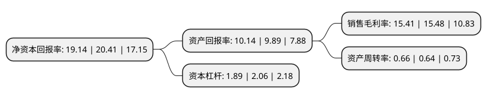

> 本页面由自动化程序生成于 2022年5月20日 01:32
> 内容可能存在错误，如有bug请提交issue至：https://github.com/Eroleice/doc-pi/issues
{.is-warning}

# 上市公司基本情况

## 基本资料

上海泛微网络科技股份有限公司（以下简称“ST泛微”）成立于2001年03月14日，上海市。于2017年01月13日在上交所主板上市。

ST泛微注册资本26,060.307万元，主要从事协同管理软件产品的研发，销售及相关技术服务。主要产品为e-office，e-cology和e-weaver。以下是详细信息：

- 公司名称: 上海泛微网络科技股份有限公司
- 股票代码: 603039.SH
- 所在地: 上海 - 上海市
- 成立日期: 2001年03月14日
- 注册资本: 26,060.307万元
- 法定代表人: 韦利东
- 主营业务: 主要从事协同管理软件产品的研发，销售及相关技术服务主要产品为e-office，e-cology和e-weaver
- 公司官网: www.weaver.com.cn
- 公司介绍: 公司注于协同管理软件领域，并致力于以协同OA为核心帮助企业构建全员统一的移动办公平台。在移动办公领域，打造了上海医药、复星集团、绿地集团等多个业界标杆。泛微是“国家规划布局内重点软件企业”。公司以专注、专业的态度，以强大的产品研发能力、本地化能力、咨询能力，成功服务于全国上万家企事业单位客户，其中包括PICC、绿地集团、中国能建、上汽集团、浙江物产集团、正威集团、复星集团、百丽国际、上海医药、格力电器、TCL、双汇集团、伊利集团、恒安集团、万达集团、王府井百货等世界及中国500强企业。公司发布了以“移动化、社交化、平台化、云端化”四化为核心的全新一代产品系列，包括面向大中型企业的平台型产品e-cology、面向中小型企业的应用型产品e-office、一体化的移动办公云OA平台eteams，面向政务市场的移动政务平台e-nation，以及帮助企业对接移动互联的移动办公平台e-mobile、移动集成平台e-bridge等。

## 股东及高管情况

上市公司第一大股东为韦利东，持股84,845,266股，占比32.5573%，为上市公司实际控制人。

截至2022年05月12日，上市公司的前十大股东中，共有6名自然人股东，1名机构股东，2个产品账户，1个海外主体，其中5%以上大股东共有5名。上市公司前十大股东明细如下：

> 截至2022年05月12日，上市公司前十大股东信息如下：

| 股东名称 | 持股数量（股） | 持股比例 |
| --- | --- | --- |
| 韦利东 | 84,845,266 | 32.5573% |
| 韦利东 | 84,345,266 | 32.3654% |
| 韦利东 | 84,342,666 | 32.36% |
| 韦锦坤 | 49,047,265 | 18.82% |
| 韦锦坤 | 49,047,265 | 18.82% |
| 深圳市腾讯产业投资基金有限公司 | 12,737,785 | 4.89% |
| 香港中央结算有限公司(陆股通) | 6,089,950 | 2.34% |
| 上海影才文化中心(有限合伙) | 4,764,358 | 1.83% |
| 季学庆 | 4,337,328 | 1.66% |
| 中国农业银行股份有限公司-嘉实新兴产业股票型证券投资基金 | 4,143,317 | 1.59% |

## 利润表分析

上市公司2021年总收入为20.02亿元，净利润为3.08亿元，实现盈利。

## 杜邦分析

> 数据列示周期：2021年 | 2020年 | 2019年
{.is-info}

上市公司的净资产收益率在近一年有所下降，下降幅度为-6.22%，其变化情况分解如下：
- 上市公司的销售毛利率在近一年下降了-0.45%，可能是生产效率的下降、商品原材料价格上涨或商品价格的下跌所致。
- 上市公司的资产周转率在近一年上升了3.13%，可能是源自于更快的销售回款或库存管理效果提升。
- 上市公司的财务杠杆比率在近一年下降了-8.25%，可能是减少负债降低财务费用。

