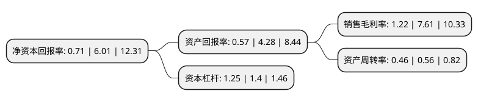

> 本页面由自动化程序生成于 2022年5月20日 01:32
> 内容可能存在错误，如有bug请提交issue至：https://github.com/Eroleice/doc-pi/issues
{.is-warning}

# 上市公司基本情况

## 基本资料

北京海量数据技术股份有限公司（以下简称“海量数据”）成立于2007年07月30日，北京市。于2017年03月06日在上交所主板上市。

海量数据注册资本28,328.179万元，主营业务主要包括系统集成，技术服务，服务销售及产品销售。主要产品:硬件(包括服务器，存储设备，磁带库等)，软件(包括操作系统，虚拟化，中间件，数据库，数据集成，备份软件等)等多品牌产品。以下是详细信息：

- 公司名称: 北京海量数据技术股份有限公司
- 股票代码: 603138.SH
- 所在地: 北京 - 北京市
- 成立日期: 2007年07月30日
- 注册资本: 28,328.179万元
- 法定代表人: 闫忠文
- 主营业务: 主营业务主要包括系统集成，技术服务，服务销售及产品销售主要产品:硬件(包括服务器，存储设备，磁带库等)，软件(包括操作系统，虚拟化，中间件，数据库，数据集成，备份软件等)等多品牌产品
- 公司官网: www.vastdata.com.cn
- 公司介绍: 公司是中国领先的数据技术提供商，业务涵盖数据服务、数据分析和数据应用等领域。总部设在北京，在沈阳、济南、上海、南京、武汉、广州、深圳、成都、西安等多个城市设有办事机构，在全国主要的省会城市和计划单列市常驻技术专家和销售顾问，可为客户提供7*24小时支持。公司在行业内率先提出了“专注数据”的发展战略和业务定位，并快速完成在“数据+”产业链的布局，主要针对大中型企事业单位的数据中心，搭建IT基础设施数据平台，提供相关的数据存储与安全、数据库与数据管理、数据分析与应用等方面的解决方案和技术服务。随着数据技术时代的来临，数据已成为企业的核心资产和创新驱动力，海量数据凭借多年积累的实践经验，获得用户及合作伙伴的良好商誉。

## 股东及高管情况

上市公司第一大股东为陈志敏，持股70,629,737股，占比24.9327%，**疑似为**上市公司实际控制人。

截至2022年03月31日，上市公司的前十大股东中，共有5名自然人股东，4名机构股东，1个产品账户，其中5%以上大股东共有2名。上市公司前十大股东明细如下：

> 未能通过持股比例判定出上市公司实际控制人（持股30%以上）
> 可能存在通过间接持股、联合持股、协议控制等方式拥有实际控制权的主体，具体请参考上市公司定期公告！
{.is-warning}

> 截至2022年03月31日，上市公司前十大股东信息如下：

| 股东名称 | 持股数量（股） | 持股比例 |
| --- | --- | --- |
| 陈志敏 | 70,629,737 | 24.9327% |
| 朱华威 | 63,385,330 | 22.38% |
| 张建飞 | 8,785,713 | 3.1% |
| 中国平安人寿保险股份有限公司-投连-个险投连 | 4,000,000 | 1.41% |
| 王武 | 2,692,690 | 0.95% |
| 深圳市彩云网影科技有限公司 | 2,367,100 | 0.84% |
| 国泰君安证券股份有限公司 | 2,214,285 | 0.78% |
| 华泰证券股份有限公司 | 2,032,046 | 0.72% |
| 王栋 | 2,010,600 | 0.71% |
| 招商银行股份有限公司-汇添富绝对收益策略定期开放混合型发起式证券投资基金 | 2,000,000 | 0.71% |

## 利润表分析

上市公司2021年总收入为4.2亿元，净利润为0.05亿元，实现盈利。

## 杜邦分析

> 数据列示周期：2021年 | 2020年 | 2019年
{.is-info}

上市公司的净资产收益率在近一年有所下降，下降幅度为-88.19%，其变化情况分解如下：
- 上市公司的销售毛利率在近一年下降了-83.97%，可能是生产效率的下降、商品原材料价格上涨或商品价格的下跌所致。
- 上市公司的资产周转率在近一年下降了-17.86%，可能是源自于更慢的销售回款或库存管理效果下降。
- 上市公司的财务杠杆比率在近一年下降了-10.71%，可能是减少负债降低财务费用。

