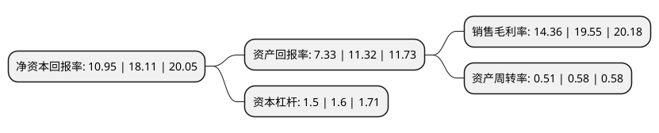

> 本页面由自动化程序生成于 2022年5月20日 01:33
> 内容可能存在错误，如有bug请提交issue至：https://github.com/Eroleice/doc-pi/issues
{.is-warning}

# 上市公司基本情况

## 基本资料

税友软件集团股份有限公司（以下简称“税友股份”）成立于1999年12月22日，杭州市。于2021年06月30日在上交所主板上市。

税友股份注册资本40,589万元，专注于财税信息化领域的技术研究，项目开发，产品销售和服务，是国内专业的财税信息化综合业务提供商。以下是详细信息：

- 公司名称: 税友软件集团股份有限公司
- 股票代码: 603171.SH
- 所在地: 浙江 - 杭州市
- 成立日期: 1999年12月22日
- 注册资本: 40,589万元
- 法定代表人: 张镇潮
- 主营业务: 专注于财税信息化领域的技术研究，项目开发，产品销售和服务，是国内专业的财税信息化综合业务提供商
- 公司官网: www.servyou.com.cn
- 公司介绍: 公司自成立以来，一直专注于财税信息化领域的技术研究、项目开发、产品销售和服务，在财税信息化领域内耕耘二十年，是国内专业的财税信息化综合业务提供商。公司客户主要包括税务机关、纳税企业、财税中介。公司为税务机关提供税务系统开发与运维，为纳税企业和财税中介提供企业财税综合服务。截至目前，公司承建并持续优化国家税务总局的管理决策分析平台系统(第2包)和个人税收管理系统两大金税三期核心项目，并实现了系统在全国税务机关推广应用，是国家税务信息化领域的重要建设单位。是浙江省软件行业协会理事单位、高新技术企业、国家高技术产业化示范基地、信用等级AAA企业等，2017年凭借“税务大数据计算与服务关键技术及其应用”项目荣获了国家科学技术进步奖(二等奖)。公司通过了CMMI ML4、ITSS二级，并全面建立了ISO9001质量管理体系、ISO20000IT服务管理体系、ISO27001信息安全管理体系。

## 股东及高管情况

上市公司第一大股东为宁波思驰股权投资合伙企业(有限合伙)，持股223,095,730股，占比54.96%，为上市公司实际控制人。

截至2022年03月31日，上市公司的前十大股东中，共有4名自然人股东，5名机构股东，1个产品账户，其中5%以上大股东共有2名。上市公司前十大股东明细如下：

> 截至2022年03月31日，上市公司前十大股东信息如下：

| 股东名称 | 持股数量（股） | 持股比例 |
| --- | --- | --- |
| 宁波思驰股权投资合伙企业(有限合伙) | 223,095,730 | 54.96% |
| 张镇潮 | 92,300,000 | 22.74% |
| 上海云鑫创业投资有限公司 | 18,228,470 | 4.49% |
| 北京磐茂投资管理有限公司-磐茂(上海)投资中心(有限合伙) | 18,082,350 | 4.45% |
| 杭州普阳投资管理有限公司-兰溪普华晖赢投资合伙企业(有限合伙) | 6,758,050 | 1.66% |
| 瑞士信贷(香港)有限公司 | 4,240,513 | 1.04% |
| 李高齐 | 2,860,000 | 0.7% |
| 李华 | 2,288,100 | 0.56% |
| 中信信托有限责任公司-中信信托成泉汇涌八期金融投资集合资金信托计划 | 772,485 | 0.19% |
| 叶龙华 | 685,000 | 0.17% |

## 利润表分析

上市公司2021年总收入为16.04亿元，净利润为2.3亿元，实现盈利。

## 杜邦分析

> 数据列示周期：2021年 | 2020年 | 2019年
{.is-info}

上市公司的净资产收益率在近一年有所下降，下降幅度为-39.54%，其变化情况分解如下：
- 上市公司的销售毛利率在近一年下降了-26.55%，可能是生产效率的下降、商品原材料价格上涨或商品价格的下跌所致。
- 上市公司的资产周转率在近一年下降了-12.07%，可能是源自于更慢的销售回款或库存管理效果下降。
- 上市公司的财务杠杆比率在近一年下降了-6.25%，可能是减少负债降低财务费用。

