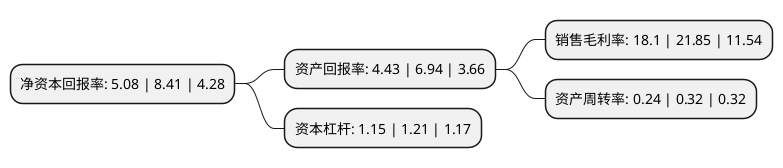

> 本页面由自动化程序生成于 2022年5月20日 01:33
> 内容可能存在错误，如有bug请提交issue至：https://github.com/Eroleice/doc-pi/issues
{.is-warning}

# 上市公司基本情况

## 基本资料

上海网达软件股份有限公司（以下简称“网达软件”）成立于2009年12月09日，上海市。于2016年09月14日在上交所主板上市。

网达软件注册资本26,954.835万元，主营业务主要包括两类:一是移动互联网多媒体软件及服务;二是商业智能(BI)应用软件及服务。主要产品:数据仓库和企业客户统一视图等。以下是详细信息：

- 公司名称: 上海网达软件股份有限公司
- 股票代码: 603189.SH
- 所在地: 上海 - 上海市
- 成立日期: 2009年12月09日
- 注册资本: 26,954.835万元
- 法定代表人: 冯达
- 主营业务: 主营业务主要包括两类:一是移动互联网多媒体软件及服务;二是商业智能(BI)应用软件及服务主要产品:数据仓库和企业客户统一视图等
- 公司官网: www.wondertek.com.cn
- 公司介绍: 公司是一家为电信运营商、广电媒体及金融保险提供移动互联网及互联网软件产品和服务的高新技术企业。公司一直致力于核心软件的自主研发，形成了互联网业务运营管理系统、融合媒资管理系统、多格式多协议的视音频处理系统、全平台覆盖的客户端开发技术、数字营销推广等主要产品。并以此主要产品面向客户需求进行定制化方案及服务。网达软件方案涉及新闻媒体、视音频、电子出版、集成播控、商业智能、营销推广、多屏互动、在线教育、应用发行等不同的行业领域；并提供针对移动互联的推广服务、承担营销策划的运营服务、基于专家团队的咨询服务、提供敏捷开发的定制服务、面向集成实施的运维。

## 股东及高管情况

上市公司第一大股东为蒋宏业，持股95,400,000股，占比35.39%，为上市公司实际控制人。

截至2022年03月31日，上市公司的前十大股东中，共有5名自然人股东，1名机构股东，4个产品账户，其中5%以上大股东共有3名。上市公司前十大股东明细如下：

> 截至2022年03月31日，上市公司前十大股东信息如下：

| 股东名称 | 持股数量（股） | 持股比例 |
| --- | --- | --- |
| 蒋宏业 | 95,400,000 | 35.39% |
| 中国国有企业混合所有制改革基金有限公司 | 19,762,845 | 7.33% |
| 冯达 | 15,300,000 | 5.68% |
| 广州市玄元投资管理有限公司-玄元科新14号私募证券投资基金 | 6,587,615 | 2.44% |
| 徐志英 | 6,587,615 | 2.44% |
| 中国工商银行股份有限公司-华夏磐利一年定期开放混合型证券投资基金 | 3,952,569 | 1.47% |
| 崔晓路 | 3,600,000 | 1.34% |
| 安徽华茂产业投资有限公司 | 2,400,000 | 0.89% |
| 上海贤盛投资管理有限公司-贤盛稳健增强1号私募投资基金 | 1,930,000 | 0.72% |
| 糜宏伟 | 1,509,400 | 0.56% |

## 利润表分析

上市公司2021年总收入为3.62亿元，净利润为0.65亿元，实现盈利。

## 杜邦分析

> 数据列示周期：2021年 | 2020年 | 2019年
{.is-info}

上市公司的净资产收益率在近一年有所下降，下降幅度为-39.6%，其变化情况分解如下：
- 上市公司的销售毛利率在近一年下降了-17.16%，可能是生产效率的下降、商品原材料价格上涨或商品价格的下跌所致。
- 上市公司的资产周转率在近一年下降了-25%，可能是源自于更慢的销售回款或库存管理效果下降。
- 上市公司的财务杠杆比率在近一年下降了-4.96%，可能是减少负债降低财务费用。

