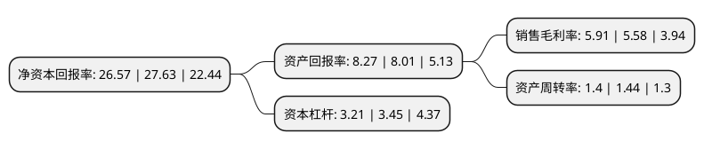

> 本页面由自动化程序生成于 2022年5月20日 01:33
> 内容可能存在错误，如有bug请提交issue至：https://github.com/Eroleice/doc-pi/issues
{.is-warning}

## 股东及高管情况

上市公司第一大股东为宗琰，持股90,329,450股，占比29.6%，**疑似为**上市公司实际控制人。

截至2022年05月06日，上市公司的前十大股东中，共有2名自然人股东，5名机构股东，3个产品账户，其中5%以上大股东共有3名。上市公司前十大股东明细如下：

> 未能通过持股比例判定出上市公司实际控制人（持股30%以上）
> 可能存在通过间接持股、联合持股、协议控制等方式拥有实际控制权的主体，具体请参考上市公司定期公告！
{.is-warning}

> 截至2022年05月06日，上市公司前十大股东信息如下：

| 股东名称 | 持股数量（股） | 持股比例 |
| --- | --- | --- |
| 宗琰 | 90,329,450 | 29.6% |
| 秦卫忠 | 90,309,450 | 29.59% |
| 南京环智投资管理合伙企业(有限合伙) | 19,361,100 | 6.34% |
| 南京元奕和股权投资合伙企业(有限合伙) | 9,000,000 | 2.95% |
| 南京昌晟兴股权投资合伙企业(有限合伙) | 9,000,000 | 2.95% |
| 深圳市领誉基石股权投资合伙企业(有限合伙) | 5,449,994 | 1.79% |
| 中国国际金融股份有限公司 | 706,894 | 0.23% |
| 中国建设银行股份有限公司企业年金计划-中国工商银行股份有限公司 | 10,476 | 0.0034% |
| 中国工商银行股份有限公司企业年金计划-中国建设银行股份有限公司 | 8,730 | 0.0029% |
| 广东省壹号职业年金计划-工商银行 | 8,730 | 0.0029% |

## 利润表分析

上市公司2021年总收入为35.54亿元，净利润为2.09亿元，实现盈利。

## 杜邦分析

> 数据列示周期：2021年 | 2020年 | 2019年
{.is-info}

上市公司的净资产收益率在近一年有所下降，下降幅度为-3.84%，其变化情况分解如下：
- 上市公司的销售毛利率在近一年上升了5.91%，可能是生产效率的提升、商品原材料价格下跌或商品价格的上涨所致。
- 上市公司的资产周转率在近一年下降了-2.78%，可能是源自于更慢的销售回款或库存管理效果下降。
- 上市公司的财务杠杆比率在近一年下降了-6.96%，可能是减少负债降低财务费用。

