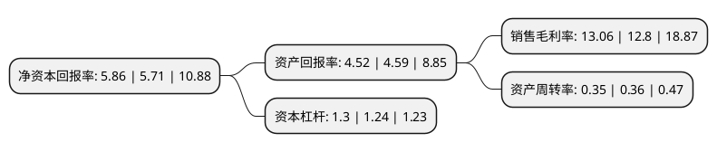

> 本页面由自动化程序生成于 2022年5月20日 01:33
> 内容可能存在错误，如有bug请提交issue至：https://github.com/Eroleice/doc-pi/issues
{.is-warning}

# 上市公司基本情况

## 基本资料

格尔软件股份有限公司（以下简称“格尔软件”）成立于1998年03月03日，上海市。于2017年04月21日在上交所主板上市。

格尔软件注册资本23,172.203万元，公司自成立以来一直专注于信息安全行业PKI领域，主要从事以公钥基础设施PKI(Public Key Infrastructure)为核心的商用密码软件产品的研发，生产和销售及服务业务。主要产品是基于PKI的信息安全系列产品，安全服务和信息安全整体解决方案。以下是详细信息：

- 公司名称: 格尔软件股份有限公司
- 股票代码: 603232.SH
- 所在地: 上海 - 上海市
- 成立日期: 1998年03月03日
- 注册资本: 23,172.203万元
- 法定代表人: 孔令钢
- 主营业务: 公司自成立以来一直专注于信息安全行业PKI领域，主要从事以公钥基础设施PKI(Public Key Infrastructure)为核心的商用密码软件产品的研发，生产和销售及服务业务主要产品是基于PKI的信息安全系列产品，安全服务和信息安全整体解决方案
- 公司官网: www.koal.com
- 公司介绍: 公司是中国较早研制和推出公钥基础设施PKI(Public Key Infrastructure)平台的厂商之一，是国内首批商用密码产品定点生产与销售单位之一，是国家保密局批准认定的涉及国家秘密的计算机信息系统集成甲级资质单位，是全国信息安全标准化技术委员会的核心成员单位；公司是国家“863”计划信息安全示范工程金融子项目的责任承担单位，是国家科技支撑计划商用密码基础设施(ECC)项目的牵头单位之一。公司拥有全系列信息安全产品、安全服务和解决方案的提供能力，产品包括:“安全认证网关”、“可信边界安全网关”、“无线安全网关”、“电子签章系统”、“安全电子邮件系统”、“安全即时通系统”、“网络保险箱”、“终端保密系统”、“签名验证服务系统”、“局域网接入认证系统”、“打印管控系统”、“移动安全管理平台”、“云安全服务平台系统”、“移动介质管理系统等产品”。公司先后通过了CMMI3认证和ISO9001质量认证，为用户提供功能完善、质量可靠的PKI产品。同时，公司本着客户至上的宗旨为广大用户提供“专业、快捷、优质”的各类信息安全服务。

## 股东及高管情况

上市公司第一大股东为孔令钢，持股30,081,462股，占比12.98%，**疑似为**上市公司实际控制人。

截至2022年03月31日，上市公司的前十大股东中，共有7名自然人股东，3名机构股东，其中5%以上大股东共有3名。上市公司前十大股东明细如下：

> 未能通过持股比例判定出上市公司实际控制人（持股30%以上）
> 可能存在通过间接持股、联合持股、协议控制等方式拥有实际控制权的主体，具体请参考上市公司定期公告！
{.is-warning}

> 截至2022年03月31日，上市公司前十大股东信息如下：

| 股东名称 | 持股数量（股） | 持股比例 |
| --- | --- | --- |
| 孔令钢 | 30,081,462 | 12.98% |
| 上海格尔实业发展有限公司 | 19,629,252 | 8.47% |
| 陆海天 | 19,147,695 | 8.26% |
| 陈宁生 | 10,258,080 | 4.43% |
| 杨文山 | 7,754,985 | 3.35% |
| 陈廷宇 | 4,934,380 | 2.13% |
| 上海展荣投资管理有限公司 | 4,751,834 | 2.05% |
| 中电科投资控股有限公司 | 2,722,114 | 1.17% |
| 马晓娜 | 2,718,787 | 1.17% |
| 叶枫 | 1,783,849 | 0.77% |

## 利润表分析

上市公司2021年总收入为6.11亿元，净利润为0.79亿元，实现盈利。

## 杜邦分析

> 数据列示周期：2021年 | 2020年 | 2019年
{.is-info}

上市公司的净资产收益率在近一年有所上升，上升幅度为2.63%，其变化情况分解如下：
- 上市公司的销售毛利率在近一年上升了2.03%，可能是生产效率的提升、商品原材料价格下跌或商品价格的上涨所致。
- 上市公司的资产周转率在近一年下降了-2.78%，可能是源自于更慢的销售回款或库存管理效果下降。
- 上市公司的财务杠杆比率在近一年上升了4.84%，可能是增加负债扩大生产规模。

