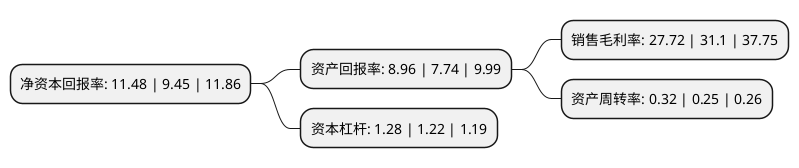

> 本页面由自动化程序生成于 2022年5月20日 01:34
> 内容可能存在错误，如有bug请提交issue至：https://github.com/Eroleice/doc-pi/issues
{.is-warning}

# 上市公司基本情况

## 基本资料

福建顶点软件股份有限公司（以下简称“顶点软件”）成立于2000年10月25日，福州市。于2017年05月22日在上交所主板上市。

顶点软件注册资本17,092.352万元，主营业务主要涉及证券，期货，银行，信托，电子交易市场等多个行业和领域，业务范围涵盖前，中，后台等多个层次。主要产品:前台服务渠道与作业支持信息化解决方案，中台流程信息化解决方案，后台基础运营支持系统解决方案，电子交易市场信息化解决方案，银行综合经营管理信息化解决方案，数字化校园流程管理信息化解决方案，企业流程管理信息化解决方案。以下是详细信息：

- 公司名称: 福建顶点软件股份有限公司
- 股票代码: 603383.SH
- 所在地: 福建 - 福州市
- 成立日期: 2000年10月25日
- 注册资本: 17,092.352万元
- 法定代表人: 严孟宇
- 主营业务: 主营业务主要涉及证券，期货，银行，信托，电子交易市场等多个行业和领域，业务范围涵盖前，中，后台等多个层次主要产品:前台服务渠道与作业支持信息化解决方案，中台流程信息化解决方案，后台基础运营支持系统解决方案，电子交易市场信息化解决方案，银行综合经营管理信息化解决方案，数字化校园流程管理信息化解决方案，企业流程管理信息化解决方案
- 公司官网: www.apexsoft.com.cn
- 公司介绍: 公司是一家专业化平台型软件及信息化服务提供商，致力于利用自主研发的“灵动业务架构平台(LiveBOS)”，为包括证券、期货、银行、电子交易市场等在内的金融行业及其他行业提供以业务流程管理(BPM)为核心、以“互联网+”应用为重点方向的信息化解决方案。公司的主营业务主要涉及证券、期货、银行、信托、电子交易市场等多个行业和领域，业务范围涵盖前、中、后台等多个层次，提供针对互联网化应用支持、集中交易、高端客户交易、业务运营中台、柜台市场、区域市场、投融资业务、财富管理等多种业务领域的软件产品及服务。基于LiveBOS，公司在跨行业实现技术、管理经验、开发模式的共享，成长为跨行业“基础平台＋应用方案”的综合解决方案提供商。在非金融行业，顶点通过建立专业化子公司的形式开展业务，其中，顶点信息主要从事非金融行业企业信息化业务，亿维航软件主要从事教育软件开发领域信息化业务。公司是国家火炬计划重点高新技术企业、科技部创新基金实施十周年优秀企业、首批国家规划布局内重点软件企业、福建省高新技术企业、福建省软件十强企业、福建省省级企业技术中心、福建省重点软件骨干企业，通过“双软认证”、“ISO9001：2000”等资质认证。

## 股东及高管情况

上市公司第一大股东为严孟宇，持股35,887,614股，占比21%，**疑似为**上市公司实际控制人。

截至2022年03月31日，上市公司的前十大股东中，共有4名自然人股东，2名机构股东，4个产品账户，其中5%以上大股东共有4名。上市公司前十大股东明细如下：

> 未能通过持股比例判定出上市公司实际控制人（持股30%以上）
> 可能存在通过间接持股、联合持股、协议控制等方式拥有实际控制权的主体，具体请参考上市公司定期公告！
{.is-warning}

> 截至2022年03月31日，上市公司前十大股东信息如下：

| 股东名称 | 持股数量（股） | 持股比例 |
| --- | --- | --- |
| 严孟宇 | 35,887,614 | 21% |
| 福州爱派克电子有限公司 | 23,990,400 | 14.04% |
| 金石投资有限公司 | 14,164,160 | 8.29% |
| 赵伟 | 11,832,800 | 6.92% |
| 东方证券股份有限公司-中庚价值先锋股票型证券投资基金 | 5,473,668 | 3.2% |
| 雷世潘 | 4,776,800 | 2.79% |
| 上海通怡投资管理有限公司-通怡芙蓉2号私募证券投资基金 | 2,850,000 | 1.67% |
| 赵莹 | 2,476,480 | 1.45% |
| 中国建设银行股份有限公司-信达澳银新能源产业股票型证券投资基金 | 2,410,763 | 1.41% |
| 中国银行股份有限公司-中信保诚至远动力混合型证券投资基金 | 1,944,200 | 1.14% |

## 利润表分析

上市公司2021年总收入为5.02亿元，净利润为1.39亿元，实现盈利。

## 杜邦分析

> 数据列示周期：2021年 | 2020年 | 2019年
{.is-info}

上市公司的净资产收益率在近一年有所上升，上升幅度为21.48%，其变化情况分解如下：
- 上市公司的销售毛利率在近一年下降了-10.87%，可能是生产效率的下降、商品原材料价格上涨或商品价格的下跌所致。
- 上市公司的资产周转率在近一年上升了28%，可能是源自于更快的销售回款或库存管理效果提升。
- 上市公司的财务杠杆比率在近一年上升了4.92%，可能是增加负债扩大生产规模。

