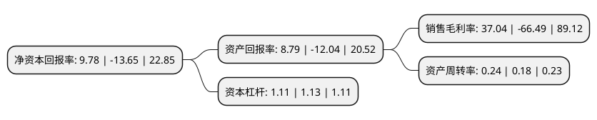

> 本页面由自动化程序生成于 2022年5月20日 01:34
> 内容可能存在错误，如有bug请提交issue至：https://github.com/Eroleice/doc-pi/issues
{.is-warning}

# 上市公司基本情况

## 基本资料

河南思维自动化设备股份有限公司（以下简称“思维列控”）成立于1998年04月29日，郑州市。于2015年12月24日在上交所主板上市。

思维列控注册资本27,233.884万元，主营业务为列车运行控制系统的研发，升级，产业化及技术支持，向客户提供适用于我国铁路复杂运营条件和高负荷运输特点的列车运行控制系统，行车安全监测系统，LKJ安全管理及信息化系统等整体解决方案。主要产品为LKJ系统及机务安防系统，主要包括LKJ2000，TAX装置，LAIS车载设备，6A车载音视频显示终端等产品。以下是详细信息：

- 公司名称: 河南思维自动化设备股份有限公司
- 股票代码: 603508.SH
- 所在地: 河南 - 郑州市
- 成立日期: 1998年04月29日
- 注册资本: 27,233.884万元
- 法定代表人: 李欣
- 主营业务: 主营业务为列车运行控制系统的研发，升级，产业化及技术支持，向客户提供适用于我国铁路复杂运营条件和高负荷运输特点的列车运行控制系统，行车安全监测系统，LKJ安全管理及信息化系统等整体解决方案主要产品为LKJ系统及机务安防系统，主要包括LKJ2000，TAX装置，LAIS车载设备，6A车载音视频显示终端等产品
- 公司官网: www.hnthinker.com
- 公司介绍: 公司是国内最早从事列车安全监控、监测系统研发、设计和生产的企业之一。公司先后承担多项列车安全监控、监测系统开发以及铁路运输安全关键技术研究项目，多项产品获得铁道部、河南省政府、相关铁路局颁发的科技进步奖。公司主要产品有LKJ系列列车运行安全监控装置、机车安全信息综合监测装置、列车运行状态信息系统等，主要用于保障铁路运输安全、提高铁路部门运用管理水平。以防超速、防冒进/冒出著称的LKJ系列列车运行安全监控装置为历次全国铁路大提速、保障铁路运输事业的飞速发展保驾护航，做出了突出贡献。公司不断完善质保体系，顺利通过ISO9001，CMMI3体系认证以及CRCC，SIL4等产品认证。未来，公司力争成为“中国铁路行车安全控制整体解决方案的专业供应商”。

## 股东及高管情况

上市公司第一大股东为郭洁，持股55,536,638股，占比20.39%，**疑似为**上市公司实际控制人。

截至2022年03月31日，上市公司的前十大股东中，共有6名自然人股东，2名机构股东，1个产品账户，1个海外主体，其中5%以上大股东共有4名。上市公司前十大股东明细如下：

> 未能通过持股比例判定出上市公司实际控制人（持股30%以上）
> 可能存在通过间接持股、联合持股、协议控制等方式拥有实际控制权的主体，具体请参考上市公司定期公告！
{.is-warning}

> 截至2022年03月31日，上市公司前十大股东信息如下：

| 股东名称 | 持股数量（股） | 持股比例 |
| --- | --- | --- |
| 郭洁 | 55,536,638 | 20.39% |
| 王卫平 | 38,871,400 | 14.27% |
| 赵建州 | 34,659,982 | 12.73% |
| 李欣 | 30,119,681 | 11.06% |
| 深圳市远望谷信息技术股份有限公司 | 12,497,028 | 4.59% |
| 西藏蓝信信息技术有限公司 | 8,423,689 | 3.09% |
| 魏晓红 | 2,245,000 | 0.82% |
| 张仟 | 1,313,151 | 0.48% |
| 上海呈瑞投资管理有限公司-呈瑞和兴4号私募证券投资基金 | 1,060,469 | 0.39% |
| 香港中央结算有限公司(陆股通) | 1,031,908 | 0.38% |

## 利润表分析

上市公司2021年总收入为10.64亿元，净利润为3.94亿元，实现盈利。

## 杜邦分析

> 数据列示周期：2021年 | 2020年 | 2019年
{.is-info}

上市公司的净资产收益率在近一年有所下降，下降幅度为-171.65%，其变化情况分解如下：
- 上市公司的销售毛利率在近一年下降了-155.71%，可能是生产效率的下降、商品原材料价格上涨或商品价格的下跌所致。
- 上市公司的资产周转率在近一年上升了33.33%，可能是源自于更快的销售回款或库存管理效果提升。
- 上市公司的财务杠杆比率在近一年下降了-1.77%，可能是减少负债降低财务费用。

