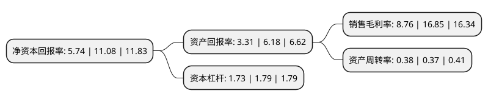

> 本页面由自动化程序生成于 2022年5月20日 01:34
> 内容可能存在错误，如有bug请提交issue至：https://github.com/Eroleice/doc-pi/issues
{.is-warning}

# 上市公司基本情况

## 基本资料

南威软件股份有限公司（以下简称“南威软件”）成立于2002年10月18日，泉州市。于2014年12月30日在上交所主板上市。

南威软件注册资本59,079.358万元，主要从事电子政务的软件开发，系统集成及技术服务，并以解决方案的方式向政务部门提供上述全部或部分业务。以下是详细信息：

- 公司名称: 南威软件股份有限公司
- 股票代码: 603636.SH
- 所在地: 福建 - 泉州市
- 成立日期: 2002年10月18日
- 注册资本: 59,079.358万元
- 法定代表人: 吴志雄
- 主营业务: 主要从事电子政务的软件开发，系统集成及技术服务，并以解决方案的方式向政务部门提供上述全部或部分业务
- 公司官网: www.linewell.com
- 公司介绍: 公司是智慧城市、数字经济、分享经济平台建设运营的综合性科技集团，是全国行业龙头企业，拥有国家信息系统集成及服务壹级资质、涉及国家秘密的计算机信息系统集成甲级资质、国家建筑智能化系统设计专项甲级资质、电子与智能化工程专业承包壹级、国家安防工程企业设计施工维护能力一级、CMMI-5国际认证等业内六甲顶级资质，综合竞争力处于全国前列水平。坚持技术创新，设立院士专家工作站、博士后科研工作站、企业技术中心、工程技术研究中心、自主可控软件重点实验室，并承担了国家科技支撑计划、国家电子信息产业发展基金、国家信息安全专项等科研课题。公司集中资源投资建设运营智慧城市、发展数字经济，是国家新型智慧城市标准制定的十家理事单位之一。其中智慧丰泽为全国首个综合型智慧城市建设工程，是新型智慧城市的示范项目。

## 股东及高管情况

上市公司第一大股东为吴志雄，持股239,181,429股，占比40.48%，为上市公司实际控制人。

截至2022年03月31日，上市公司的前十大股东中，共有6名自然人股东，2名机构股东，1个产品账户，1个海外主体，其中5%以上大股东共有3名。上市公司前十大股东明细如下：

> 截至2022年03月31日，上市公司前十大股东信息如下：

| 股东名称 | 持股数量（股） | 持股比例 |
| --- | --- | --- |
| 吴志雄 | 239,181,429 | 40.48% |
| 中电科投资控股有限公司 | 29,897,679 | 5.06% |
| 上海云鑫创业投资有限公司 | 29,897,678 | 5.06% |
| 刘志强 | 21,240,622 | 3.6% |
| 刘妍婧 | 6,408,080 | 1.08% |
| 交通银行-中海优质成长证券投资基金 | 3,314,000 | 0.56% |
| JPMORGAN CHASE BANK,NATIONAL ASSOCIATION | 2,340,830 | 0.4% |
| 周天弋 | 2,150,034 | 0.36% |
| 曹立华 | 2,051,345 | 0.35% |
| 包东群 | 1,864,400 | 0.32% |

## 利润表分析

上市公司2021年总收入为17.16亿元，净利润为1.5亿元，实现盈利。

## 杜邦分析

> 数据列示周期：2021年 | 2020年 | 2019年
{.is-info}

上市公司的净资产收益率在近一年有所下降，下降幅度为-48.19%，其变化情况分解如下：
- 上市公司的销售毛利率在近一年下降了-48.01%，可能是生产效率的下降、商品原材料价格上涨或商品价格的下跌所致。
- 上市公司的资产周转率在近一年上升了2.7%，可能是源自于更快的销售回款或库存管理效果提升。
- 上市公司的财务杠杆比率在近一年下降了-3.35%，可能是减少负债降低财务费用。

