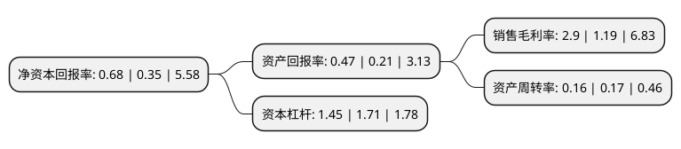

> 本页面由自动化程序生成于 2022年5月20日 01:35
> 内容可能存在错误，如有bug请提交issue至：https://github.com/Eroleice/doc-pi/issues
{.is-warning}

# 上市公司基本情况

## 基本资料

新智认知数字科技股份有限公司（以下简称“新智认知”）成立于1986年05月10日，北海市。于2015年03月26日在上交所主板上市。

新智认知注册资本50,450.051万元，主营业务:智慧旅游和行业认知解决方案等业务。以下是详细信息：

- 公司名称: 新智认知数字科技股份有限公司
- 股票代码: 603869.SH
- 所在地: 广西 - 北海市
- 成立日期: 1986年05月10日
- 注册资本: 50,450.051万元
- 法定代表人: 张亚东
- 主营业务: 主营业务:智慧旅游和行业认知解决方案等业务
- 公司官网: www.encdata.cn
- 公司介绍: 公司是新奥集团旗下数字产业核心企业。作为行业认知解决方案提供商，公司主要面向智慧警务、智慧企业等领域，以客户的一线业务场景为驱动，基于对行业客户需求的深刻理解，通过人工智能、大数据、云计算等创新技术，自主研发数据治理与服务平台、大数据智能建模引擎及一体化指挥调度平台等核心产品，为行业客户提供包括数据汇聚、治理、挖掘、分析、应用等功能的行业认知解决方案。公司自主研发的产品与解决方案已成功应用于G20峰会、“一带一路”国际合作高峰论坛等多项国际级大型活动及各大城市的智慧城市项目建设。

## 股东及高管情况

上市公司第一大股东为新奥能源供应链有限公司，持股176,841,072股，占比35.05%，为上市公司实际控制人。

截至2022年04月29日，上市公司的前十大股东中，共有3名自然人股东，7名机构股东，其中5%以上大股东共有3名。上市公司前十大股东明细如下：

> 截至2022年04月29日，上市公司前十大股东信息如下：

| 股东名称 | 持股数量（股） | 持股比例 |
| --- | --- | --- |
| 新奥能源供应链有限公司 | 176,841,072 | 35.05% |
| 张滔 | 36,000,000 | 7.14% |
| 天津亿恩锐投资中心(有限合伙) | 31,041,252 | 6.15% |
| 宿迁新毅德辉投资管理中心(有限合伙) | 21,760,879 | 4.31% |
| 新奥资本管理有限公司 | 18,666,443 | 3.7% |
| 新奥控股投资股份有限公司 | 14,507,253 | 2.88% |
| 杨英 | 8,554,911 | 1.7% |
| 新奥新智科技有限公司 | 5,770,000 | 1.14% |
| 赵天时 | 4,503,093 | 0.89% |
| 深圳市天禄行信息咨询有限公司 | 3,480,000 | 0.69% |

## 利润表分析

上市公司2021年总收入为9.36亿元，净利润为0.27亿元，实现盈利。

## 杜邦分析

> 数据列示周期：2021年 | 2020年 | 2019年
{.is-info}

上市公司的净资产收益率在近一年有所上升，上升幅度为94.29%，其变化情况分解如下：
- 上市公司的销售毛利率在近一年上升了143.7%，可能是生产效率的提升、商品原材料价格下跌或商品价格的上涨所致。
- 上市公司的资产周转率在近一年下降了-5.88%，可能是源自于更慢的销售回款或库存管理效果下降。
- 上市公司的财务杠杆比率在近一年下降了-15.2%，可能是减少负债降低财务费用。

