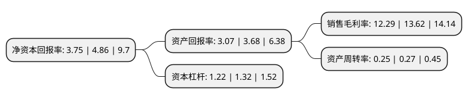

> 本页面由自动化程序生成于 2022年5月20日 01:36
> 内容可能存在错误，如有bug请提交issue至：https://github.com/Eroleice/doc-pi/issues
{.is-warning}

# 上市公司基本情况

## 基本资料

苏州麦迪斯顿医疗科技股份有限公司（以下简称“麦迪科技”）成立于2009年08月14日，苏州市。于2016年12月08日在上交所主板上市。

麦迪科技注册资本16,546.349万元，主营业务:提供临床医疗管理信息系统(CIS)系列应用软件和临床信息化整体解决方案。核心产品主要包括两大类:(一)DoCare系列临床医疗管理信息系统应用软件，其中包括麻醉临床信息系统，重症监护(ICU)临床信息系统，院前急救信息系统，血液净化信息系统和临床路径信息系统等;(二)临床信息化整体解决方案，其中包括Doricon数字化手术室整体解决方案及正在推广的Doricon数字化病区和Doricon数字化急诊急救平台整体解决方案。以下是详细信息：

- 公司名称: 苏州麦迪斯顿医疗科技股份有限公司
- 股票代码: 603990.SH
- 所在地: 江苏 - 苏州市
- 成立日期: 2009年08月14日
- 注册资本: 16,546.349万元
- 法定代表人: 翁康
- 主营业务: 主营业务:提供临床医疗管理信息系统(CIS)系列应用软件和临床信息化整体解决方案核心产品主要包括两大类:(一)DoCare系列临床医疗管理信息系统应用软件，其中包括麻醉临床信息系统，重症监护(ICU)临床信息系统，院前急救信息系统，血液净化信息系统和临床路径信息系统等;(二)临床信息化整体解决方案，其中包括Doricon数字化手术室整体解决方案及正在推广的Doricon数字化病区和Doricon数字化急诊急救平台整体解决方案
- 公司官网: www.medicalsystem.com.cn
- 公司介绍: 公司是一家以提供临床医疗管理信息系统(CIS)系列应用软件和临床信息化整体解决方案为核心业务的高新技术企业。目前，公司核心产品主要包括两大类：DoCare系列临床医疗管理信息系统应用软件，其中包括麻醉临床信息系统、重症监护(ICU)临床信息系统、院前急救信息系统、血液净化信息系统和临床路径信息系统等；临床信息化整体解决方案，其中包括Doricon数字化手术室整体解决方案及正在推广的Doricon数字化病区和Doricon数字化急诊急救平台整体解决方案。公司通过ISO9001、ISO27001体系认证；引进并应用CMMI管理模式，并承担了国家“十二五”863课题——数字化医疗工程技术，“数字化手术室、院前急救、重症监护”的设计、开发和推广。

## 股东及高管情况

上市公司第一大股东为翁康，持股21,872,760股，占比13.22%，**疑似为**上市公司实际控制人。

截至2022年03月31日，上市公司的前十大股东中，共有7名自然人股东，3个产品账户，其中5%以上大股东共有1名。上市公司前十大股东明细如下：

> 未能通过持股比例判定出上市公司实际控制人（持股30%以上）
> 可能存在通过间接持股、联合持股、协议控制等方式拥有实际控制权的主体，具体请参考上市公司定期公告！
{.is-warning}

> 截至2022年03月31日，上市公司前十大股东信息如下：

| 股东名称 | 持股数量（股） | 持股比例 |
| --- | --- | --- |
| 翁康 | 21,872,760 | 13.22% |
| 严黄红 | 5,569,798 | 3.37% |
| 汪建华 | 3,972,864 | 2.4% |
| 刘长羽 | 3,013,305 | 1.82% |
| 傅洪 | 2,402,930 | 1.45% |
| 苏州麦迪斯顿医疗科技股份有限公司回购专用证券账户 | 2,337,300 | 1.41% |
| 王英 | 1,913,136 | 1.16% |
| 上海方圆达创投资合伙企业(有限合伙)-方圆-东方2号私募投资基金 | 1,278,600 | 0.77% |
| 上海时成投资管理有限公司-时成丙申一号私募证券投资基金 | 1,050,000 | 0.63% |
| 李铁刚 | 1,019,840 | 0.62% |

## 利润表分析

上市公司2021年总收入为3.53亿元，净利润为0.43亿元，实现盈利。

## 杜邦分析

> 数据列示周期：2021年 | 2020年 | 2019年
{.is-info}

上市公司的净资产收益率在近一年有所下降，下降幅度为-22.84%，其变化情况分解如下：
- 上市公司的销售毛利率在近一年下降了-9.77%，可能是生产效率的下降、商品原材料价格上涨或商品价格的下跌所致。
- 上市公司的资产周转率在近一年下降了-7.41%，可能是源自于更慢的销售回款或库存管理效果下降。
- 上市公司的财务杠杆比率在近一年下降了-7.58%，可能是减少负债降低财务费用。

