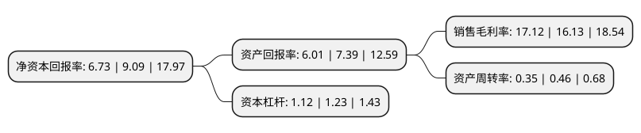

> 本页面由自动化程序生成于 2022年5月20日 01:37
> 内容可能存在错误，如有bug请提交issue至：https://github.com/Eroleice/doc-pi/issues
{.is-warning}

# 上市公司基本情况

## 基本资料

北京市博汇科技股份有限公司（以下简称“博汇科技”）成立于1993年04月01日，北京市。于2020年06月12日在上交所科创板上市。

博汇科技注册资本5,680万元，主营业务涵盖视听业务运维平台，媒体内容安全和信息化视听数据管理三个主要领域。以下是详细信息：

- 公司名称: 北京市博汇科技股份有限公司
- 股票代码: 688004.SH
- 所在地: 北京 - 北京市
- 成立日期: 1993年04月01日
- 注册资本: 5,680万元
- 法定代表人: 郭忠武
- 主营业务: 主营业务涵盖视听业务运维平台，媒体内容安全和信息化视听数据管理三个主要领域
- 公司官网: www.bohui.com.cn
- 公司介绍: 公司是一家专注于视听大数据领域的信息技术企业。公司拥有完善的研发、生产、销售和服务体系，通过整合运用编解码、数据采集、智能分析、可视化展现等技术手段，为广播电视、新媒体、政府、教育、人防、气象、公安、武警、交通、能源等下游客户群体提供视听信息技术解决方案。公司主营产品涵盖视听业务运维平台、媒体内容安全、信息化视听数据管理三个主要业务领域，致力于为目标客户的全业务运营提供数据采集、存储、分析、可视化、协同指挥等信息化服务。公司成立以来，相继参与了载人航天工程信息化显示项目、上海进博会安保指挥调度工作、中央广播电视总台5G+4K媒体应用实验室建设、人民日报“中央厨房”可视化展示工作，圆满完成了北京奥运会、国庆阅兵、十九大的安全播出保障任务。作为视听信息技术行业领先者，公司还参与了多项行业标准的制订工作，多次获得国家和省级相关科技奖项。

## 股东及高管情况

上市公司第一大股东为孙传明，持股10,000,000股，占比17.61%，**疑似为**上市公司实际控制人。

截至2022年03月31日，上市公司的前十大股东中，共有7名自然人股东，2名机构股东，1个产品账户，其中5%以上大股东共有5名。上市公司前十大股东明细如下：

> 未能通过持股比例判定出上市公司实际控制人（持股30%以上）
> 可能存在通过间接持股、联合持股、协议控制等方式拥有实际控制权的主体，具体请参考上市公司定期公告！
{.is-warning}

> 截至2022年03月31日，上市公司前十大股东信息如下：

| 股东名称 | 持股数量（股） | 持股比例 |
| --- | --- | --- |
| 孙传明 | 10,000,000 | 17.61% |
| 北京数码视讯科技股份有限公司 | 6,380,000 | 11.23% |
| 郭忠武 | 3,706,680 | 6.53% |
| 郑金福 | 3,441,529 | 6.06% |
| 北京博聚睿智投资咨询中心(有限合伙) | 3,250,000 | 5.72% |
| 陈恒 | 2,714,211 | 4.78% |
| 杨秋 | 1,187,549 | 2.09% |
| 上海网宿晨徽股权投资基金合伙企业(有限合伙) | 1,037,837 | 1.83% |
| 王荣芳 | 800,000 | 1.41% |
| 韩芳 | 798,000 | 1.4% |

## 利润表分析

上市公司2021年总收入为2.87亿元，净利润为0.49亿元，实现盈利。

## 杜邦分析

> 数据列示周期：2021年 | 2020年 | 2019年
{.is-info}

上市公司的净资产收益率在近一年有所下降，下降幅度为-25.96%，其变化情况分解如下：
- 上市公司的销售毛利率在近一年上升了6.14%，可能是生产效率的提升、商品原材料价格下跌或商品价格的上涨所致。
- 上市公司的资产周转率在近一年下降了-23.91%，可能是源自于更慢的销售回款或库存管理效果下降。
- 上市公司的财务杠杆比率在近一年下降了-8.94%，可能是减少负债降低财务费用。

