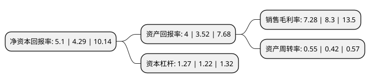

> 本页面由自动化程序生成于 2022年5月20日 01:37
> 内容可能存在错误，如有bug请提交issue至：https://github.com/Eroleice/doc-pi/issues
{.is-warning}

# 上市公司基本情况

## 基本资料

山石网科通信技术股份有限公司（以下简称“山石网科”）成立于2011年07月20日，苏州市。于2019年09月30日在上交所科创板上市。

山石网科注册资本18,022.345万元，公司为各行业客户提供完整的网络安全解决方案，主要覆盖下一代防火墙，入侵检测和防御系统，安全审计，安全管理，Web应用防火墙，内网安全在内的网络安全产品及服务。提供包括边界安全，云安全，数据安全，内网安全在内的网络安全产品及服务，致力于为用户提供全方位，更智能，零打扰的网络安全解决方案。以下是详细信息：

- 公司名称: 山石网科通信技术股份有限公司
- 股票代码: 688030.SH
- 所在地: 江苏 - 苏州市
- 成立日期: 2011年07月20日
- 注册资本: 18,022.345万元
- 法定代表人: 罗东平
- 主营业务: 公司为各行业客户提供完整的网络安全解决方案，主要覆盖下一代防火墙，入侵检测和防御系统，安全审计，安全管理，Web应用防火墙，内网安全在内的网络安全产品及服务提供包括边界安全，云安全，数据安全，内网安全在内的网络安全产品及服务，致力于为用户提供全方位，更智能，零打扰的网络安全解决方案
- 公司官网: www.hillstonenet.com.cn
- 公司介绍: 公司是中国网络安全行业的技术创新领导厂商，自成立以来一直专注于网络安全领域前沿技术的创新，提供包括边界安全、云安全、数据安全、内网安全在内的网络安全产品及服务，致力于为用户提供全方位、更智能、零打扰的网络安全解决方案。公司为政府、金融、运营商、互联网、教育、医疗卫生等行业累计超过17,000家用户提供高效、稳定的安全防护。公司在苏州、北京和美国硅谷均设有研发中心，业务已经覆盖了美洲、欧洲、东南亚、中东等50多个国家和地区。公司在网络安全全方位防护的能力和市场成绩被多家国内外第三方机构认可。公司连续五年入选国际权威分析机构Gartner的―企业级防火墙魔力象限‖、―UTM魔力象限‖，连续两年入选Gartner的―IDPS魔力象限‖。2019年公司成为中国唯一入选Gartner《网络流量分析市场指南》的网络安全厂商；公司数据中心安全防护平台获得Silicon Valley Communications出版的《信息安全产品指南》―2019年全球卓越奖‖；公司数据中心防火墙、微隔离与可视化产品―山石云格‖、T系列智能下一代防火墙分别获得《Cyber Defense Magazine》颁发的―最具创新数据中心安全产品奖‖、―下一代云安全方案奖‖、―突破性安全分析解决方案奖‖。

## 股东及高管情况

上市公司第一大股东为越超高科技有限公司，持股30,522,850股，占比16.94%，**疑似为**上市公司实际控制人。

截至2022年03月31日，上市公司的前十大股东中，共有2名自然人股东，5名机构股东，2个产品账户，1个海外主体，其中5%以上大股东共有6名。上市公司前十大股东明细如下：

> 未能通过持股比例判定出上市公司实际控制人（持股30%以上）
> 可能存在通过间接持股、联合持股、协议控制等方式拥有实际控制权的主体，具体请参考上市公司定期公告！
{.is-warning}

> 截至2022年03月31日，上市公司前十大股东信息如下：

| 股东名称 | 持股数量（股） | 持股比例 |
| --- | --- | --- |
| 越超高科技有限公司 | 30,522,850 | 16.94% |
| 田涛 | 13,403,662 | 7.44% |
| 苏州工业园区元禾重元并购股权投资基金合伙企业(有限合伙) | 13,149,771 | 7.3% |
| 三六零数字安全科技集团有限公司 | 12,604,505 | 6.99% |
| 国创开元股权投资基金(有限合伙) | 11,859,118 | 6.58% |
| 宜兴光控投资有限公司 | 10,964,397 | 6.08% |
| 北京奇虎科技有限公司 | 5,406,698 | 3% |
| LUO DONGPING | 4,825,318 | 2.68% |
| 卞伟 | 4,414,568 | 2.45% |
| 宁波梅山保税港区山石行健投资管理合伙企业(有限合伙) | 3,687,723 | 2.05% |

## 杜邦分析

> 数据列示周期：2021年 | 2020年 | 2019年
{.is-info}

上市公司的净资产收益率在近一年有所上升，上升幅度为18.88%，其变化情况分解如下：
- 上市公司的销售毛利率在近一年下降了-12.29%，可能是生产效率的下降、商品原材料价格上涨或商品价格的下跌所致。
- 上市公司的资产周转率在近一年上升了30.95%，可能是源自于更快的销售回款或库存管理效果提升。
- 上市公司的财务杠杆比率在近一年上升了4.1%，可能是增加负债扩大生产规模。

