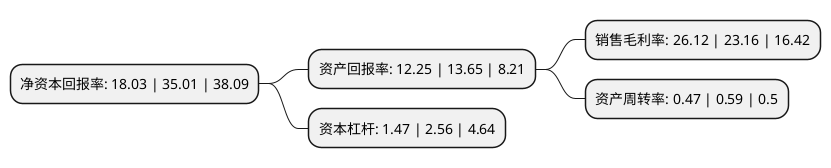

> 本页面由自动化程序生成于 2022年5月20日 01:37
> 内容可能存在错误，如有bug请提交issue至：https://github.com/Eroleice/doc-pi/issues
{.is-warning}

# 上市公司基本情况

## 基本资料

罗克佳华科技集团股份有限公司（以下简称“佳华科技”）成立于2007年09月14日，北京市。于2020年03月20日在上交所科创板上市。

佳华科技注册资本7,733.4万元，主营业务包括物联网解决方案和物联网大数据服务，其中物联网大数据服务系物联网解决方案的迭代升级。以下是详细信息：

- 公司名称: 罗克佳华科技集团股份有限公司
- 股票代码: 688051.SH
- 所在地: 北京 - 北京市
- 成立日期: 2007年09月14日
- 注册资本: 7,733.4万元
- 法定代表人: 李玮
- 主营业务: 主营业务包括物联网解决方案和物联网大数据服务，其中物联网大数据服务系物联网解决方案的迭代升级
- 公司官网: www.rockontrol.com
- 公司介绍: 公司是一家致力于科技创新，集物联网智能制造、数据采集、数据融合、智能分析为一体的物联网大数据服务企业，聚焦智慧环保领域，拓展智慧城市应用。公司的主营业务包括物联网解决方案和物联网大数据服务，其中物联网大数据服务系物联网解决方案的迭代升级。公司深耕物联网领域十余年，积累了丰富的物联网解决方案项目经验，通过持续研发投入和技术创新，公司形成自主知识产权的IoT平台、云链数据库、AI算法等技术优势，成为一家覆盖物联网全产业链的物联网大数据服务企业。公司拥有国际软件能力成熟度认证评估的最高资质CMMI5资质，以及电子与智能化工程专业承包壹级(最高资质)、建筑智能化系统设计专项甲级(最高资质)、信息系统集成及服务一级、安全防范工程设计施工壹级等50余项资质和产品认证。2018年，公司被评为“环保产业协会第五届常务理事”，公司的山西太原智慧环保入围中国信息通信研究院评选的“2018年智慧城市城市治理领域十大优秀解决方案”。

## 股东及高管情况

上市公司第一大股东为上海百昱信息技术有限公司，持股24,463,099股，占比31.63%，为上市公司实际控制人。

截至2022年03月31日，上市公司的前十大股东中，共有6名自然人股东，4名机构股东，其中5%以上大股东共有3名。上市公司前十大股东明细如下：

> 截至2022年03月31日，上市公司前十大股东信息如下：

| 股东名称 | 持股数量（股） | 持股比例 |
| --- | --- | --- |
| 上海百昱信息技术有限公司 | 24,463,099 | 31.63% |
| 李玮 | 12,089,574 | 15.63% |
| 共青城华云投资管理合伙企业(有限合伙) | 8,952,485 | 11.58% |
| 李劲 | 2,500,000 | 3.23% |
| 上海普纲企业管理中心(有限合伙) | 2,500,000 | 3.23% |
| 吴伟 | 1,747,937 | 2.26% |
| 田三红 | 1,500,000 | 1.94% |
| 李增亮 | 1,500,000 | 1.94% |
| 苏湘 | 898,968 | 1.16% |
| 光大富尊投资有限公司 | 787,246 | 1.02% |

## 杜邦分析

> 数据列示周期：2020年 | 2019年 | 2018年
{.is-info}

上市公司的净资产收益率在近一年有所下降，下降幅度为-48.5%，其变化情况分解如下：
- 上市公司的销售毛利率在近一年上升了12.78%，可能是生产效率的提升、商品原材料价格下跌或商品价格的上涨所致。
- 上市公司的资产周转率在近一年下降了-20.34%，可能是源自于更慢的销售回款或库存管理效果下降。
- 上市公司的财务杠杆比率在近一年下降了-42.58%，可能是减少负债降低财务费用。

