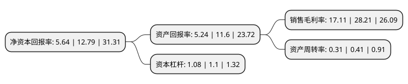

> 本页面由自动化程序生成于 2022年5月20日 01:37
> 内容可能存在错误，如有bug请提交issue至：https://github.com/Eroleice/doc-pi/issues
{.is-warning}

# 上市公司基本情况

## 基本资料

江苏云涌电子科技股份有限公司（以下简称“云涌科技”）成立于2010年03月12日，泰州市。于2020年07月10日在上交所科创板上市。

云涌科技注册资本6,000万元，致力于工业信息安全产品及工业物联网产品的研发，生产和销售以下是详细信息：

- 公司名称: 江苏云涌电子科技股份有限公司
- 股票代码: 688060.SH
- 所在地: 江苏 - 泰州市
- 成立日期: 2010年03月12日
- 注册资本: 6,000万元
- 法定代表人: 高南
- 主营业务: 致力于工业信息安全产品及工业物联网产品的研发，生产和销售
- 公司官网: www.yytek.com
- 公司介绍: 公司是专注于工业互联网领域的高新技术企业，致力于工业信息安全产品及工业物联网产品的研发、生产和销售，主要应用于电力、能源、金融和铁路等领域。公司从设立开始即致力于研究基于RISC架构计算机和Linux裁剪操作系统的嵌入式技术，是国内较早将嵌入式技术应用于工业互联网信息安全领域的公司之一。结合工业行业用户的特点，在技术路线选择方面采用“硬件定制+软件定制”的双轮驱动来实现客户的应用需求；在产品策略方面根据行业特定需求采用“定制化+产业化”来实现公司的长远发展。公司长期深耕电力行业，该行业在工业化与信息化的过程中对安全性、可靠性、稳定性和实时性的要求最高、需求最大，特别是在电力调度和配电等安全领域，公司具有较强的核心竞争力。

## 股东及高管情况

上市公司第一大股东为高南，持股20,250,000股，占比33.75%，为上市公司实际控制人。

截至2022年03月31日，上市公司的前十大股东中，共有6名自然人股东，1名机构股东，2个产品账户，1名其他股东，其中5%以上大股东共有4名。上市公司前十大股东明细如下：

> 截至2022年03月31日，上市公司前十大股东信息如下：

| 股东名称 | 持股数量（股） | 持股比例 |
| --- | --- | --- |
| 高南 | 20,250,000 | 33.75% |
| 焦扶危 | 13,500,000 | 22.5% |
| 肖相生 | 6,150,200 | 10.25% |
| 张奎 | 4,005,000 | 6.68% |
| 浙商证券投资有限公司 | 515,900 | 0.86% |
| 招商银行股份有限公司-海富通碳中和主题混合型证券投资基金 | 357,537 | 0.6% |
| 俞素园 | 288,903 | 0.48% |
| 中国农业银行-华夏平稳增长混合型证券投资基金 | 276,148 | 0.46% |
| 宋复兴 | 183,138 | 0.31% |
| 法国兴业银行 | 163,538 | 0.27% |

## 利润表分析

上市公司2021年总收入为3.09亿元，净利润为0.52亿元，实现盈利。

## 杜邦分析

> 数据列示周期：2021年 | 2020年 | 2019年
{.is-info}

上市公司的净资产收益率在近一年有所下降，下降幅度为-55.9%，其变化情况分解如下：
- 上市公司的销售毛利率在近一年下降了-39.35%，可能是生产效率的下降、商品原材料价格上涨或商品价格的下跌所致。
- 上市公司的资产周转率在近一年下降了-24.39%，可能是源自于更慢的销售回款或库存管理效果下降。
- 上市公司的财务杠杆比率在近一年下降了-1.82%，可能是减少负债降低财务费用。

