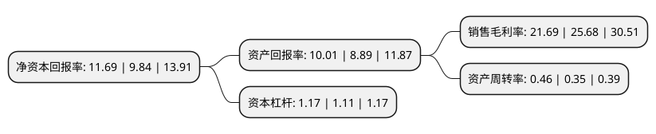

> 本页面由自动化程序生成于 2022年5月20日 01:37
> 内容可能存在错误，如有bug请提交issue至：https://github.com/Eroleice/doc-pi/issues
{.is-warning}

# 上市公司基本情况

## 基本资料

北京龙软科技股份有限公司（以下简称“龙软科技”）成立于2002年02月22日，北京市。于2019年12月30日在上交所科创板上市。

龙软科技注册资本7,075万元，主营业务是以自主研发的专业地理信息系统平台为基础，利用物联网，大数据，云计算等技术，为煤炭工业的安全生产，智能开采提供工业应用软件及全业务流程信息化整体解决方案;为政府应急和安全监管部门，科研院所，安全生产服务机构，工业园区，高危行业企业提供现代信息技术与安全生产深度融合的智慧应急，智慧安监整体解决方案。以下是详细信息：

- 公司名称: 北京龙软科技股份有限公司
- 股票代码: 688078.SH
- 所在地: 北京 - 北京市
- 成立日期: 2002年02月22日
- 注册资本: 7,075万元
- 法定代表人: 毛善君
- 主营业务: 主营业务是以自主研发的专业地理信息系统平台为基础，利用物联网，大数据，云计算等技术，为煤炭工业的安全生产，智能开采提供工业应用软件及全业务流程信息化整体解决方案;为政府应急和安全监管部门，科研院所，安全生产服务机构，工业园区，高危行业企业提供现代信息技术与安全生产深度融合的智慧应急，智慧安监整体解决方案
- 公司官网: www.longruan.com
- 公司介绍: 公司专注于煤矿基础地理信息系统与专业应用软件开发与销售，是煤炭智能开采领域龙头厂商。公司以自主研发的“龙软专业地理信息系统”为底层开发平台，向煤炭、石油天然气等能源行业以及各种政企单位客户提供全面、个性化的等以空间信息管理为特点的信息化整体解决方案(智能矿山、智慧安监、智能应急等)，主要产品包括LongRuan GIS、LongRuan GIS“一张图”、LongRuan安全云服务三大基础技术平台及在其基础上开发的系列专业应用软件。公司产品目前已被各矿业集团或公司及下属单位使用广泛，在中国煤炭企业50强中市场占有率达80%。

## 股东及高管情况

上市公司第一大股东为毛善君，持股33,259,466股，占比47.01%，为上市公司实际控制人。

截至2022年03月31日，上市公司的前十大股东中，共有5名自然人股东，1名机构股东，3个产品账户，1个海外主体，其中5%以上大股东共有1名。上市公司前十大股东明细如下：

> 截至2022年03月31日，上市公司前十大股东信息如下：

| 股东名称 | 持股数量（股） | 持股比例 |
| --- | --- | --- |
| 毛善君 | 33,259,466 | 47.01% |
| 任永智 | 2,368,179 | 3.35% |
| 郭兵 | 2,029,807 | 2.87% |
| 高华-汇丰-GOLDMAN, SACHS & CO.LLC | 1,456,903 | 2.06% |
| 华泰证券股份有限公司 | 1,355,346 | 1.92% |
| 尹华友 | 1,253,205 | 1.77% |
| 李尚蓉 | 1,253,205 | 1.77% |
| 招商银行股份有限公司-华夏经典配置混合型证券投资基金 | 1,171,150 | 1.66% |
| 中国银行股份有限公司-景顺长城策略精选灵活配置混合型证券投资基金 | 1,086,750 | 1.54% |
| 上海高毅资产管理合伙企业(有限合伙)-高毅邻山1号远望基金 | 1,000,000 | 1.41% |

## 利润表分析

上市公司2021年总收入为2.9亿元，净利润为0.63亿元，实现盈利。

## 杜邦分析

> 数据列示周期：2021年 | 2020年 | 2019年
{.is-info}

上市公司的净资产收益率在近一年有所上升，上升幅度为18.8%，其变化情况分解如下：
- 上市公司的销售毛利率在近一年下降了-15.54%，可能是生产效率的下降、商品原材料价格上涨或商品价格的下跌所致。
- 上市公司的资产周转率在近一年上升了31.43%，可能是源自于更快的销售回款或库存管理效果提升。
- 上市公司的财务杠杆比率在近一年上升了5.41%，可能是增加负债扩大生产规模。

