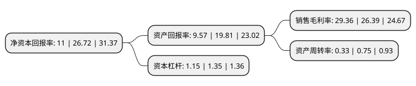

> 本页面由自动化程序生成于 2022年5月20日 01:37
> 内容可能存在错误，如有bug请提交issue至：https://github.com/Eroleice/doc-pi/issues
{.is-warning}

# 上市公司基本情况

## 基本资料

广州中望龙腾软件股份有限公司（以下简称“中望软件”）成立于1998年08月24日，广州市。于2021年03月11日在上交所科创板上市。

中望软件注册资本6,194.386万元，主要从事CAD/CAM/CAE等研发设计类工业软件的研发，推广与销售业务。以下是详细信息：

- 公司名称: 广州中望龙腾软件股份有限公司
- 股票代码: 688083.SH
- 所在地: 广东 - 广州市
- 成立日期: 1998年08月24日
- 注册资本: 6,194.386万元
- 法定代表人: 杜玉林
- 主营业务: 主要从事CAD/CAM/CAE等研发设计类工业软件的研发，推广与销售业务
- 公司官网: www.zwcad.com
- 公司介绍: 公司是国内领先的研发设计类工业软件供应商，主要从事CAD/CAM/CAE等研发设计类工业软件的研发、推广与销售业务。公司成立之初专注于2D CAD软件的研发与销售工作，秉承着成为世界一流的工业软件供应商的愿景，打造易操作、兼容性强、功能完善的工业设计绘图软件，为客户提供优质的软件产品及服务。凭借着在2D CAD软件领域20年的深耕细作及持续研发投入，公司在业内知名度和认可度逐步提高，品牌优势逐渐形成，逐步打破了我国2D CAD软件领域由欧美垄断的局面，为实现2D CAD软件产品国产化、自主化作出较大贡献,公司自成立以来一直注重产品的研发，取得了一系列科研成果及荣誉，被认定为“国家高新技术企业”。公司还积极参与国际CAD技术组织的交流与合作，是国际IntelliCAD技术协会的成员，国际设计联盟Open Design Alliance会员，也是国际未来工程设计联盟The Congress On The Future Of Engineering Software成员。

## 股东及高管情况

上市公司第一大股东为杜玉林，持股22,029,015股，占比35.5629%，为上市公司实际控制人。

截至2022年04月28日，上市公司的前十大股东中，共有3名自然人股东，6名机构股东，1个产品账户，其中5%以上大股东共有3名。上市公司前十大股东明细如下：

> 截至2022年04月28日，上市公司前十大股东信息如下：

| 股东名称 | 持股数量（股） | 持股比例 |
| --- | --- | --- |
| 杜玉林 | 22,029,015 | 35.5629% |
| 杜玉林 | 21,998,000 | 35.51% |
| 李红 | 3,960,000 | 6.39% |
| 普信投资公司-客户资金 | 3,004,277 | 4.85% |
| 厦门梦泽投资咨询合伙企业(有限合伙) | 2,382,500 | 3.85% |
| 厦门森希投资合伙企业(有限合伙) | 2,372,500 | 3.83% |
| 厦门硕裕投资合伙企业(有限合伙) | 2,367,500 | 3.82% |
| 深圳市达晨财智创业投资管理有限公司-深圳市达晨创通股权投资企业(有限合伙) | 1,794,209 | 2.9% |
| 厦门雷骏投资合伙企业(有限合伙) | 1,402,500 | 2.26% |
| 摩根资产管理(新加坡)有限公司-摩根中国A股市场机会基金 | 1,038,991 | 1.68% |

## 利润表分析

上市公司2021年总收入为6.18亿元，净利润为1.81亿元，实现盈利。

## 杜邦分析

> 数据列示周期：2021年 | 2020年 | 2019年
{.is-info}

上市公司的净资产收益率在近一年有所下降，下降幅度为-58.83%，其变化情况分解如下：
- 上市公司的销售毛利率在近一年上升了11.25%，可能是生产效率的提升、商品原材料价格下跌或商品价格的上涨所致。
- 上市公司的资产周转率在近一年下降了-56%，可能是源自于更慢的销售回款或库存管理效果下降。
- 上市公司的财务杠杆比率在近一年下降了-14.81%，可能是减少负债降低财务费用。

