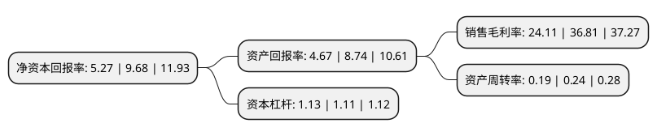

> 本页面由自动化程序生成于 2022年5月20日 01:37
> 内容可能存在错误，如有bug请提交issue至：https://github.com/Eroleice/doc-pi/issues
{.is-warning}

# 上市公司基本情况

## 基本资料

虹软科技股份有限公司（以下简称“虹软科技”）成立于2003年02月25日，杭州市。于2019年07月22日在上交所科创板上市。

虹软科技注册资本40,600万元，主营业务:视觉人工智能技术的研发和应用，为智能手机，智能汽车，物联网(IoT)等智能设备提供一站式视觉人工智能解决方案。以下是详细信息：

- 公司名称: 虹软科技股份有限公司
- 股票代码: 688088.SH
- 所在地: 浙江 - 杭州市
- 成立日期: 2003年02月25日
- 注册资本: 40,600万元
- 法定代表人: 邓晖
- 主营业务: 主营业务:视觉人工智能技术的研发和应用，为智能手机，智能汽车，物联网(IoT)等智能设备提供一站式视觉人工智能解决方案
- 公司官网: www.arcsoft.com.cn
- 公司介绍: 公司是全球领先的计算摄影解决方案提供商，计算机视觉技术领导者，属于具备底层算法能力的技术型企业。其盈利模式是将其视觉人工智能算法技术与客户特定设备深度整合，通过合约的方式授权给客户，允许客户将相关算法软件或软件包装载在约定型号的智能设备上使用，以此收取技术和软件使用授权费用。公司始终致力于视觉人工智能技术的研发和应用，在全球范围内为智能手机、智能汽车、物联网(IoT)等智能设备提供一站式视觉人工智能解决方案。公司在端计算和边缘计算以及视觉人工智能技术拥有积累优势。同时与产业链深度合作，经验丰富。公司在手机领域的下游客户，囊括了除苹果外的全部领先厂商，是全球最大的智能手机视觉算法供应商。

## 股东及高管情况

上市公司第一大股东为虹润资本管理有限公司，持股118,698,800股，占比29.24%，**疑似为**上市公司实际控制人。

截至2022年03月31日，上市公司的前十大股东中，共有7名机构股东，2个产品账户，1个海外主体，其中5%以上大股东共有2名。上市公司前十大股东明细如下：

> 未能通过持股比例判定出上市公司实际控制人（持股30%以上）
> 可能存在通过间接持股、联合持股、协议控制等方式拥有实际控制权的主体，具体请参考上市公司定期公告！
{.is-warning}

> 截至2022年03月31日，上市公司前十大股东信息如下：

| 股东名称 | 持股数量（股） | 持股比例 |
| --- | --- | --- |
| 虹润资本管理有限公司 | 118,698,800 | 29.24% |
| 南京瑞联新兴产业投资基金合伙企业(有限合伙) | 61,658,064 | 15.19% |
| 虹扬全球有限公司 | 19,595,020 | 4.83% |
| 杭州虹力投资管理合伙企业(有限合伙) | 18,962,950 | 4.67% |
| 虹宇有限公司 | 14,679,634 | 3.62% |
| 香港中央结算有限公司(陆股通) | 8,852,536 | 2.18% |
| 杭州虹礼投资管理合伙企业(有限合伙) | 8,150,266 | 2.01% |
| 上海君桐股权投资管理有限公司-嘉兴君帆投资管理合伙企业(有限合伙) | 6,584,918 | 1.62% |
| 招商银行股份有限公司-华夏上证科创板50成份交易型开放式指数证券投资基金 | 5,610,150 | 1.38% |
| 达隆发展有限公司 | 5,570,756 | 1.37% |

## 利润表分析

上市公司2021年总收入为5.73亿元，净利润为1.38亿元，实现盈利。

## 杜邦分析

> 数据列示周期：2021年 | 2020年 | 2019年
{.is-info}

上市公司的净资产收益率在近一年有所下降，下降幅度为-45.56%，其变化情况分解如下：
- 上市公司的销售毛利率在近一年下降了-34.5%，可能是生产效率的下降、商品原材料价格上涨或商品价格的下跌所致。
- 上市公司的资产周转率在近一年下降了-20.83%，可能是源自于更慢的销售回款或库存管理效果下降。
- 上市公司的财务杠杆比率在近一年上升了1.8%，可能是增加负债扩大生产规模。

