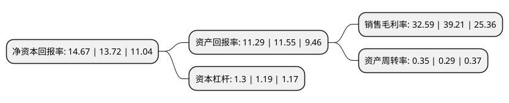

> 本页面由自动化程序生成于 2022年5月20日 01:38
> 内容可能存在错误，如有bug请提交issue至：https://github.com/Eroleice/doc-pi/issues
{.is-warning}

# 上市公司基本情况

## 基本资料

北京金山办公软件股份有限公司（以下简称“金山办公”）成立于2011年12月20日，北京市。于2019年11月18日在上交所科创板上市。

金山办公注册资本46,100万元，主要从事WPS Office办公软件产品及服务的设计研发及销售推广。公司产品主要包括WPS Office办公软件和金山词霸等，可在Windows，Linux，MacOS，Android，iOS等众多主流操作平台上应用;公司服务主要包括基于公司产品及相关文档的增值服务以及互联网广告推广服务，为客户提供一站式，多平台应用解决方案。以下是详细信息：

- 公司名称: 北京金山办公软件股份有限公司
- 股票代码: 688111.SH
- 所在地: 北京 - 北京市
- 成立日期: 2011年12月20日
- 注册资本: 46,100万元
- 法定代表人: 邹涛
- 主营业务: 主要从事WPS Office办公软件产品及服务的设计研发及销售推广公司产品主要包括WPS Office办公软件和金山词霸等，可在Windows，Linux，MacOS，Android，iOS等众多主流操作平台上应用;公司服务主要包括基于公司产品及相关文档的增值服务以及互联网广告推广服务，为客户提供一站式，多平台应用解决方案
- 公司官网: www.wps.cn
- 公司介绍: 公司是国内领先的办公软件和服务提供商，主要从事WPS Office办公软件产品及服务的设计研发及销售推广。公司拥有办公软件领域30余年研发经验及技术积累，旗下主要产品及服务皆由公司自主研发，对核心技术具有自主知识产权。公司重点针对文字排版技术、电子表格计算技术、动画渲染技术、在线协同编辑、安全文档以及数据协同共享等多种关键技术进行深入研究，通过核心技术的突破，建立互联网云办公应用服务体系，创建智能办公新模式，全面提升用户体验。2018年12月，公司主要产品月度活跃用户数(MAU)超过3.10亿，其中WPS Office桌面版月度活跃用户数超过1.20亿，领先其他国产办公软件；WPSOffice移动版月度活跃用户数超过1.81亿；公司其他产品(如金山词霸等)月度活跃用户数接近0.10亿。WPS Office移动版已覆盖全球超过220个国家和地区，在全球Google Play、中国App Store的办公软件应用市场中排名前列，并持续保持领先地位。为适应客户的安全可靠需求，公司自主研发的WPS Office Linux版本已经全面支持国产整机平台(如：龙芯、飞腾、兆芯、申威等芯片)和国产操作系统，并在国家“十二五”、“十三五”期间的“核高基”多项重大示范工程项目中完成系统适配和应用推广。

## 股东及高管情况

上市公司第一大股东为Kingsoft WPS Corporation Limited，持股243,000,000股，占比52.71%，为上市公司实际控制人。

截至2022年03月31日，上市公司的前十大股东中，共有5名机构股东，1个产品账户，4个海外主体，其中5%以上大股东共有2名。上市公司前十大股东明细如下：

> 截至2022年03月31日，上市公司前十大股东信息如下：

| 股东名称 | 持股数量（股） | 持股比例 |
| --- | --- | --- |
| Kingsoft WPS Corporation Limited | 243,000,000 | 52.71% |
| 天津奇文五维企业管理咨询合伙企业(有限合伙) | 27,469,173 | 5.96% |
| 深圳市腾讯信息技术有限公司 | 20,745,000 | 4.5% |
| MS TMT Holding II Limited | 12,741,347 | 2.76% |
| 香港中央结算有限公司(陆股通) | 12,262,802 | 2.66% |
| 天津奇文四维企业管理咨询合伙企业(有限合伙) | 8,357,456 | 1.81% |
| 天津奇文七维企业管理咨询合伙企业(有限合伙) | 6,342,062 | 1.38% |
| GGV(WPS)Limited | 5,889,501 | 1.28% |
| 招商银行股份有限公司-华夏上证科创板50成份交易型开放式指数证券投资基金 | 5,044,103 | 1.09% |
| 中移投资控股有限责任公司 | 3,216,407 | 0.7% |

## 利润表分析

上市公司2021年总收入为32.8亿元，净利润为10.68亿元，实现盈利。

## 杜邦分析

> 数据列示周期：2021年 | 2020年 | 2019年
{.is-info}

上市公司的净资产收益率在近一年有所上升，上升幅度为6.92%，其变化情况分解如下：
- 上市公司的销售毛利率在近一年下降了-16.88%，可能是生产效率的下降、商品原材料价格上涨或商品价格的下跌所致。
- 上市公司的资产周转率在近一年上升了20.69%，可能是源自于更快的销售回款或库存管理效果提升。
- 上市公司的财务杠杆比率在近一年上升了9.24%，可能是增加负债扩大生产规模。

