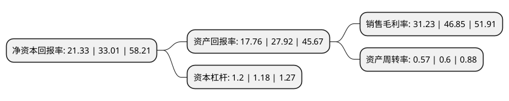

> 本页面由自动化程序生成于 2022年5月20日 01:38
> 内容可能存在错误，如有bug请提交issue至：https://github.com/Eroleice/doc-pi/issues
{.is-warning}

# 上市公司基本情况

## 基本资料

广东纬德信息科技股份有限公司（以下简称“纬德信息”）成立于2012年04月24日，广州市。于2022年01月27日在上交所科创板上市。

纬德信息注册资本8,377.34万元，致力于为工业企业提供自主可控，安全可靠的工业互联网信息安全产品和服务。以下是详细信息：

- 公司名称: 广东纬德信息科技股份有限公司
- 股票代码: 688171.SH
- 所在地: 广东 - 广州市
- 成立日期: 2012年04月24日
- 注册资本: 8,377.34万元
- 法定代表人: 尹健
- 主营业务: 致力于为工业企业提供自主可控，安全可靠的工业互联网信息安全产品和服务
- 公司官网: www.weide-gd.com
- 公司介绍: 公司是一家工业互联网信息安全领域的技术创新型企业，公司致力于为工业企业提供自主可控、安全可靠的工业互联网信息安全产品和服务。公司依托工业互联网信息安全领域的关键技术，主要从事智能安全设备和信息安全云平台的研发、生产和销售，并基于上述产品为客户提供工业互联网信息安全整体解决方案。公司产品可广泛应用于电力、通信、石油石化、交通运输等领域。同时随着5G、云计算、人工智能等新兴技术的广泛应用，新兴安全需求不断产生，公司产品应用领域也将更为广泛,公司凭借领先的技术能力、稳定的产品质量、卓越的客户服务、长期积累的品牌影响力，在细分领域中处于领先地位。公司产品在行业内拥有突出的市场竞争力，公司已成为电力信息安全领域重要的供应商。公司客户包括国家电网、南方电网、北京科锐、长园深瑞、国电集团、许继电气等众多业内知名企业，公司与客户保持长期稳定的合作关系，持续得到客户的认可。公司通过提升产品性能、推出更多满足客户需求的产品，在巩固与原有客户合作关系的基础上，逐步增加客户覆盖范围和产品市场占有率，提高公司在工业互联网信息安全行业的市场地位。

## 股东及高管情况

上市公司第一大股东为尹健，持股32,424,911股，占比38.71%，为上市公司实际控制人。

截至2022年03月31日，上市公司的前十大股东中，共有5名自然人股东，2名机构股东，3个产品账户，其中5%以上大股东共有2名。上市公司前十大股东明细如下：

> 截至2022年03月31日，上市公司前十大股东信息如下：

| 股东名称 | 持股数量（股） | 持股比例 |
| --- | --- | --- |
| 尹健 | 32,424,911 | 38.71% |
| 魏秀君 | 10,431,720 | 12.45% |
| 广州纬腾股权投资合伙企业(有限合伙) | 3,584,229 | 4.28% |
| 梁裕厚 | 2,894,265 | 3.45% |
| 中广基金管理有限公司-济南中广股权投资合伙企业(有限合伙) | 2,830,000 | 3.38% |
| 深圳市达晨财智创业投资管理有限公司-深圳市达晨创通股权投资企业(有限合伙) | 2,348,746 | 2.8% |
| 陈锐 | 1,987,276 | 2.37% |
| 张春 | 1,666,667 | 1.99% |
| 广发信德智胜投资管理有限公司-珠海广发信德科技文化产业股权投资基金(有限合伙) | 1,433,692 | 1.71% |
| 广发信德投资管理有限公司-珠海广发信德智能创新升级股权投资基金(有限合伙) | 1,379,928 | 1.65% |

## 利润表分析

上市公司2021年总收入为1.77亿元，净利润为0.55亿元，实现盈利。

## 杜邦分析

> 数据列示周期：2021年 | 2020年 | 2019年
{.is-info}

上市公司的净资产收益率在近一年有所下降，下降幅度为-35.38%，其变化情况分解如下：
- 上市公司的销售毛利率在近一年下降了-33.34%，可能是生产效率的下降、商品原材料价格上涨或商品价格的下跌所致。
- 上市公司的资产周转率在近一年下降了-5%，可能是源自于更慢的销售回款或库存管理效果下降。
- 上市公司的财务杠杆比率在近一年上升了1.69%，可能是增加负债扩大生产规模。

